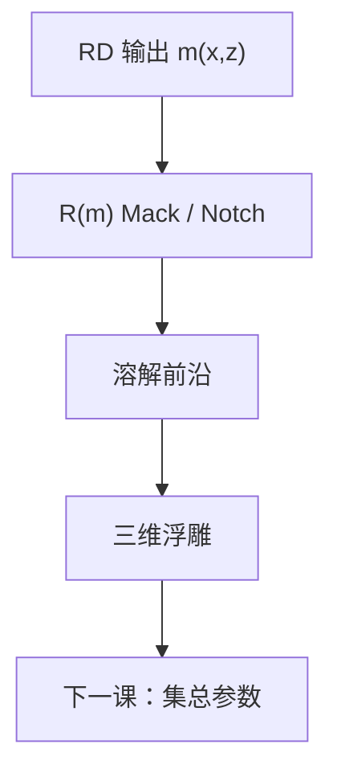

# 显影速率模型

反应–扩散交出脱保护场；浮雕是溶解速率沿法向积分出来的。没有 $R(m)$，阈值只是那条等值面的口语。

<footer>—— 据 Mack 显影速率（原式与 Notch）及剩余厚度曲线的定义整理</footer>

[上一课](/litho/quencher-neutralization)把脱保护场钉在含中和的 PEB 解上。[衬度曲线](/litho/resist-contrast-curve)与 [Mack / Notch](/litho/dissolution-mack) 在主干已经写出 $T(\log E)$ 和 $R(m)$ 四参数。缺口是补层接口：把 RD 的 $m(x,z)$ 明确送进速率积分，而不是再从均匀垫上重推一遍 $\gamma$。本课钉这条连接。少参数的集总模型，留给[下一课](/litho/lumped-parameter-model)。

## 问题

主干溶解课默认 $m$ 来自「指定的」抑制剂分数。现在 $m$ 来自曝光动力学 + PEB 反应–扩散，沿 $x$ 与 $z$ 都不是常数。溶解前沿法向速度等于当地 $R(m)$，固定显影时间后，穿通的区域构成三维浮雕。OPC 常数阈值等于假定 $R$ 在某一 $m_\mathrm{th}$ 处跳变，并把跳变映射回空中像强度——RD 一改，$m_\mathrm{th}$ 对应的 $I$ 就漂，看起来像「阈值模型失校准」。

缺口因此是：显影模型吃的是 $m$，不是 $I$。把 Mack 式再抄一遍不是本课任务；本课要求后课改 PEB 或淬灭时，声明进 $R$ 的场已经变了。

### $R_\mathrm{min}$ 仍不是零

暗侵蚀在未曝光区也掉厚。长时间显影、搅拌过强，CD 会在「已经清底」之后继续漂。RD 把暗区 $m$ 抬得再高，只要 $R_\mathrm{min}\gt 0$，时间轴仍在切暗区。主干已经警告过；接到本课方程后，它变成 PEB 泄漏与显影时间的联合超差。

Notch 形状（低脱保护时贴 $R_\mathrm{min}$，过槽口后猛升）是 CAR 常见拟合，来自疏水保护基的集体开关，不是另一种 NILS。

## 方法

流程：ABC / 产酸 → PEB RD → $m(x,z)$ → $R(m)$ → 沿时间推进前沿。实验室仍用大垫测 $R$ 对剂量（或对已知 $m$），再把同一组 $R_\mathrm{max}$、$R_\mathrm{min}$、$n$、$m_\mathrm{th}$ 用到图形上。图形对不上时，先查 $m$ 场（PEB、驻波），不要先改 $n$。

负显影把「谁溶」翻转，必须重拟合 $R(m)$。金属氧化物胶的「$m$」是配体/网络分数，函数族要换，名字仍叫显影速率模型。

## 机制

亮区 $m$ 低，$R$ 大，表面先被挖穿；边沿处在 Notch 附近，前沿走得慢，侧壁由 $R$ 的陡度与 $m$ 的横向梯度共同决定。$m$ 的横向梯度已经含光学 NILS、酸核与中和面；显影再做一次非线性。两步都叫切锐，物理不同——主干衬度课写过，本课指出非线性的输入是 RD 场。

底部 $m$ 若因 $B$ 吸收或驻波偏高，$R$ 不够，清底时间爆掉，残胶进刻蚀。阈值模型看不见这条 $z$ 向账，速率积分看得见。

流体力学（puddle、喷雾、耗尽）改有效时间与表面 $R$，不改 $R(m)$ 作为材料函数的地位。轨道课再写碗；本课保持材料接口。

## 边界

不重导 Mack 四参数公式——见[溶解模型](/litho/dissolution-mack)。不讲倒塌，那是力学。下一课把这条三维积分收成少参数，以便手算曝光宽容度；代价是丢掉侧壁波纹与残胶。

参数随显影液浓度、温度、PAB 变。换液等于作废 $n$。

## 小结

- 显影吃 $m$ 场，不吃空中像 $I$；RD 一改，阈值模型要重标定。
- $R(m)$ 沿法向积分得浮雕；$\gamma$ 是均匀垫上的后果。
- 暗侵蚀与清底是时间轴问题，Notch 是 CAR 的延迟起溶。
- 下一课把三维积分集总掉。
- 出处：Mack 显影速率；主干 [Mack / Notch](/litho/dissolution-mack)。
