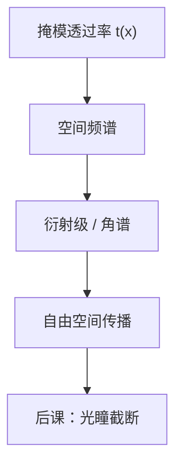

# 衍射与空间频率

有限物体把入射场切出一套平面波；每一级衍射对应一个空间频率，透镜能做的，只是收集其中进得去的那些。

<footer>—— 据 Abbe 成像原理与 Goodman, Introduction to Fourier Optics 整理</footer>

[上一课](/litho/em-wave-index)把单色场收成复振幅、折射率与光程，相位已经可以沿路径积分。缺口是：掩模不是无限均匀介质，开口有限宽。有限物体把入射平面波衍射成许多传播方向，每个方向对应一个空间频率。本课只钉衍射与空间频率的接口；透镜能收集多高的频率，是 [数值孔径](/litho/lens-na) 留下的缺口。

## 问题

若仍只用光线穿过铬缝，缝边缘的场会不连续，亥姆霍兹方程不允许这样的解。正确的下一步是把掩模透过率 $t(x,y)$ 当成物面的复振幅调制，出射场在自由空间里按角谱传播。周期为 $p$ 的线栅把入射波劈成离散衍射级；非周期图形则是连续谱。没有「空间频率」这个轴，后课的光瞳、部分相干和 $k_1$ 都没有自变量。

缺口因此不是「显微镜能不能分辨两点」，而是：先把物体写成空间频率的叠加，使后课的镜头成为这个轴上的低通滤波器。

### 衍射级不是装饰，是成像的通道

一维周期掩模、正入射、真空外侧，第 $m$ 级的正弦条件是 $\sin\theta_m = m\lambda/p$。$m=0$ 沿轴走，$|m|\ge 1$ 偏到轴外。空中像的调制来自至少两个级在像面的干涉；若只剩零级，强度没有空间结构。本课不讨论哪些级进得了镜头，只承认：物体的傅里叶分量与这些传播方向一一对应。

空间频率的单位是 1/长度。光刻里常把 $f_x=n\sin\theta/\lambda$ 写在物镜光瞳坐标上。$n$ 来自[上一课](/litho/em-wave-index)，不要在这里把 $\lambda$ 改成介质波长却忘了 $n$。

## 方法

Goodman 的角谱说法：把 $z=0$ 的场做傅里叶分解，每个空间频率 $(f_x,f_y)$ 对应一个平面波，其波矢的横向分量 $k_x=2\pi f_x$。传播一段距离只给该分量乘相位因子 $\exp(i k_z z)$，$k_z=\sqrt{n^2 k_0^2-k_x^2-k_y^2}$。evanescents（$k_x^2+k_y^2>n^2 k_0^2$）沿 $z$ 指数衰减，普通投影光学收集不到。

阿贝的说法更短：物体衍射，镜头把衍射级当光源再干涉成像。两套语言同一件事：有限孔径的信息上限是它收得进的最高 $|f|$。周期图形的级是 $\delta$ 梳；孤立图形的谱是连续包络。计算光刻把掩模的 $t(x,y)$ 变换到这个频率轴上，再乘光瞳函数。

### 斜入射只是把梳整体平移

照明若以角度 $\theta_\mathrm{ill}$ 入射，衍射级相对光瞳中心平移 $n\sin\theta_\mathrm{ill}/\lambda$。后课的离轴照明靠的就是这条平移，让本会掉出光瞳的一级重新进来。本课不选光瞳形状，只留下：空间频率轴可以相对照明方向移动，物体本身的周期并未改变。

不要把「衍射极限」四个字在本课写成 $0.61\lambda/\mathrm{NA}$。那是后课的产线判据。本课的极限只是：高于 $n/\lambda$ 的横向频率在均匀介质里不能传播。

## 机制

铬缝的锐边拥有很宽的频谱。镜头若是理想低通，像面的边会变缓，对比度下降——这就是「衍射模糊」的频率说法，不必先画艾里斑。艾里斑是圆孔光瞳对点物的脉冲响应，是本课频谱截断的一个特例；后课引入 $\mathrm{NA}$ 之后再写它。

相位物体同样衍射。光程台阶（相移掩模）改变的是 $t(x)$ 的辐角，频谱里会出现与纯振幅铬不同的级权重。本课只要求把 $t$ 当成复数；$180^\circ$ 相移如何压零级，是掩模课的缺口。

### 缩比把频率轴一起缩放

$4\times$ 投影把掩模坐标缩小到晶圆。空间频率按缩比放大：掩模上较疏的周期，在晶圆上变成更密的频率。讨论「哪一级进光瞳」时，必须声明频率是在物方还是像方。惯例是把光瞳坐标归一到像方 $\mathrm{NA}/\lambda$。本课不引入 $\mathrm{NA}$，只警告：缩比不是把同一张频谱图贴到晶圆上。

## 边界

本课用标量角谱，忽略掩模吸收体的厚度。真实铬或 MoSi 有几十纳米的高度，电磁边界条件会改各级的复振幅，那是[掩模 3D](/litho/mask-3d-effect) 的缺口。也不处理部分相干：单色平面波照明下的衍射级是确定的；扩展光源要把许多入射方向的强度非相干相加，留给[部分相干](/litho/partial-coherence)。

空间频率不是「分辨率」的同义词。分辨率还要胶把连续强度切成线宽。本课结束时，后课可以谈论光瞳，但还不能写 $\mathrm{CD}=k_1\lambda/\mathrm{NA}$。

## 小结

- 有限掩模把单色场分解为空间频率；周期图形对应离散衍射级。
- 可传播的横向频率不超过 $n/\lambda$；更高的是倏逝波。
- 空中像的调制来自至少两个频率分量在像面干涉。
- 斜照明平移频谱，为后课离轴照明预留接口。
- 本课不引入 $\mathrm{NA}$，不写瑞利 CD 公式。
- 出处：Abbe 成像原理；Goodman, *Introduction to Fourier Optics*。
