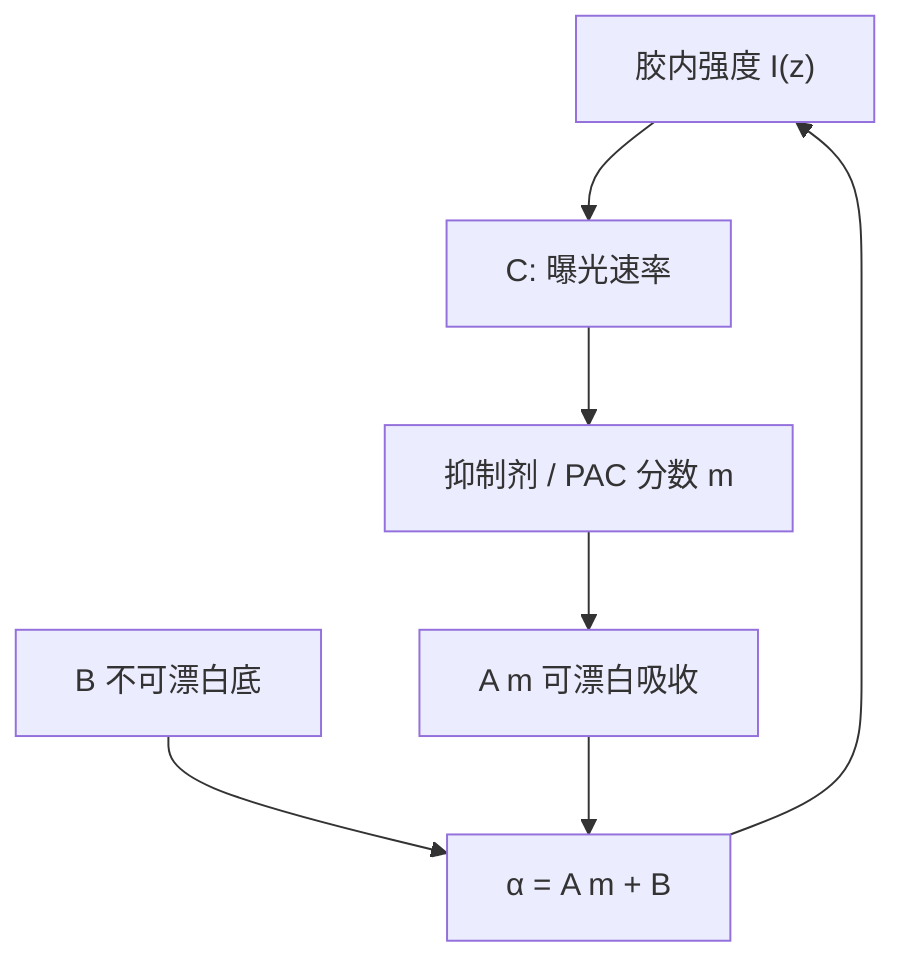

# Dill 参数 A、B、C

空中像给出的是入射强度；胶里真正驱动光化学的是被吸收的那一段。Dill 用 A、B、C 三个数把吸收、漂白与曝光速率钉死。

<footer>—— F. H. Dill 等，IEEE Trans. Electron Devices (1975)，正胶光学与曝光表征</footer>

[上一课](/litho/euv-thin-film-effects)把薄膜栈里的 $I(z)$ 写完：驻波、swing、EUV 高吸收薄膜。缺口是胶自己作为光敏介质——强度沿厚度走的时候，吸收系数还在变。本课钉 Dill 的 $A$、$B$、$C$。光子如何变成酸，留给[下一课](/litho/exposure-kinetics-acid)。不要从瑞利 CD 起笔：分辨率课已经结束，这里问的是记录介质的速率方程。

## 问题

薄膜课留下的是光学：$n$、$k$、多层反射，得到胶内强度。没有光化学反应，$I(z)$ 只是热量。Dill 1975 年的正胶表征把这件事收成三个可测参数：可漂白吸收 $A$、不可漂白底 $B$、曝光速率常数 $C$。相对抑制剂（或 PAC）分数 $m$ 从 1 走到 0 时，吸收系数

$$
\alpha = Am+B,\qquad \frac{\partial m}{\partial t}=-C\,I\,m.
$$

缺口因此是这套耦合：曝光改 $m$，$m$ 改 $\alpha$，$\alpha$ 再改沿 $z$ 的 $I$。只报一个「胶的 $k$」，等于假定膜永远不漂白。

### 三个字母不是三种胶

$A$ 是会随曝光消失的那截吸收（DNQ 一类 PAC 的漂白）；$B$ 是树脂、染料、PAG 骨架留下的底；$C$ 是单位强度把 $m$ 打掉的速率，单位常用 $\mathrm{cm}^2/\mathrm{mJ}$。换胶族等于换三个数，不是换一套成像理论。[DNQ–Novolac](/litho/dnq-novolac) 已经点过这组符号；本课把它从一句旁注写成后课默认的接口。

$A$、$B$ 的单位是吸收系数（常用 $\mu\mathrm{m}^{-1}$），与薄膜课的 $k$ 通过 $\alpha=4\pi k/\lambda$ 相连。不要把 $C$ 写成「灵敏度 mJ/cm²」：$C$ 是速率，$E_0$ 是后课才出场的清场剂量。

## 方法

实验室：用透明衬底上的膜测透过率随曝光剂量的变化。未曝光透过率给出 $A+B$；充分漂白后的透过率给出 $B$；中间曲线的斜率标定 $C$。Mack 教材把这套手续写成标准 ABC 提取，PROLITH 一类模拟器吃的就是这三个数，而不是分子轨道。

[化学放大胶](/litho/car-resist) 往往 $A$ 很小：聚合物与 PAG 不怎么靠漂白变透明，吸收几乎是常数 $B$。$C$ 仍用来写 PAG 转化速率。把 CAR 的「无漂白」写成「没有 Dill 模型」，会让曝光模块失去唯一的紧凑接口。EUV 薄膜课已经说明 13.5 nm 上 $k$ 很大、$I(z)$ 指数衰减；那只改 $B$ 的量级，不改 ABC 的定义。

## 机制

入射强度在膜里按 $\alpha$ 衰减，并与衬底反射干涉——薄膜课的 $I(z)$ 是本课方程的输入。PAC 转化使 $A m$ 下降，上层先变透明，光子更容易到达底部：这就是 DNQ 厚胶还能清底的光学原因。CAR 几乎没有这截红利，底部剂量靠薄胶和高 $C$、或靠后课的化学增益来凑。

$C$ 把强度乘进 $\partial m/\partial t$，所以空中像的横向对比直接变成 $m(x)$ 的对比。光学 NILS 在这里还没有被酸扩散卷积；那是[酸扩散与 LWR](/litho/acid-diffusion-lwr) 的核。本课停在曝光瞬间的 $m$，不把 PEB 偷运进来。

Dill 原文的工作点是 g/i 线正胶与汞灯。后课引用 ABC 时，数字必须在本层波长与本批胶上重测。抄 1975 年的 $A=0.9\,\mu\mathrm{m}^{-1}$ 进 ArF 浸没，是把文献当规格。

## 边界

本课不写产酸量子效率、不写淬灭剂、不把 $C$ 等同于 $E_0$。也不把某供应商数据表上的一组 ABC 写成全厂常数：涂胶厚度、PAB、溶剂残留都会微扰有效 $A$、$B$。下一课默认本课的 $m(x,z)$ 已经是曝光结束时的场，再问 CAR 如何把 $m$ 读成酸。

瑞利判据与 $k_1$ 不在本课重写。薄膜干涉已经在上一课，本课只承认它改 $I(z)$，从而改沿厚度的 $m$。

## 小结

- Dill $A$、$B$、$C$ 分别是可漂白吸收、不可漂白底、曝光速率。
- $\alpha=Am+B$ 与 $\partial m/\partial t=-CIm$ 把光学 $I(z)$ 接到潜像 $m$。
- DNQ 靠 $A$ 漂白补底部；CAR 常 $A\approx 0$，仍用 $C$ 写转化。
- $C$ 不是 $E_0$；清场剂量是后课锚点。
- 参数必须在本层波长与本批胶上测，不能抄 1975 年的表。
- 出处：Dill 等，IEEE Trans. Electron Devices (1975)；Mack, *Fundamental Principles of Optical Lithography*。
