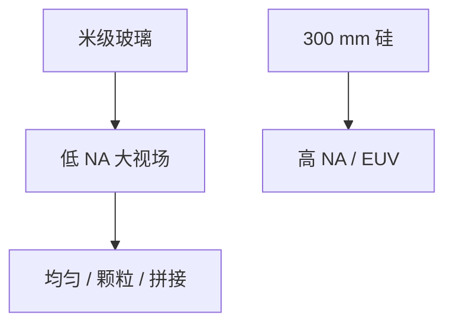

# 显示光刻

Gen 10 玻璃是几米见方；分辨率在微米，均匀性、颗粒和产能按面积计。这是另一门投影光学，不是逻辑扫描机的放大版。

<footer>—— 对照 FPD（平板显示）光刻机与半导体步进器的尺度分工</footer>

[上一课](/litho/panel-level-litho)把封装面板做到半米量级。缺口是显示把基板做到米级。本课钉显示光刻。封装步进器作为半导体厂仍会买的大视场机，留给[下一课](/litho/packaging-steppers）。

## 问题

TFT/OLED 阵列：线宽微米到亚微米，基板 Gen 号对应边长数米。工具是专用投影或扫描系统（Nikon、Canon 等 FPD 机家族），掩模也是大版。挑战是照度均匀、拼接、掩模 sag、颗粒（缺陷按面积放大）、胶涂布。k1 与 EUV 随机不是这门的语言。

缺口是**米级均匀**，不是纳米 NILS。把显示当「很松的光刻」会低估大面积缺陷经济学；把逻辑 EUV 经验直接搬去也会错。

### 与半导体掩模厂不同

大掩模的写、检验、 pellicle 是另一供应链。不要假设 OASIS.MASK 的 6 寸故事适用。

高分辨率显示（VR、硅基 OLED）会向半导体工具靠拢。本课指大板 FPD 主流。

## 方法

规格：分辨率、DOV（大焦深）、照度、产能 m²/h。缺陷：按可视面积的杀手定义与 IC $A_c$ 不同（人眼 vs 电学）。规划：与 IC fab 设备不通用。

## 机制

投影仍是成像，但 NA 低、场大、波长常近 UV。衍射极限远宽于 IC。限制来自工程均匀与缺陷，不是通带截止。

## 边界

不讲 LCD 化学。不把硅基微显示与大板混为一谈。本课不进入逻辑节点。

后课默认：FPD 是独立工具族；下一课半导体封装步进器夹在 IC 与 FPD 之间。

## 小结

- 显示光刻是米级低 NA 大视场，墙在均匀与缺陷面积。
- 与 IC 扫描机、6 寸掩模链不通用。
- 微显示例外地可靠近半导体工具。
- 出处：FPD 光刻与半导体步进器的尺度分工通称。
