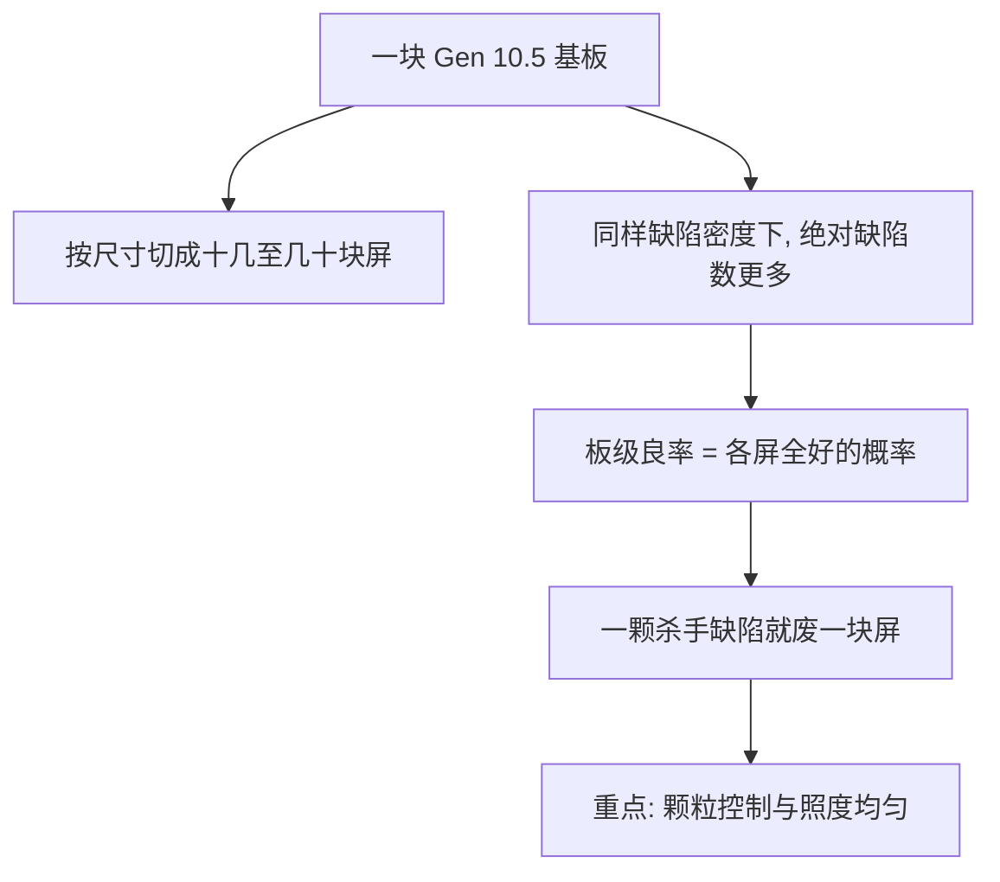
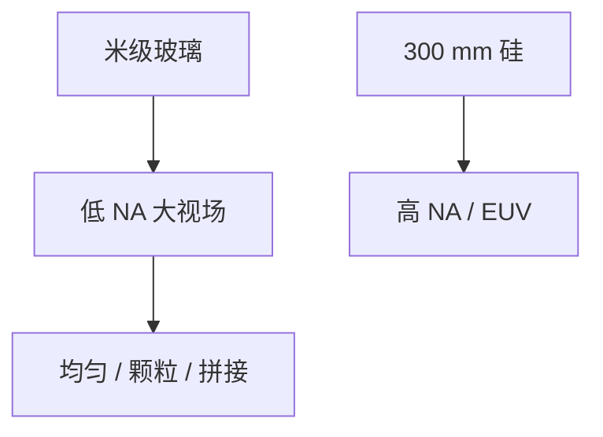

# 显示光刻

Gen 10 玻璃是几米见方；分辨率在微米，均匀性、颗粒和产能按面积计。这是另一门投影光学，不是逻辑扫描机的放大版。

<footer>—— 对照 FPD（平板显示）光刻机与半导体步进器的尺度分工</footer>

[上一课](/litho/panel-level-litho)把封装面板做到半米量级。缺口是显示把基板做到米级。本课钉显示光刻。封装步进器作为半导体厂仍会买的大视场机，留给[下一课](/litho/packaging-steppers)。

## 问题

TFT/OLED 阵列：线宽微米到亚微米，基板 Gen 号对应边长数米。工具是专用投影或扫描系统（Nikon、Canon 等 FPD 机家族），掩模也是大版。挑战是照度均匀、拼接、掩模 sag、颗粒（缺陷按面积放大）、胶涂布。k1 与 EUV 随机不是这门的语言。

术语翻译：「Gen 号」（Generation）是显示行业给玻璃基板定的尺寸档位——号越大板越大，Gen 10.5 基板约 2.9 m × 3.4 m，比一张乒乓球桌还大。一块板切几块屏、怎么切最省料，是显示厂排产的第一道算术。

缺口是**米级均匀**，不是纳米 NILS。把显示当「很松的光刻」会低估大面积缺陷经济学；把逻辑 EUV 经验直接搬去也会错。

直觉类比：IC 光刻像在邮票上刻微雕，比的是最小线条；显示光刻像在一面墙上印巨幅海报，线条不细但整面墙处处要均匀。海报上一颗墨点不影响远观，可要是正好落在人脸正中，整张就废——缺陷经济学按位置与面积计价。

```mermaid
flowchart TD
  G["一块 Gen 10.5 基板"] --> CUT["按尺寸切成十几至几十块屏"]
  G --> DEF["同样缺陷密度下, 绝对缺陷数更多"]
  DEF --> Y["板级良率 = 各屏全好的概率"]
  Y --> ECON["一颗杀手缺陷就废一块屏"]
  ECON --> PRI["重点: 颗粒控制与照度均匀"]
```

### 与半导体掩模厂不同

大掩模的写、检验、 pellicle 是另一供应链。不要假设 OASIS.MASK 的 6 寸故事适用。

高分辨率显示（VR、硅基 OLED）会向半导体工具靠拢。本课指大板 FPD 主流。

## 方法

规格：分辨率、DOV（大焦深）、照度、产能 m²/h。缺陷：按可视面积的杀手定义与 IC $A_c$ 不同（人眼 vs 电学）。规划：与 IC fab 设备不通用。

常见误区：初学者容易按「分辨率不够高」给 FPD 光刻机打低分。实际上它的难点是大视场下照度、焦面、拼接误差处处达标——把 NA 从 0.33 降到 0.1 量级并不难，难的是在三米行程上把均匀性压住；这是另一门工程，不是简化版光刻。

## 机制

投影仍是成像，但 NA 低、场大、波长常近 UV。衍射极限远宽于 IC。限制来自工程均匀与缺陷，不是通带截止。

```mermaid
flowchart TD
  M["米级玻璃"] --> FPD["低 NA 大视场"]
  IC["300 mm 硅"] --> SCN["高 NA / EUV"]
  FPD --> UNIF["均匀 / 颗粒 / 拼接"]
```

## 边界

不讲 LCD 化学。不把硅基微显示与大板混为一谈。本课不进入逻辑节点。

后课默认：FPD 是独立工具族；下一课半导体封装步进器夹在 IC 与 FPD 之间。

## 小结

- 显示光刻是米级低 NA 大视场，墙在均匀与缺陷面积。
- 与 IC 扫描机、6 寸掩模链不通用。
- 微显示例外地可靠近半导体工具。
- 出处：FPD 光刻与半导体步进器的尺度分工通称。
