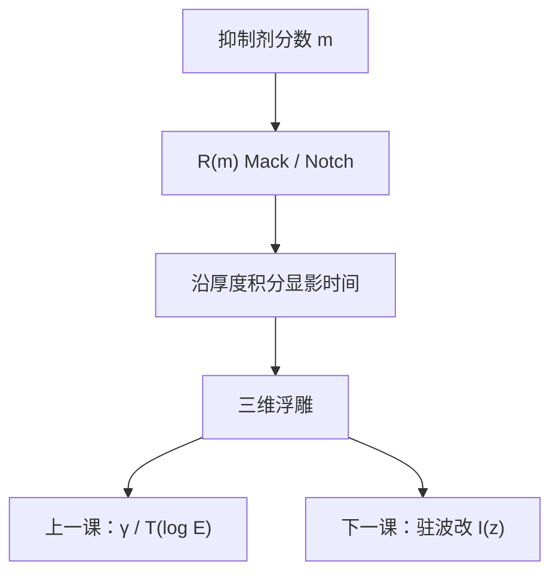

# Mack / Notch 溶解模型

衬度曲线是均匀垫上的剩余厚度；剖面要从溶解速率 $R$ 对抑制剂分数的函数沿厚度积分而来。Mack 给出紧凑的 $R(m)$。

<footer>—— 据 Mack 对显影速率模型（原 Mack 式与 Notch）的定义整理</footer>

[上一课](/litho/resist-contrast-curve)钉死了 $T(\log E)$ 与 $\gamma$，并点名「Mack 显影模型是产线紧凑形式之一」。缺口是：还没有把那条曲线背后的速率函数写出来——阈值模型只是 $R$ 在目标厚度处的工作点。本课钉 Mack / Notch。沿 $z$ 的驻波让 $R$ 不再均匀，留给[下一课](/litho/standing-wave-barc)。

## 问题

$\gamma$ 来自大面积均匀曝光。密线的边是三维的：溶解前沿从表面往下、从侧面往里走，停在「速率 × 时间刚好不够」的等值面上。只有 $\gamma$ 没有 $R(m)$，OPC 抗蚀剂模块只能用一条强度阈值，剖面角、残胶、清底时间都进不去。缺口因此是 $R$ 对剩余抑制剂（或保护基）分数 $m$ 的函数。

DNQ 体系里 $m$ 是 PAC 分数；CAR 里 $m$ 是仍被保护的比例。上一课不重推 CAR 循环，本课只要求：$m$ 从 1（未转）到 0（转完），$R$ 从 $R_\mathrm{min}$ 升到 $R_\mathrm{max}$。

### 阈值是 $R(m)$ 的切片

固定显影时间，把 $R(m(E))$ 沿厚度积到穿或积不满，就得到 $T(E)$，从而有 $\gamma$。极陡的 $R(m)$ 给出大 $\gamma$；Notch 形状（先几乎不溶，过阈值后猛升）是 CAR 常见拟合，不是另一种光学对比度。

$R_\mathrm{min}$ 不是零：暗侵蚀在未曝光区也掉厚。长时间显影会吃掉暗区，CD 漂移。模型必须保留 $R_\mathrm{min}$，不能写成理想开关。

## 方法

原 Mack 显影模型用四个材料参数：$R_\mathrm{max}$、$R_\mathrm{min}$、溶解选择度 $n$、阈值抑制剂分数 $m_\mathrm{th}$。常用紧凑式

$$
R(m)=R_\mathrm{max}\frac{(a+1)(1-m)^n}{a+(1-m)^n}+R_\mathrm{min},
$$

其中 $a=\dfrac{n+1}{n-1}(1-m_\mathrm{th})^n$，使 $R(m)$ 在阈值附近获得需要的陡度。这就是口语里的「Mack 四参数」。PROLITH 一类模拟器、以及 OPC 的紧凑胶模块，用的就是这一族，而不是分子动力学。$n\to\infty$ 时趋向理想开关，对应上一课极大的 $\gamma$，也对应本课已经警告过的噪声放大。

Notch 变体在 $R(m)$ 上再乘（或再叠加）一个更陡的阈值因子：低脱保护时速率几乎贴着 $R_\mathrm{min}$，过「槽口」后迅速靠近 $R_\mathrm{max}$。CAR 的实验溶速常长这样——保护基掉到某一分数之前聚合物仍疏水。拟合 Notch 是为了把这张形状送进计算光刻，不是新发明一种显影液。

## 机制

溶解前沿的法向速度就是当地 $R$。亮区 $m$ 低，$R$ 大，先被挖穿；边沿 $m$ 处于阈值附近，前沿走得慢，侧壁形状由 $R(m)$ 的陡度与空中像沿 $x$ 的斜率共同决定。$n$ 大、Notch 深，侧壁更直，同时对剂量噪声更敏感——与上一课「γ 过大放大 LWR」是同一句话的速率版。清底时间由底部 $R$ 与胶厚决定：底部 $m$ 若因吸收或驻波而偏高，即使表面已经切锐，仍会留残胶。这是阈值模型看不见、速率积分看得见的差。

沿 $z$，若 $I$ 均匀，积分只是时间够不够清底。下一课会取消这个若：驻波让 $m(z)$ 振荡，$R$ 跟着振荡，侧壁出现波纹。本课的 $R(m)$ 仍然成立，输入 $m$ 不再是常数。

负显影把「谁溶」翻转，$R(m)$ 的自变量改成另一套极性，函数形状要重拟合。不要把正胶 Mack 参数抄到 NTD 上。

## 边界

本课不讲喷雾、搅拌、显影液耗尽的流体力学。那些会改有效时间，不改 $R(m)$ 作为材料紧凑描述的地位。也不把某胶拟合出的 $n=20$ 写进所有层：PEB、显影液浓度、温度都改参数。空中像对比 $C$ 禁止再与 $n$ 混名。

驻波与 BARC 是下一课：本课默认 $I(z)$ 已被说成「指定的」，以便先把速率函数钉住。侧壁角作为刻蚀输入，再下一课才从剖面几何来讲。

参数随 PEB、显影液浓度和温度变。换胶或换显影液等于作废 $n$ 与 $m_\mathrm{th}$。不要把某一层拟合表抄到全厂。

## 小结

- 剖面由 $R(m)$ 沿空间积分得到；$\gamma$ 是均匀垫上的后果。
- Mack 四参数给出从 $R_\mathrm{min}$ 到 $R_\mathrm{max}$ 的陡开关；Notch 拟合 CAR 的延迟起溶。
- OPC 阈值模型是 $R(m)$ 的工作点切片。
- 下一课取消 $I(z)$ 均匀的假设。
- 出处：Mack, *Fundamental Principles of Optical Lithography*（Mack / Notch 显影速率）。
