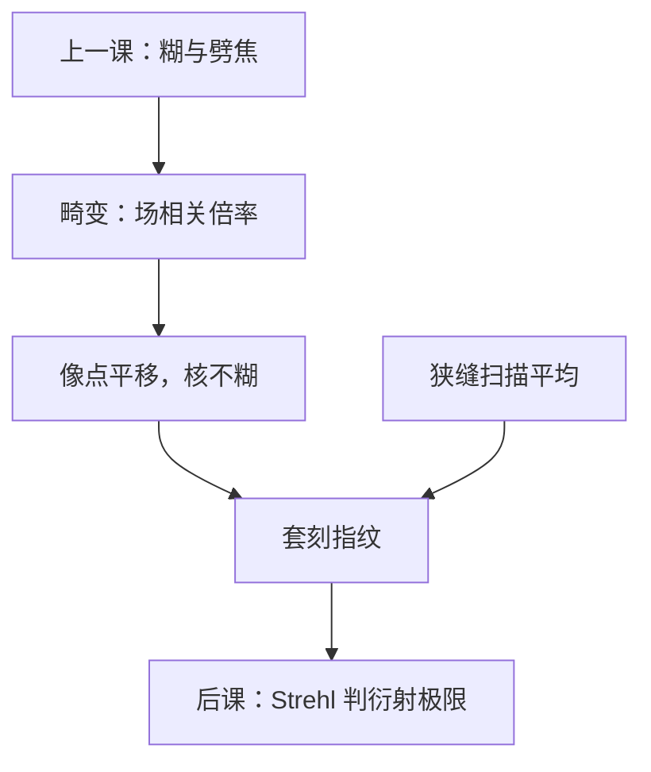

# 畸变

像散还在把点拉成焦线；畸变不增加糊斑，只让理想像点按视场挪位——桶形或枕形一次写进套刻指纹。

<footer>—— Levinson, Principles of Lithography 对光学畸变与套刻的表述</footer>

[上一课](/litho/astigmatism-field)把 H/V 焦线与场曲钉死。缺口是：**即使落在当地最佳焦面上，像点仍可能不在高斯位置**。本课只谈畸变（Seidel $S_V$）如何进套刻。把整瞳 RMS 收成衍射极限判据，留给[Strehl 比](/litho/strehl-ratio)。不要从瑞利 CD 重讲，也不要引用未公开的镜头畸变残差图。

## 问题

初级畸变波前对孔径是倾斜（$\propto\rho\cos\phi$），系数随视场三次方涨：每个场点看见的是当地倍率误差，不是模糊。桶形：边缘倍率小于近轴；枕形相反。光刻扫描场要的是栅格仍是栅格；畸变把矩形拉成枕或桶，层与层之间若指纹不同，套刻超标——即使两层的 NILS 都合格。缺口因此是这条**位置误差**，而不是再劈一次焦线。

远心也是倾斜项，但远心的倾斜随离焦才变成 $\Delta x$；畸变在 $z=0$ 已经在。场曲改的是哪一个 $z$ 最好，不改高斯点的径向放大率（到初级）。

### 畸变不是 CD 误差

阈值等高线的宽度由 NILS 与剂量决定；畸变把整条等高线平移。计量若用同一套标记既报 CD 又报套刻，要把「图形变胖」和「图形搬家」拆开。Levinson 把畸变放进套刻光学桶，与工件台、晶圆变形并列。

扫描方向上狭缝积分把静态枕形收成一条有效畸变。报指纹必须声明是静态透镜还是扫描平均后的晶圆结果。

## 方法

对视场网格量或仿真像点位移 $(\Delta x,\Delta y)$，拟合到 Seidel 畸变或高阶多项式（以及可补偿的放大、旋转、非正交）。镜头操纵能吃掉一部分低阶；吃不掉的高阶进套刻模型或进层间匹配。本课不列机台补偿器名单。

波前语言：畸变是场相关的 $Z_2$、$Z_3$（倾斜），与远心那对倾斜同形、场依赖不同。拟合时要把「全局放大」与「三次畸变」分开，否则对准模型会把光学指纹当成晶圆膨胀。

### 与套刻标记的空间频率

标记通常比器件稀疏。畸变本身与频率无关——它是几何点的搬家。但若标记落在场内与器件不同的位置，读到的套刻不是器件处的畸变。高阶指纹下「标记合格、器件不合格」可以是采样问题，不一定是彗差。

浸没与干式、或两台镜头之间的畸变指纹不同，是层间套刻的经典光学项。匹配靠补偿与选场，不靠再加大 $\mathrm{NA}$。

## 机制

孔径上的线性相位使像平移，平移量随 $H^3$ 变，网格被非线性拉伸。强度点扩散的宽度（球差、像散、彗差决定）可以仍然接近衍射极限，Strehl 下一课可以很高，套刻却已经超标——这正是畸变必须单独成课的原因：对比判据看不见它。

扫描机沿狭缝扫过不同 $H$，瞬时畸变被时间平均。有效指纹比静态透镜平滑，但残留的高阶项仍在。热漂移让指纹随负荷变，与 Zernike 课的加热补偿是同一类控制，通道不同。

### 后课默认的接口

说到套刻光学指纹、桶/枕、层间匹配，先问畸变（静态与扫描平均），再问远心 $\alpha\Delta z$ 与彗差假套刻。Strehl 与 MTF 不替代本课。下一课用 RMS 波前谈「还能不能叫衍射极限」，默认已经把不糊的搬家拆走。

## 边界

本课不含晶圆热膨胀、不含对准算法的高阶模型细节。那些会与光学畸变相加，定义仍是投影几何的场相关倍率。禁止编造未公开的纳米畸变图；Levinson 的预算分类与 Seidel $S_V$ 已经够用。EUV 物方斜入射的阴影位移是掩模三维，不要全部记成投影畸变。

## 小结

- 畸变改像点位置，不增加糊斑；初级项随视场三次方。
- 直接进套刻指纹；与 CD / NILS 分桶。
- $z=0$ 已存在，不同于远心的 $\alpha\Delta z$。
- 扫描平均改变有效指纹，须声明读图条件。
- 整瞳是否衍射极限，下一课用 Strehl。
- 出处：Levinson, *Principles of Lithography*；Seidel 畸变见 Born &amp; Wolf。
