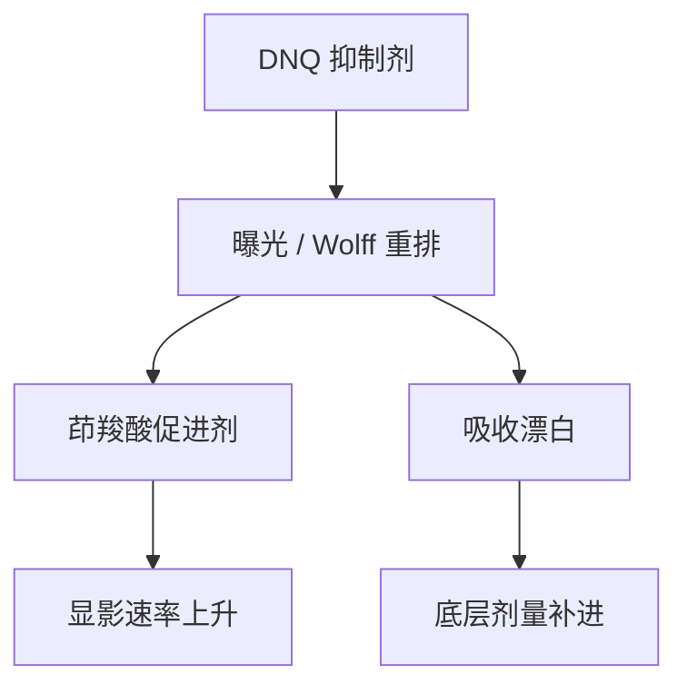

# DNQ–Novolac 胶

曝光把溶解抑制剂变成溶解促进剂：一个光子大约办一件事，灵敏度靠漂白与胶厚，不靠催化循环。

<footer>—— 据 Reiser 对 DNQ 光化学的论述，以及 Mack 对 i 线正胶显影模型的表述整理</footer>

[上一课](/litho/positive-vs-negative)（正胶与负胶）。把扫描机焦轴做成可以故意摊开的窗。成像与分辨率到此结束。缺口换成记录介质：窗的另一条边是胶怎样把空中像切成浮雕。本课写 CAR 之前的默认正胶——i 线的 DNQ–Novolac。[化学放大](/litho/car-resist)是下一课，不要在这里预支 PAG。

## 问题

扫描机写下剂量。没有光敏材料，剂量只是热量与光子计数。i 线（365 nm）上量产用了很久的答案是：酚醛树脂（novolac）做成膜聚合物，重氮萘醌（DNQ）当光敏剂。未曝光时 DNQ 抑制碱性显影；曝光后 DNQ 经 Wolff 重排变成茚羧酸，反过来促进溶解。缺口是这套「抑制剂 ↔ 促进剂」开关，而不是再讲一遍狭缝。

没有化学增益：吸收一个光子，大约转化一颗 PAC。要够敏，就得让 PAC 吸收够多——于是胶更厚、或曝光更慢。短波（KrF 起）novolac 自己吸收变强，底部吃黑，薄膜又撑不住灵敏度，这才把下一课的 CAR 逼上台。本课默认停在 g/i 线工作点。

### 漂白是机制的一部分

DNQ 曝光后吸收下降（漂白）。上层先透明，光子更容易到下层，部分补偿厚胶的底部剂量不足。CAR 没有同等的「越照越透」红利。把 i 线剖面的直壁完全写成「γ 高」，会漏掉漂白对轴向均匀的贡献。

Dill 的 A/B/C 参数就是为这类可漂白 PAC 写的：A 是可漂白吸收，B 是不可漂白底，C 是曝光速率。Mack 的紧凑模型从这里接到显影。后课 CAR 仍借用 ABC 的语言，但增益不在 ABC 里。

## 方法

配方：novolac + DNQ PAC + 溶剂；显影用碱性水溶液。前烘赶溶剂、定膜厚。曝光写 PAC 转化分数 $m$ 的空间分布（潜像），没有 PEB 催化这一步——可以有软烘/硬烘，但不是酸扩散时钟。显影速率随 $m$ 降（抑制剂变少）而升，切出浮雕。

对比来自溶解开关的非线性，不是来自一个光子打许多反应。衬度曲线仍是 $T(\log E)$，定义留给显影课；本课只要求后课提到 i 线胶时，默认无 PAG、无淬灭剂、无 PEB 酸核。

### 与扫描产能

灵敏度低，扫描必须慢或脉冲必须强。i 线汞灯不是准分子脉冲串，步进器曾长期够用。不要用 NXT 的 wph 反推 i 线步进器该扫多快。本课的对象是化学开关，不是工件台。

## 机制

Reiser 把 DNQ 的光化学写成：光子引发释放氮气，重排得烯酮，有水则成羧酸。羧酸在碱水里电离，novolac 酚羟基一起溶。未曝光区 DNQ 与树脂的相互作用把溶速压到很低，这才有暗区留膜。PAC 加载太高，未曝光区也开始掉；太低，开关不够陡、灵敏度不够。开关的陡度决定 γ，环境湿度会影响烯酮去路，这是轨道与存储要管的，不是镜头 NA。

驻波在透明 i 线胶里很明显，因为衬底反射强、胶吸收不极端。BARC 后课再写。本课只承认：潜像沿 $z$ 已经被干涉调制，DNQ 转化分数不是空中像的复印件。前一课的 focus drilling 在厚胶植入层上常与这套化学一起用：光学把焦轴摊开，漂白把轴向吸收补一截，两笔账不要合成「胶很神奇」。

负胶、交联胶在 i 线也存在。本课默认正性 DNQ–Novolac，因为量产逻辑/存储前段的主流正胶路径从这里接到 CAR。不要并列开一套百科。

## 边界

本课不写 193 nm 的丙烯酸酯聚合物，不写 EUV 金属氧化物。也不把某瓶 i 线胶的 $E_0$ 当成所有轨道的常数。157 nm 与早期 KrF 曾尝试过非 CAR 体系，那是材料史的分叉，不在主干展开。

下一课的 CAR 要解决的正是本课在 DUV 上的失败模式：薄膜 + 够敏。读 CAR 时默认已经知道「没有增益时光子必须一比一买溶解开关」。Dill ABC 仍可借用，增益不在 ABC 里。

g/i 线步进器长期够用，不是因为化学更简单，而是汞灯连续照明不依赖准分子脉间积分。

## 小结

- DNQ–Novolac 用 PAC 转化在抑制剂与促进剂之间切换，无催化放大。
- 漂白帮助厚胶底部曝光；Dill ABC 描述可漂白吸收。
- 无 PAG / 淬灭剂 / PEB 酸扩散；潜像就是 PAC 分数。
- DUV 薄膜灵敏度不够，才接到下一课 CAR。
- 湿度与存储影响烯酮去路，那是轨道问题，不是 NA。
- 与 focus drilling 补底部是不同机制，不要合成「胶很神奇」。
- 出处：Reiser, *Photoreactive Polymers*；Mack, *Fundamental Principles of Optical Lithography*。
