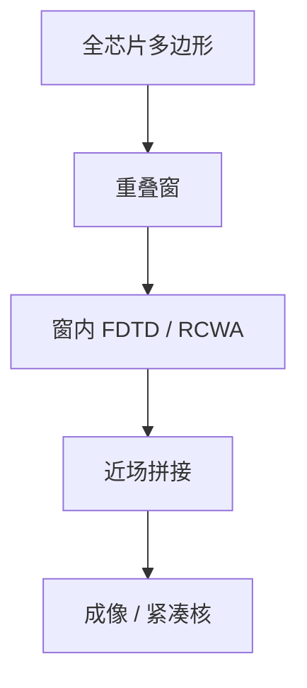

# 域分解掩模电磁

全场麦克斯韦不可算；把掩模切成重叠域，近场拼接，用严格解去伺候 OPC 真正在乎的那一圈边。

<footer>—— 对照掩模 EMF 域分解 / 重叠近场拼接的计算光刻公开方法</footer>

[上一课](/litho/rcwa)把周期结构交给模态法。缺口是逻辑版既非无限周期也不可整场 FDTD。本课钉域分解。严格近场如何变成可校准的胶模型，留给[下一课](/litho/resist-model-calibration）。

## 问题

OPC 要的是局部空中像对碎片的灵敏度。掩模 3D 的电磁相关长度通常比设计规则短：离边几个波长外，场接近「局部环境 + 周期近似」。域分解：把版切成带重叠的窗口，每个窗口 FDTD 或 RCWA 超胞，再把近场在重叠区混合，避免缝上的假衍射。Adam–Neureuther 一类工作与后续 EDA 实现走这条工程路。

缺口是**可拼的严格性**，不是发明一种新麦克斯韦。把域分解当「免费全芯片 FDTD」，重叠与窗宽选错会在缝上造热点。

### 窗宽是物理不是软件参数

窗必须覆盖电磁相关长度与助条邻域，否则边界条件（周期、PML）污染中心像素。窗太大则回到算力墙。这与光学 TCC 的核半径不同：一个是掩模近场，一个是投影成像。

分解是空间上的；与 SMO 的光瞳分解不是一件事。不要把「decomposition」在双重图形着色课里的词义混进来——那是后课着色。

## 方法

流程：按图形密度或规则网格切窗 → 每窗严格 EMF → 重叠加权拼接 → 远场成像或生成局部边界条件给紧凑核。热区窗加密、稀疏区用薄屏。与 GPU：窗独立，可并行，但仍不是全芯片每迭代全严格。

验证：与大窗 FDTD 参考比中心 CD；缝上 EPE 必须低于预算。

## 机制

麦克斯韦是局域微分方程，信息以有限速度（数值上以网格）传播；稳态频域里是倏逝衰减长度。超过衰减长度，远处几何对本地近场的贡献可忽略，于是分解合法。金属波导般的异常结构可以让相关长度变长，窗宽经验必须覆盖这类图形，不能只按介质石英估。

## 边界

域分解不消除材料 $n,k$ 误差，不替代 AIMS 对修复材料。缝伪影是方法风险，必须有监测。不把某 EDA 模块名当算法定义。

后课默认：严格 EMF 可以按窗提供教师数据；下一课用这些（外加晶圆 FEM）去校准紧凑胶模型。

## 小结

- 域分解用重叠窗把严格掩模 EMF 接到可算尺度。
- 窗宽由电磁相关长度决定；缝必须验证。
- 仍不能每步全芯片严格，只给紧凑核与热区当老师。
- 出处：掩模 EMF 域分解的计算光刻公开方法（Adam–Neureuther 传统及后续工程实现）。
