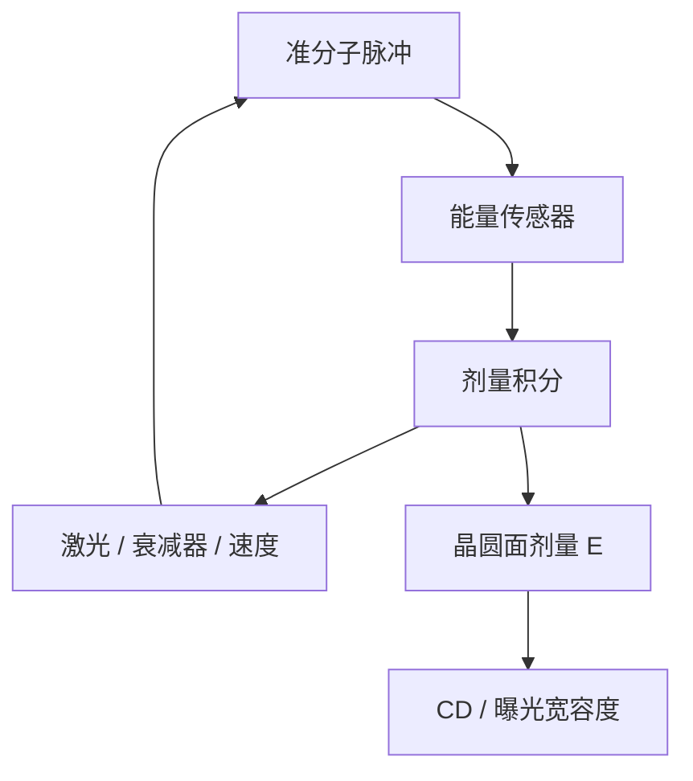

# 剂量控制

扫描机写下的不是「开过灯」，而是每个晶圆点积分到的能量密度；能量传感器与闭环把这场积分锁进工艺窗的剂量轴。

<footer>—— 据 Levinson 对曝光剂量控制与能量监测的论述整理</footer>

[上一课](/litho/slit-scan-average)把剂量写成狭缝剖面除以扫描速度的积分。缺口是：积分值如何被测到、如何被拧回目标 $\mathrm{mJ/cm^2}$。脉冲在跳、激光在热、衰减器在老，没有闭环，上一课的平均算子只是一句运动学。本课钉剂量控制。故意走焦扩窗留给[下一课](/litho/focus-drilling)。

## 问题

准分子脉冲能量有脉间涨落，光源功率随气体寿命与重复频率变。扫描时每个晶圆点只在狭缝下停留很短一段时间，吃到的是有限个脉冲之和。上一课给出 $E\propto v^{-1}\int I\,\mathrm{d}y'$；缺口是谁在量 $I$、谁在改 $v$ 或衰减，使 $E$ 落到曝光宽容度里面。

剂量误差直接乘到 CD 上，斜率由 NILS 与胶 $\gamma$ 决定。把 CD 飘全部写成「胶批次」，会漏掉激光室和能量传感器。把剂量闭环当成可以补空中像对比，又会高估控制——对比不够的节距，剂量再稳也没有窗。

### 开环积分不够

只按名义功率 × 时间算剂量，忽略脉间涨落与照明效率漂移，一场之内就会画出沿扫描的剂量斜坡。必须用能量传感器看真实到达（或可追溯到晶圆面）的能量，再在脉冲串内补偿。

剂量的单位是 $\mathrm{mJ/cm^2}$，是面能量密度，不是激光头的毫焦。报数要声明是晶圆面还是传感器面、有没有计 pellicle 与透镜透过率。EUV 还要计收集器与膜，本课默认 DUV 扫描机。

## 方法

典型闭环：脉冲能量传感器取样每一发（或高占空比抽样），积分器按目标剂量累加；偏差通过激光高压/能量设定、可变衰减器或扫描速度修正。狭缝内还有沿 $x$ 的均匀性调节（照明器），那是静态剖面，与本课的「总剂量」正交——上一课已经分开两轴。

控制目标通常是场内均值进规格，再加沿扫描、沿狭缝的均匀性。沿扫描的楔形多半是积分器没跟上慢漂；沿狭缝则是照明剖面，上一课的静态轴，不能靠加速扫描来抹平。CD 反馈（ADI）是更外一环，慢，用来修胶、BARC、光源老化的系统偏；内环必须在每一场把脉冲积分锁住。两环不要抢同一个执行器：用 SEM 去跟脉间噪声，来不及。

### 与产能的耦合

目标剂量高，要么降 $v$、要么要更强的脉冲能量。灵敏度差的胶直接打 wph。本课只承认这道算术，不把 CAR 增益提前写成处方——那是抗蚀剂课。Focus drilling 会故意摊开焦点，有时还要加剂量补对比，那是下一课对窗的取舍，本课先把「能把剂量钉住」当作前提。

## 机制

每个晶圆点的剂量是狭缝通过期间脉冲能量的和，再乘光学链路透过率。传感器必须放在能代表晶圆面的位置，或用可标定的比例去推。脉间涨落若白，多脉冲平均会压 $1/\sqrt{N}$；若慢漂（气体、热），积分器看到的是斜坡，必须用执行器跟上，否则沿扫描 CD 呈楔形。

曝光宽容度把 $\Delta E/E$ 翻译成 $\Delta\mathrm{CD}$。NILS 高的图形对剂量误差不敏感，预算可以松；禁戒节距相反。所以剂量规格不能对所有层抄同一个百分数。套刻预算里的扫描同步与本课正交：一个钉位置，一个钉能量。离焦会改有效 ILS，从而使同一剂量误差对应更大的 CD 误差，因此剂量环与调平环要一起合格，而不能只报能量传感器的百分数。场与场之间的剂量匹配（同一片、同一批）另进 CDU：内环锁的是「这一场到了」，外环才看见胶厚、BARC、光源老化把有效剂量挪走。

「剂量到了」不等于空中像对了。衰减器 mag 会轻微改照明，极端时动 $\sigma$。把剂量旋钮当纯标量，偶尔会把 OPE 曲线一起拧歪。大动作之后要复测均匀性与邻近曲线。

## 边界

本课不写某型号激光器的气体寿命表，不把 EUV 剂量（含随机、膜透过）一次做完。也不讨论轨道涂胶均匀性——那是胶厚对有效剂量的调制，对象在晶圆上而不是在照明器里。

不要把数据表上的「剂量稳定性 0.5%」写成所有层的 CD 已进规格。没有 $\gamma$ 与 NILS，百分比没有纳米。Focus drilling 是下一课：走焦之后工作点的 $E$ 会变，闭环仍用同一套传感器，只是设定值不同。

## 小结

- 剂量是狭缝下脉冲积分得到的面能量密度，须传感器闭环。
- 执行器是激光能量、衰减器或扫描速度；与沿狭缝均匀性调节分开。
- 内环锁场，外环（ADI）修系统偏，不要用 SEM 跟脉间噪声。
- $\Delta E$ 经 NILS 与 $\gamma$ 变成 $\Delta\mathrm{CD}$，规格按层而不是抄百分比。
- 走焦之后只改设定值，不换传感器链路。
- 狭缝均匀性是静态轴，不能靠加快扫描抹平。
- 出处：Levinson, *Principles of Lithography*；Mack 对曝光剂量与工艺窗剂量轴的讨论。
