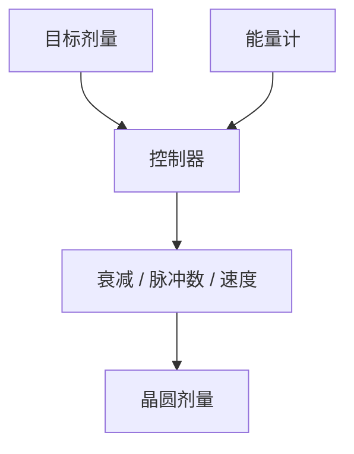

# 剂量传感闭环

脉冲能量会抖，气体会老。闭环用狭缝附近的能量计把脉冲数和衰减器扣到目标剂量，不是把激光开到最大。

<footer>—— 对照 [剂量控制](/litho/dose-control)；扫描投影机能量传感器</footer>

[上一课](/litho/pupil-metrology)校准角谱。缺口是标量：这场要多少 mJ/cm²。主干剂量课写过控制目标；本课写传感器与执行器在机台里怎么环。

## 问题

开环按名义 $E_p\times N$ 会随气体寿命漂。[脉冲能量](/litho/pulse-energy-rep-rate) 课已指出抖动。没有现场传感，CDU 的剂量项不可控。传感器脏了或标定错了，闭环会把系统偏差锁死。

## 方法

能量计放在照明路径取样位置（部分反射）。执行器：可变衰减、脉冲计数、扫描速度。每场或每扫描带修正。标定用剂量垫或剂量晶圆，把传感器读数接到胶上的有效剂量（含狭缝透过与扫描平均）。

传感器看到的是照明取样，不是胶里的化学剂量。换胶、换 BARC 不自动改闭环增益；有效剂量要重新标定。

## 机制

反馈把 $E_p$ 慢漂压住。脉冲间高频抖动若快于环带宽，仍进剂量噪声——需要激光自身稳定（上一课序）。扫描速度调制可补偿狭缝向残纹，与均匀性课耦合。

## 边界

下一课光源功率稳定：激光侧如何少给闭环添乱。传感环不能替代光瞳计。

## 小结

- 剂量闭环 = 能量计 + 衰减/脉冲/速度。
- 标定必须接到胶上的有效剂量。
- 出处：剂量控制课；扫描机能效通识。
