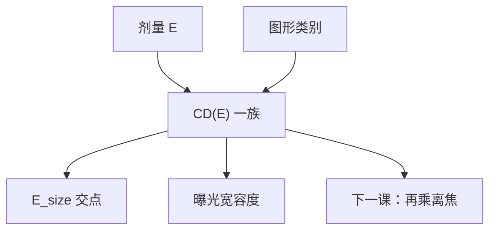

# 剂量-尺寸曲线

$E_\mathrm{size}$ 是目标 CD 上的一个点；剂量–尺寸曲线才问：剂量再漂一点，边横着走多远，疏密是否一起走。

<footer>—— 据 Mack 对 CD(E) 与曝光宽容度的读图；产线亦称 dose–CD 曲线</footer>

[上一课](/litho/e0-esize)钉死两个剂量锚点。缺口是把 $E_\mathrm{size}$ 展开成整条 $\mathrm{CD}(E)$：产线拧剂量、算曝光宽容度、看 iso–dense 是否同向，都靠这张图。本课钉剂量–尺寸曲线。剂量与焦深如何耦成一张窗，留给[下一课](/litho/dose-focus-coupling)。

## 问题

固定焦距与照明，扫剂量，量某一类图形的 CD，得到 $\mathrm{CD}(E)$。正胶密线通常剂量升则线变瘦（清掉区变宽）。斜率 $d\mathrm{CD}/dE$ 在目标处决定曝光宽容度：[曝光宽容度](/litho/exposure-latitude) 把相对剂量宽度写成规格百分比；本课提供那条斜率的实验来源。

缺口不是再定义 $E_\mathrm{size}$，而是：一条曲线只对一类图形成立。孤立线、密线、孔的 $\mathrm{CD}(E)$ 斜率与截距都不同，这就是 iso–dense 偏置随剂量走的原因。只报一个 $E_\mathrm{size}$，看不见疏密是否在同一剂量下同时进规格。

### 它不是衬度曲线

衬度曲线的纵轴是剩余厚度，横轴是大垫剂量。剂量–尺寸的纵轴是图形 CD。$\gamma$ 高通常让 $\mathrm{CD}(E)$ 更陡，但陡度还乘光学 ILS。把两张图叠名，会把光学问题写成「胶 γ 漂了」。

必须声明 ADI 还是 AEI。刻蚀偏置随密度变，AEI 的 $\mathrm{CD}(E)$ 不是胶曲线的平移副本。

## 方法

曝光矩阵：剂量轴要跨过规格带两侧，以便拟合斜率，而不是只打在目标一点。同时测密/疏/反向，得到一族曲线。模拟：LPM 或轮廓仿真都能画，但验收以硅片为准。MEEF 大的层，掩模 CD 误差会让整族上下平移，看起来像剂量环失锁——要用掩模计量对拍。

[NILS](/litho/nils-ils) 预言相对 CD 误差反比于 NILS。本课的实验斜率是那句预言经过 $\gamma$ 与 $\ell$ 之后的实现。差一截，差在胶核与计量。

## 机制

边钉在化学阈值面上。剂量整体乘一个因子，空中像 $I$ 相对阈值移动，边沿 $x$ 方向的位移 $\approx (\Delta E/E)/\mathrm{ILS}$ 量级，再被显影非线性改形状。NILS 低的节距，同样 $\Delta E$ 走出更大 $\Delta\mathrm{CD}$，曲线更陡，窗先在剂量轴关上。酸扩散把 ILS 再砍一截，曲线更陡——看起来像胶很「敏」，其实是核把光学斜率吃了。

flare 抬台基，暗区接近阈值，过剂量时桥接会在 $\mathrm{CD}(E)$ 尚未走出 CD 规格时先出现。所以这张图还要叠缺陷判据，不能只看平均 CD。

孔的 $\mathrm{CD}(E)$ 往往比线更陡，因为二维边更吃 NILS。同一层不要用线的宽容度签核孔。

## 边界

不在这里画完整 E–D 面积——下一课加焦轴。不重推瑞利 CD。随机尾部会让「平均 CD 仍在曲线上」的晶圆已经缺孔，均值曲线仍然要画，只是不能当良率的充分条件。

## 小结

- $\mathrm{CD}(E)$ 把 $E_\mathrm{size}$ 展开成斜率与疏密族。
- 曝光宽容度读目标处的 $d\mathrm{CD}/dE$，不是读大垫 $\gamma$ 本身。
- 一类图形一条曲线；孔与线禁止混签。
- 声明 ADI/AEI；flare 可能让缺陷先于 CD 越界。
- 出处：Mack 对 CD(E) 与 EL；主干[曝光宽容度](/litho/exposure-latitude)。
