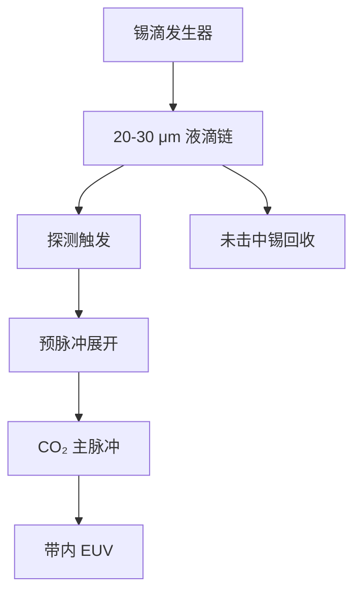

# 锡滴发生器

预脉冲配方假定每一滴都准时、同位、同质量地走进焦斑；发生器把这件事做成数十 kHz 的流体力学合同。

<footer>—— 改写自 ASML / Cymer 对 LPP 锡滴发生器的公开叙述</footer>

[上一课](/litho/euv-prepulse)把转换效率从实心球的约 1% 抬到展开靶的约 5–6%。缺口是：那两枪只对「滴已经在预定时空点」成立——直径约 20–30 μm、重复频率约 50 kHz 量级、位置抖动小于主脉冲焦斑。本课钉锡滴发生器。碎屑如何打收集镜，留给[下一课](/litho/tin-debris)。

## 问题

量产 LPP 不能用烧蚀固体锡盘：靶材不可补充、碎屑谱不可接受。[LPP](/litho/euv-lpp-tin) 把每次击打的质量量子化成一滴液锡。发生器必须在真空里连续喷出尺寸均匀的球，并让探测系统在预脉冲到达前锁定轨迹。缺任何一项：主脉冲打空，IF 功率掉，未电离的锡变成最难清的微滴。

扫描曝光把光子预算摊在狭缝驻留时间上。滴频必须与激光重频对齐，才能在[剂量](/litho/euv-power-throughput)合同内攒够带内能量。频率不是越高越好：相邻滴的尾流、氢气流和上一次等离子体残荷会改下一滴的形状与落点。发生器要交的是稳定的时空栅格，不是实验室里的单滴纪录。

### 抖动比平均直径更毒

公开叙述里滴径约 20–30 μm，质量纳克级。平均尺寸偏一点，预脉冲展开时间可以重调；逐滴位置与速度抖动会让预脉冲偏心，盘法向歪掉，主脉冲看到侧缘。CE 和离子抛射方向一起漂，剂量环只能加激光能量硬扛，碎屑谱往往更差。伺服对象因此是落点，不是喷嘴上的平均流量。

发生器喷出的是液锡球，不是 13.5 nm 光束。曝光光仍来自主脉冲点燃的 Sn 离子 UTA。不要把「滴频 50 kHz」写成光源的光学调制频率——它是靶的到达率。

## 方法

一条公开链是：储锡与控温 → 喷嘴形成射流或受激液滴链 → 真空中飞行 → 光电探测触发预脉冲与主脉冲 → 未击中或残余锡回收。Cymer 并入 ASML 之后，发生器与 CO₂ MOPA、收集舱写在同一套光源架构里，而不是外挂一台商品喷雾器。

探测给出到达时刻与横向位置，激光延时按飞行时间外推到相互作用点。氢缓冲在这个时间尺度上近似定常，它不生成滴，但改变阻力和卫星滴的命运。回收与加热回路把未用锡送回，避免腔壁长成金属膜，也避免喷嘴因氧化或冷凝堵死。

### 与双脉冲时序锁在同一时钟

50 kHz 量级意味着相邻滴间隔约 20 μs，预脉冲到主脉冲只有数微秒膨胀窗。发生器时钟、滴探测和两束激光必须是同一条触发树。改滴径等于改光学厚度与展开时间，预脉冲能量表要重资格认证，不能把「5–6% CE」当成与发生器无关的常数。

## 机制

连续射流在表面张力下断裂成滴；量产需要把断裂做成受控的等间距链，而不是随机卫星滴。卫星滴打在焦斑外，既不出光，又给收集镜送微滴。温度决定黏度与蒸气压：太冷则喷射不稳，太热则蒸发在喷嘴和飞行段上镀锡。真空中没有空气动力稳定翼，横向扰动会一直积分到相互作用点。

命中率直接进平均 IF 功率，也进剂量噪声。扫描狭缝上的瞬时功率抖动变成 CD 抖动；[随机效应](/litho/euv-stochastics)要的是剂量绝对值，发生器要的是脉冲间可重复的靶。两者同时坏时，加激光能量往往先把碎屑打猛，再把收集镜寿命吃掉。

公开材料给出滴径量级、数十 kHz 重频和「位置必须进焦斑」的稳定性要求，不给出喷嘴孔径与压电波形。后课只引用这条合同，不把会议海报上的实验室喷滴写成厂内配方。

## 边界

本课不重写预脉冲流体力学，也不把磁场碎屑抑制算进发生器。滴频上限受喷嘴寿命、回收热负荷和等离子体残荷限制，不要把「更高 kHz」外推成必然的下一代 CE。后课默认：说到 LPP 靶，先问发生器是否把滴送到预脉冲能展开的时空盒里。

与固体靶的对比已经在 LPP 课里：发生器换来可补充的量子化靶，代价是真空精密流体力学。国产替代叙事里「会熔锡」远不等于会做这条滴链。引用以 ASML/Cymer 光源公开说明为准。

直径 20–30 μm、约 50 kHz 是公开量级，后续机型公开说过更高重频，但不要写成某一个未证实的 droprate 规格表。本课用「数十 kHz、焦斑尺度抖动」即可。

## 小结

- 发生器把锡靶量子化成约 20–30 μm 的液滴链，重频约 50 kHz 量级。
- 预脉冲 CE 合同以滴的时空到位为前提；抖动比平均直径更伤。
- 探测触发把滴、预脉冲、主脉冲锁在同一时钟上。
- 卫星滴与打空脉冲既掉 IF 功率，又恶化碎屑谱。
- 下一课从这滴打完之后的离子、中性原子和微滴写起。
- 出处：ASML / Cymer LPP 锡滴发生器公开材料。
