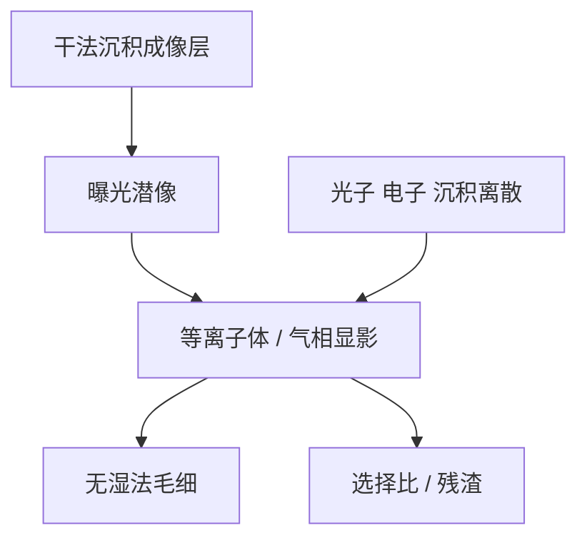

# 干法显影胶

湿法显影把链溶进液体，毛细力与溶解噪声一起到场；干法显影用等离子体或气相选择比去掉未成像部分，换的是噪声通道和倒塌预算，不是取消随机。

<footer>—— 据干法抗蚀剂 / 干法显影的公开工艺叙述（气相沉积金属胶与等离子体显影一类）</footer>

[上一课](/litho/mor-stochastics)把 MOR 的团簇随机写完，默认仍可走湿法显影。缺口是另一条工艺边：干法显影胶——成像层气相沉积、显影用干法选择比，而不是 TMAH puddle。本课钉机制与随机含义，作为「计数噪声到缺陷」课序的收束。下一课程从[旋涂均匀性](/litho/spin-coating-uniformity)进入轨道，湿法涂布重新成为默认，但本课已声明干法栈存在。

## 问题

湿法：$R(m)$ 在液体里推进，毛细力矩倒塌，溶解前沿贡献 LER。[倒塌](/litho/pattern-collapse) 与深宽比在 High-NA 薄膜预算里已经很紧。干法显影用等离子体（或气相反应）按化学状态选择去除，毛细通道取消，倒塌预算换成形貌与选择比：过显影啃侧壁，欠显影留残渣，看起来像桥或 footing。

气相沉积（干法涂布）可以做得很薄、含金属以提高 EUV 吸收，与上一课 MOR 吸收策略同向，但成膜不再是旋涂分子量那一套。缺口不是再写锡氧配体，而是：随机从「溶解噪声 + 毛细」换成「沉积离散 + 等离子体选择比 + 仍在的光子/电子」。

### 干法不是零随机

光子与二次电子仍在。沉积若以岛或晶粒生长，又是一套团簇计数。等离子体各向异性会把潜像噪声转印并可能放大侧壁。宣传「干法解决随机」若只展示倒塌改善，没有缺陷率曲线，等于没签核随机窗。

公开路线里 Lam 等讨论的 dry resist（干法沉积 + 干法显影）是这一课的工艺所指之一。课标是机制，不是商标或未公开配方。

## 方法

资格：剂量–CD、LCDU、缺陷 vs 剂量、侧壁、残渣、腔体沾污、与底层选择比。对照必须含同一光学下的湿法 MOR/CAR，否则在比倒塌而不是比随机。OPC 紧凑模型要重校准：没有湿法 Notch，$R(m)$ 换成干法速率对配体/网络分数的函数。MC 抽沉积岛与等离子体前沿，或至少换显影模块。

轨道含义：涂胶碗不再是成像层主路径，真空腔体颗粒与聚合物沉积均匀性变成 CDU 项。下一课程的旋涂课仍对 BARC/SOC 与湿法层有效。

## 机制

潜像仍是化学状态的空间图（配体密度、交联、金属–氧网络）。干法前沿的法向速度由选择比与局部状态决定，类比 $R(m)$，介质是等离子体而非 TMAH。选择比有限时，过刻把 CD 拉开，欠刻桥接。没有液体，倒塌的毛细项消失，但薄膜应力与等离子体诱生粗糙还在。

沉积离散：气相生长的厚度泊松或岛状成核，薄到十几纳米时相对涨落可观，这是新的 $N$。吸收金属提高光子利用率，与 MOR 课同一 S 角逻辑。腔体交叉污染是系统缺陷通道，对拍重复性，不要并进光子泊松。

湿法显影的表面活性剂与冲洗规对干法栈不适用。去胶与灰化路径也要重开。集成约束与锡氧课的沾污门同类。

## 边界

不写腔体食谱、不编选择比「标准值」、不宣布某节点已切换干法。本课程平均场从 Dill 走到轮廓，随机从计数走到缺陷；干法显影是显影模块的另一实现，ABC 与光子统计仍然成立。下一课程轨道工艺默认湿法旋涂，遇到干法成像层时回到本课换模块，不要把 spin-speed 公式套到 CVD 上。

## 小结

- 干法显影用选择比去掉未成像部分，取消湿法毛细倒塌，换来残渣与等离子体粗糙。
- 随机仍含光子、电子与沉积离散；必须交缺陷曲线。
- 紧凑 $R(m)$ 与 MC 显影模块要换族。
- 公开 dry resist 路线是工艺实例，不是牌号课。
- 出处：干法抗蚀剂公开工艺叙述；Naulleau 随机一般框架；上一课 MOR。
