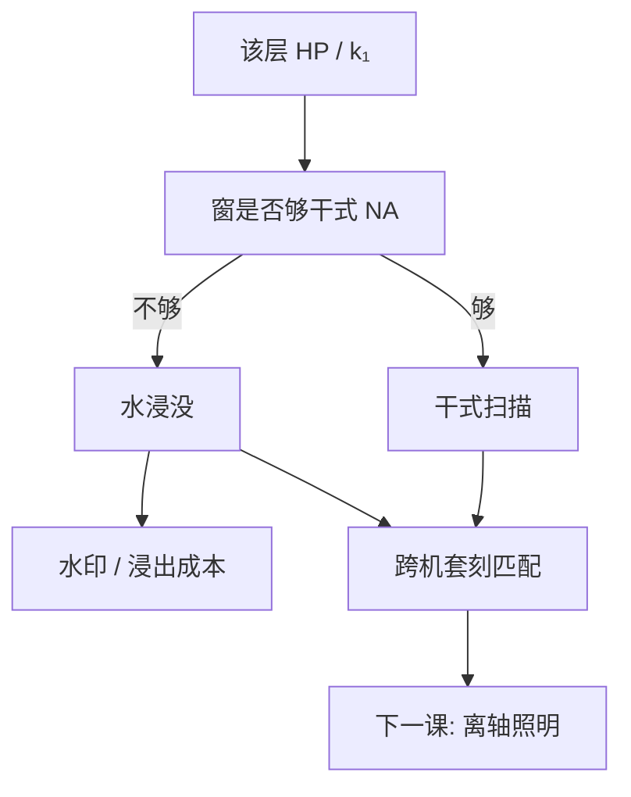

# 干式层对浸没层

不是每一层都需要 1.35 NA。干式机做植入与非关键层，浸没机做临界半节距；分层是成本与缺陷预算，不是光学洁癖。

<footer>—— 据 Levinson 对层别光刻策略与干式 / 浸没分工的讨论整理</footer>

[上一课](/litho/high-n-immersion)把第二代高 $n$ 流体钉成未量产。缺口是：水浸没成为唯一量产高 NA 路径之后，哪些层真的要上水，哪些层留在干式。本课钉干式层对浸没层。离轴照明从[下一课](/litho/off-axis-illumination)改光瞳，不在这里排偶极。

## 问题

高 $n$ 没来，临界密集层用 ArF 浸没 + RET / 多重；但晶圆上还有注入、阱、非关键金属、钝化开口——它们的 HP 用干式 ArF 甚至 KrF 的 NA 就进窗。浸没多买的是 NA、也多买水印、浸出、头维护和机时单价。把所有层赶进浸没，是在用缺陷与成本买用不上的分辨率。

缺口不是再论证水的 $n$，而是层策略：按 $k_1$ 窗口、套刻、缺陷敏感度把层分成干式与浸没（以及后课的多重、EUV）。Levinson 把光刻写成按层选工具，而不是一颗芯片一种波长。

### 节点名仍不是机台名

同一商品节点里，关键栅/金属/孔走浸没或 EUV，植入走干式，是常态。把「本代已上浸没」读成没有干式扫描机，是把新闻稿当截面工艺。产能会计也按层加：干式机的 wph 条件与浸没机不同，不能抄同一张剂量表。

干式不是「落后的浸没」。干式 NA 约到 0.93 量级，无水膜，缺陷物理回到颗粒与胶，套刻机台匹配是另一张表。选干式是因为窗口够用。

## 方法

分层判据可以写成清单，不必编某厂的层表。要浸没：单次 HP 已经让干式 $k_1$ 贴近地板，或必须与浸没关键层做极紧套刻而希望同一平台指纹。可干式：植入、较大接触、非关键互连，窗宽、缺陷宁可不要水印。中间层：有时用干式加更激进 RET，有时用浸没降 $k_1$ 换更松照明——看掩模与胶是否已为浸没准备好。

匹配：干式与浸没的放大率、畸变、对准波长不同，跨机套刻进预算。APC 的剂量与网格要分机群，不要把浸没的 CD 反馈灌进干式层。

### 后课默认

说到 193 nm 临界层，默认浸没水、NA 约 1.35，除非该层声明干式。说到注入与松层，默认可以干式。多重图形是临界浸没层内部的事，不是把植入也 LELE。

## 机制

瑞利式按层代入。干式 $n=1$，NA 上限公开约 0.93；浸没用水抬到约 1.35。同一 $k_1$ 地板下，可印 HP 差一截——只有差到规格里的层才付水的账。缺陷：浸没多一类流体缺陷；干式多一类颗粒与胶缺陷，没有弯月面。化学：浸没层要面涂或无面涂抗浸出胶；干式层可以沿用另一套胶。轨道与机台食谱于是分叉，不能共用「一套 ArF 胶打天下」。

套刻：关键层之间尽量同一浸没平台，减少匹配项；松层对关键层的套刻松，允许干式。这是预算分配，不是光学原理的推论。

High-NA EUV 出现后，分层会再插一档，但 DUV 内部的干式/浸没分工仍然在。本课不预支 EUV 层表。

## 边界

不编某代逻辑「几层浸没、几层干式」的数字。不把高 $n$ 未量产解释成以后也不会有任何高 NA DUV——只是到本课为止，量产点仍是水。下一课离轴照明对干式和浸没都适用，光瞳物理相同，流体不同。

KrF 干式仍承担不少非关键层；本课的「干式」包含 ArF 干与更长波长，按该层 HP 选，不要把干式等同于只有 193。离轴照明下一课对两类机都有效：干式层也可以用环形或弱偶极换窗口，不必为了光瞳先换浸没。

## 小结

- 高 $n$ 流体未量产后，DUV 高 NA 默认是水浸没；其余层可以干式。
- 按该层 $k_1$ 窗与缺陷/成本分层，不要全片浸没。
- 干式与浸没要分胶、分 APC、分套刻匹配。
- 节点上浸没不等于没有干式机。
- 干式也可以用离轴照明换窗，不必为了光瞳先换浸没。
- 出处：Levinson, *Principles of Lithography* 对层别工具选择的讨论。
