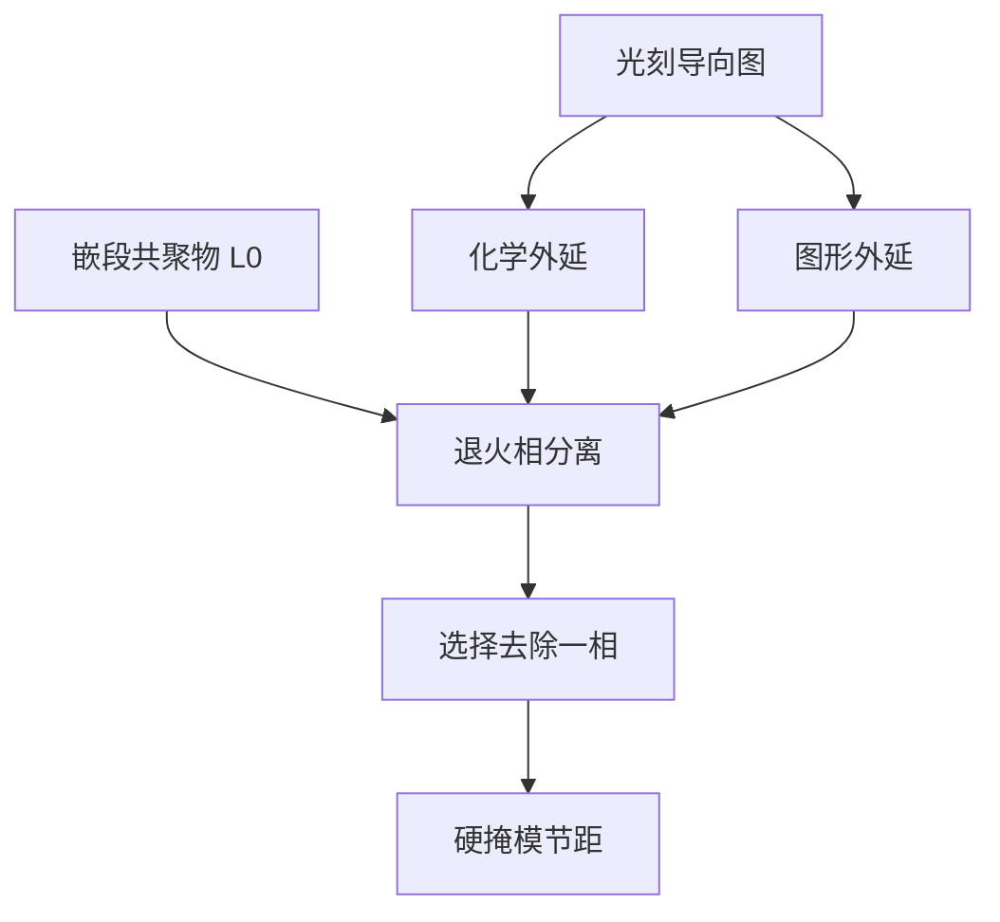

# 导向自组装 DSA

嵌段共聚物自己会选一个热力学节距；光刻只负责把导向图画对。DSA 是补投影光刻的节距，不是再买一台更短波长的镜头。

<footer>—— 对照 C. T. Black 对半导体微电子中聚合物自组装的论述，以及 IMEC 等公开的 DSA 集成</footer>

[上一课](/litho/ald-ale)把厚度收成自限制循环，对象是膜，不是节距。缺口是：节距仍由 EUV 或多重曝光定，薄膜循环填不进更密的线。导向自组装（DSA）用嵌段共聚物的本征周期做一次化学的节距倍增或孔收缩，光刻只做导向（化学外延或图形外延）。对照纳米压印从下一课才开始；本课不把模板接触当成自组装。

## 问题

多重曝光用多次套刻换节距，[SADP](/litho/sadp-saqp) 用侧墙换节距。两者都把「谁决定半节距」交给沉积或套刻。嵌段共聚物（典型 PS-*b*-PMMA 一类）在退火后相分离，周期 $L_0$ 由链长和相互作用参数钉住，不是由 $\lambda/\mathrm{NA}$ 钉住。问题是：如何让这张热力学格子对准器件需要的位置和缺陷密度。

没有导向，晶粒随机，缺陷不可用。导向过疏，缺陷湮灭不完；导向过密，又把光刻难度买回来，DSA 没有省下层。Black 把这条路写成微电子里的聚合物自组装：有用的是**导向之后的**周期，不是实验室里漂亮的指纹织构。

### DSA 不是胶

抗蚀剂记录空中像；DSA 膜在已有导向上相分离，再选择性去掉一相。它不替代 CAR 的 $\gamma$，也不替代 EUV 随机统计的全部——导向图本身仍要光刻。把 DSA 写成「不用镜头的光刻」，会漏掉导向层的套刻、CD 和缺陷。

$L_0$ 随分子量调，不是连续旋钮到任意设计节距。设计必须落在共聚物能锁住的离散周期附近。

## 方法

两条公开路线。化学外延（chemoepitaxy）：先用光刻做出浸润性条带（如 LiNe 一类流程在 IMEC / 大学合作中公开），共聚物在化学对比上注册，线密度可以是导向的倍数。图形外延（graphoepitaxy）：光刻先挖槽或孔，共聚物在侧壁约束下填入，常用于孔收缩或槽内线。随后等离子选择去掉一相，留下的一相当硬掩模往下转。

缺陷（位错、桥、漏导向）是良率项。退火时间、膜厚相对于 $L_0$、导向 CD 误差，都会改缺陷密度。IMEC 公开集成强调与逻辑或存储的设计规则对齐，而不是只报一段 TEM。本课不把 DSA 写成已经替换 EUV 量产关键层；公开状态是互补与试点，按层评估。

### 与 SADP、EUV 的分工

SADP 的半节距来自薄膜厚度，套刻主要在切线层。DSA 的半节距来自 $L_0$，导向层的 CD 和套刻决定注册误差。EUV 单次仍可能做导向，因为导向可以比最终节距松。三条路付的账不同：套刻、沉积均匀性、还是缺陷退火。DTCO 要选的是哪一种缺陷可被设计规则吸收。

## 机制

Flory–Huggins 相互作用驱使两嵌段分离；在薄膜约束下形成直立层状或圆柱。导向提供化学势或几何边界，把晶粒取向锁到晶圆网格上。倍频来自「一个导向周期里塞进 $n$ 个 $L_0$」。失败模式是注册滑移和粒界：热力学最低能量仍可能卡在亚稳缺陷，需要足够的退火与合适的导向强度。

这与 ALD 的自限制不同：ALD 按循环加厚度；DSA 按链长选节距。都是「把控制权交给材料本征尺度」，但一个管膜厚，一个管横向周期。

PMMA 去除后的选择比和 LER 决定能不能当硬掩模。漂亮的相分离图不等于可转印。

## 边界

不要发明某国产 DSA 产线的 wph 或缺陷密度。不要把 IBM / IMEC 公开演示写成所有逻辑层已切换。溶剂退火、高 χ 新材料可以改 $L_0$ 和缺陷，仍要过导向与转印两关。DSA 不抬 NA，不取消套刻；导向层仍要对准前层。

下一课的纳米压印是另一条「非投影」路：物理接触复印，不是热力学格子。

出处：C. T. Black 等对聚合物自组装进入微电子的综述；IMEC 等 DSA chemo/grapho 公开集成。不编造未公开的量产缺陷表。

## 小结

- DSA 用嵌段共聚物的 $L_0$ 补节距，光刻做导向。
- 化学外延与图形外延是两条集成，不是一种胶。
- 缺陷与注册误差是良率，不只看相分离 TEM。
- 与 SADP、EUV 分工不同，不能互相替代宣传。
- 纳米压印下一课对照。
- 出处：Black；IMEC DSA 公开材料。
