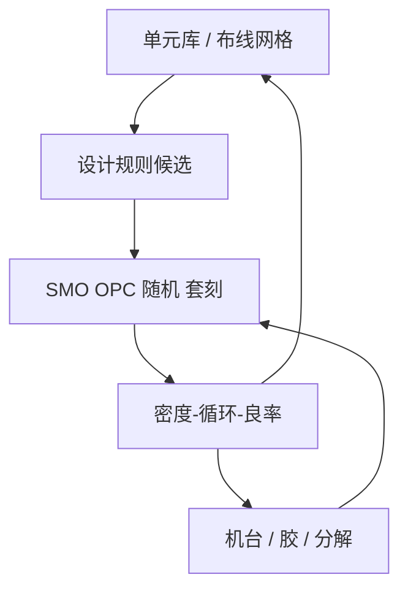

# DTCO

设计规则不是从瑞利公式抄下来的整数；它们是单元库、布线、光刻分解与刻蚀一起谈出来的可行集，这个过程叫设计–工艺协同优化。

<footer>—— 对照 imec 对 DTCO 与先进节点图形化路径的公开论述</footer>

[上一课](/litho/hotspot-fix)（热点修复）。把计算光刻的加速收成：物理模型签核，学习模型最多近似前向。缺口是：再快的 OPC 也救不回一套与工艺作对的库。标准单元轨道高度、允许节距、通孔网格、是否让某层走 [EUV 双重](/litho/euv-double-pattern) 或 SAQP，必须在设计时就选好。imec 把这套闭环称作 DTCO（Design–Technology Co-Optimization）。本课钉图形化侧的协同。紧凑模型对严格电磁，留给下一课。

## 问题

$k_1$、随机悬崖、套刻、胶厚、掩模 MRC，每一课都在收缩「能印的多边形集合」。若库仍按上一代的最小节距和二维自由度去画，OPC/ILT 只能在错误可行集里修碎形，窗口交为空。DTCO 的问题是反过来：在给定机台（0.33 / 0.55）、胶与分解选项下，选一组设计规则和单元架构，使关键层落在可印集合内，同时电学与密度可接受。

公开例子包括：用一维金属栅加切线换二维自由布线；用轨道高度和 FinFlex 一类库选项换密度；在「EUV 单次 / EUV 双重 / DUV 多重」之间按层挑选，而不是全球一句「本节点全 EUV」。imec 的 DTCO 叙事把光刻选项与标准单元、SRAM、互连一起评估，而不是先定库再把光刻当装饰。

### DTCO 不是「让设计遵守 DRC」

DRC 是协同的**输出**。DTCO 是产生 DRC 的循环：工艺给出可印节距与分解成本，设计给出库与布线需求，两边改，直到密度、功耗、循环时间可交货。把已冻结的 DRC 手册叫做 DTCO，等于把结果当成过程。

DTCO 跨设计与工艺，但本课只写图形化闭环。器件静电学（FinFET/GAA）有自己的课，不在这里重讲纳米片释放。

## 方法

循环大致是：候选设计规则（节距、取向、通孔网格、切线策略）→ 代表性标准单元与 SRAM → SMO/OPC/ILT 与随机预算 → 分解层数与套刻账 → 改规则或改库 → 再评估。计算光刻在这里是评估器，不是事后修补。GPU 与 ML 缩短每一圈的墙钟，使规则还能在定节点前多转几圈，但不能替代圈本身。

与 High-NA 半场的协同：大 die 是否接受拼接、是否改用芯粒避开半场，是 DTCO 而不是只买 EXE。与 GAA 的协同：片宽可调改变单元的 drive 档，布线 congest 形状变，金属层的可印网格要重谈。

### 成本函数是节点，不是一层的 EPE

某一层用 SAQP 可以把 EPE 做得很好，却把切线套刻和薄膜均匀性变成全芯片良率项。DTCO 的成本是周期时间、掩模数、wph、缺陷与电学的交，而不是 OPC 报表上的纳米。imec 公开比较多种图形化路径时，用的正是这种节点级权衡，而不是单一热区窗口。

## 机制

设计多边形进入成像算子之前，已经被规则投影到「友好节距 / 取向」的子集。SMO 在这个子集上才有窗口交；OPC 在这个子集上才收敛。若子集选错，自由光瞳与曲线 ILT 只是对抽样 clips 有效。DTCO 把规则子集当成优化变量之一，与光源、分解一起走——比 SMO 多一层「哪些图形允许存在」。

反向通道：工艺发现某类二维拐角不可印，就禁止或改成切线架构，而不是要求 ILT 无限正则。库、光刻、掩模厂 MRC 在同一张可行集上对齐，TAPOUT 才不会在 MRC 或随机悬崖上突然翻车。

FinFlex、COAG、单扩散断裂一类，是 DTCO 的库杠杆，不是光刻算法。写节点对比时把「库架构收益」和「NA / 波长收益」分开，避免把商标当分辨率。

## 边界

DTCO 不增加 NA，不创造光子。它只避免在不可印集合上浪费计算光刻。协同失败的典型症状是：OPC 日历爆炸、热区在量产中途冒出、N3E 一类「放松节距退回单次」的成本修复。公开节点故事可以引用这类权衡，不要编未公布的规则数值。

后课默认：设计规则是 DTCO 的产物；紧凑成像模型是评估器里跑得最快的那一层，其与严格电磁的差，下一课再钉。

引用 imec DTCO 时写清比较的是哪一种图形化路径（EUV 单次、双重、SAQP）与哪一类单元。只展示一张标准单元漂亮图，不是协同已经完成。

## 小结

- DTCO 让设计规则、单元库与光刻分解在同一可行集上闭环。
- DRC 是协同的输出；先锁库再 OPC，会把修正链困在错误集合里。
- 评估必须按节点成本（循环、掩模、随机、套刻），不能只看一层 EPE。
- 计算加速让闭环多转几圈，不替代规则与库的决策。
- 出处：imec 对 DTCO 与先进节点图形化路径的公开论述。
