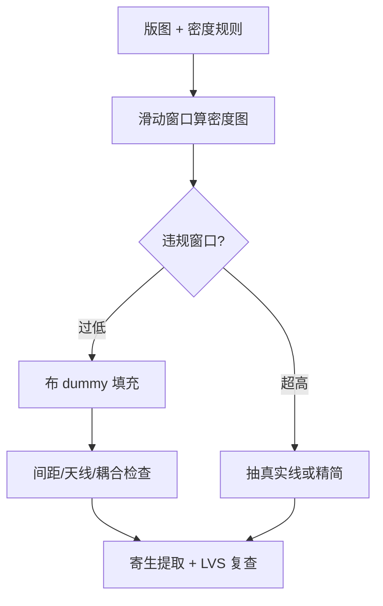
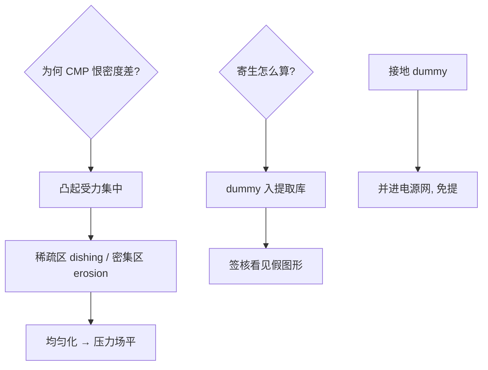

# 虚拟填充与密度规则

晶圆要的不是漂亮的版图，是均匀的版图：密度差 10% 的两块区域，CMP 之后高低差能毁掉整层光刻。

<footer>—— 据 ITRS 密度规则演进；TSMC/Intel 先进节点 design rule manual 惯例</footer>

[间隔层刻蚀与 SADP](/litho/spacer-etch-sadp)要求图形规律，本课讲反向约束：版图太「空」也不行。缺口是**虚拟填充与密度规则**——在真实电路之间塞进永远不通电的假图形，让整片晶圆的图形密度落在工艺窗口内。它是 CMP、刻蚀与光刻共同的隐形契约。本课不做填充算法的实现细节。

## 问题

三个工艺环节惩罚密度不均。CMP：抛光速率随图形密度变化，密度高的区域磨得慢——晶圆翘曲、下层光刻离焦。刻蚀：负载效应使开口密度高的区域刻得快，图形顶失真。光刻：构图密度影响显显影与衍射环境，边缘与中心 CD 漂移。缺口：**密度上限与下限规则**（如每 1μm² 窗口内 20–70%）及其自动化执行。

术语翻译：dummy fill（虚拟填充）= 不连接任何网络的假图形；density window（密度窗口）= 工艺允许的局部密度区间；fill 层次问题 = 填充图形与邻近真实图形的寄生耦合。

数字实例：金属层规则「任意 2μm 窗口内金属面积 25–70%」。某 SRAM 区实测 75%（超上限）→ 抽线；某标准单元行间区 10%（低下限）→ 塞 dummy 线。塞完后 CMP 高差从 40nm 降到 8nm，下一层光聚焦裕量回来了。

## 方法

填充流水线四步：算密度图（滑动窗口栅格）；识别违规窗口；在允许轨道内布 dummy（保间距、避天线、避耦合——能接地就接地）；验证（寄生提取把 dummy 算进电容、密度规则 LVS 复查）。先进节点的变体：**多层协同填充**（同一 x,y 在 M1/M2/M3 错开堆叠，防通孔对齐假图形形成短路风险）与**符号化填充**（填充图形带 dummy 标记，工具链识别其非电属性）。

直觉类比：像贴地砖前先找平——房间有的地方瓷砖密、有的地方空一大块，水泥（CMP）干得不均匀，地面必高低不平；dummy fill 是在空处补「假瓷砖」（不通电），让整个地面受力均匀，真实瓷砖（电路）才铺得平。

## 机制

CMP 的力学机制：抛光垫压在「凸起」处压力集中——图形稀疏区上方氧化层未被图形「顶住」，磨除更快，形成碟形凹陷（dishing）；图形密集区则侵蚀（erosion）。密度均匀化让压力场均匀，碟陷与侵蚀同步消失。光刻的机制：光刻胶显影的「负载效应」与衍射的局部环境都依赖构图密度，密度图成为 source-mask 优化的输入之一。寄生机制是暗面：dummy 与邻近信号线的耦合电容让时序模型失真——先进节点的做法是把 dummy 建进提取库，让签核「看见」假图形；接地 dummy 则直接并进电源网络。

常见误区：把 dummy fill 当成「事后补丁」——现代流程它是签核前置条件，密度违规会直接 DRC 挂掉；另一误区是「dummy 越多越好」——过填会拉高耦合、加剧蚀刻负载的反向问题，目标是进窗口不是顶上限。

## 边界

密度规则的层次：从单层的 1D 规则（SETR 风格）进化到多层的 3D 联合规则（相邻层密度耦合影响 CMP）。EUV 时代的新矛盾：stochastic 缺陷对构图密度敏感，填充策略要与 EUV 光子统计重新谈判。设计侧的怨恨：填充吃掉布线轨道、拖累时序收敛——EDA 的答案是把 fill 从「版图完成后」提前到「布局布线中」（in-route fill），并让综合工具感知密度。与[掩模版与场域极限](/litho/reticle-field-limit)的接续：版图在拼进场域时，密度图也是拼接优化的输入——从窗口到全场的密度叙事这才完整。

直觉类比：密度规则像「剧本的排练均匀度要求」——主角戏太重（密集区）与冷场太久（稀疏区）都毁演出；dummy fill 是给配角加戏份（假图形），不说话（不通电）但让整台戏节奏均匀。

## 小结

- 密度不均的三宗罪：CMP 碟陷侵蚀、刻蚀负载、光刻 CD 漂移。
- dummy fill 四步：量密度、找违规、布假图形、寄生复查。
- 现代形态：in-route fill、多层协同、EUV stochastic 重谈判。
- 出处：ITRS/Lithography 密度规则章节；CMP 机制文献（Fu–Chandra 模型）；各节点 DRML 实例。
