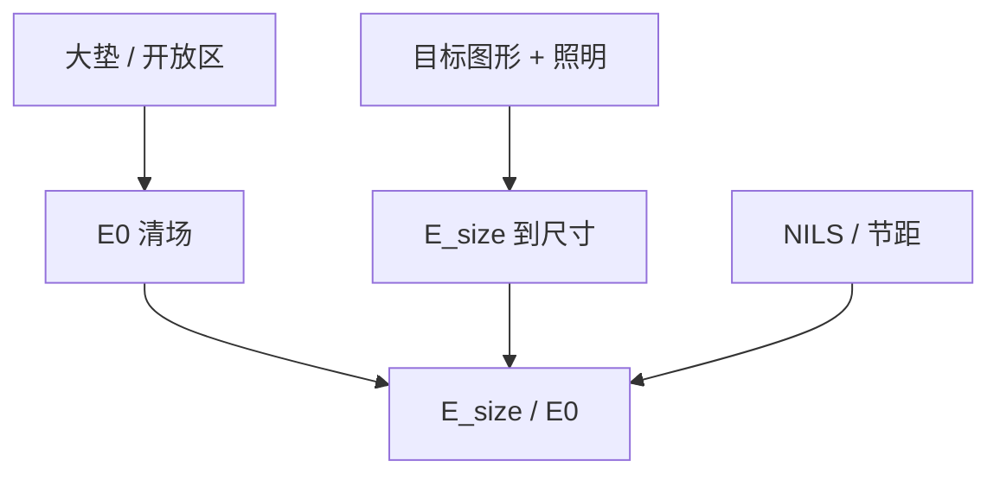

# E₀ 与 E_size

$\gamma$ 是曲线有多陡；$E_0$ 问大垫何时清场，$E_\mathrm{size}$ 问目标图形何时到尺寸。两个剂量不是一个数的两个名字。

<footer>—— 据 Mack / Levinson 对 dose-to-clear 与 dose-to-size 的产线定义整理</footer>

[上一课](/litho/resist-gamma)把 $\gamma$ 钉在大垫 $T(\log E)$ 的中段。缺口是曲线上的锚点：产线说「这胶多少剂量」时，有人报清场，有人报到尺寸。本课拆 $E_0$ 与 $E_\mathrm{size}$。整条剂量–尺寸曲线，留给[下一课](/litho/dose-to-size)。

## 问题

$E_0$（dose-to-clear）通常来自开放区或大垫：正胶在给定显影时间下刚好清到底的剂量。它靠近衬度曲线的脚，强烈依赖胶厚、吸收 $B$、PEB 与显影。$E_\mathrm{size}$（dose-to-size）是某一掩模图形、某一照明下，CD 落到目标时的剂量。密线的 $E_\mathrm{size}$ 往往明显高于 $E_0$，因为边切在空中像斜坡上，当地强度低于开放区。

缺口不是再定义 $\gamma$，而是：把扫描机配方里的「剂量」默认写成 $E_\mathrm{size}$，并把 $E_0$ 留给材料与清底检查。混用会导致「胶更敏了但密线仍印不动」——其实只是 $E_0$ 降了，$E_\mathrm{size}/E_0$ 没变或更大。

### 比值读的是光学，不只是胶

$E_\mathrm{size}/E_0$ 随 NILS、节距、MEEF 变。光学对比差，要靠加剂量把斜坡抬过化学阈值，比值变大。胶 $\gamma$ 变陡，比值可以略降，但救不了零级偏置抬死的 $I_\mathrm{min}$。不要把这个比值写成胶数据表上的本征常数。

负胶 / NTD 的「清场」语义翻转：开放区可能留下或去掉，视极性而定。写 $E_0$ 必须声明极性与显影液。金属氧化物负胶常用 dose-to-size 签核，开放区剂量含义要另写。

## 方法

测 $E_0$：大垫或开放框剂量矩阵，光学或轮廓仪看残胶。测 $E_\mathrm{size}$：目标结构 FEM，CD-SEM 插值到目标 CD。两者必须同一 PEB、同一显影、同一栈。换 BARC 只动 $E_\mathrm{size}$ 而 $E_0$ 几乎不动，问题在图形光学；两者一起动，问题在吸收或催化。

LPM 用 $E_0$ 当集总锚，再用空中像把边推到 $E_\mathrm{size}$。标定顺序不能反：先拿密线 $E_\mathrm{size}$ 当 $E_0$，薄膜一改就全部漂。

## 机制

开放区强度接近空中像的局部最大（还含 flare）。清底要求沿厚的有效剂量把 $m$ 降到 $R$ 能挖穿。图形边的强度是 $I_\mathrm{th}<I_\mathrm{max}$，要让 $I_\mathrm{th}$ 对应的化学达到同样的 $m$ 阈值，入射剂量必须更高——于是 $E_\mathrm{size}>E_0$。flare 抬暗区，会抬 $E_0$ 的「起雾」端，却不一定按同一比例抬 $E_\mathrm{size}$，暗侵蚀与桥接先报警。

淬灭剂负载同时抬两个锚点，但 $E_\mathrm{size}$ 对负载往往更敏感，因为边沿正在争夺带上。[淬灭剂](/litho/pag-quencher)的阈值语言在这里变成两个可测剂量。

$E_0$ 有时被定义为「开始掉厚」而不是「清底」，教材不统一。对表写清。本课默认正胶清底，除非声明。

## 边界

不把某胶说明书上的 15 mJ/cm² 写成所有节距的 $E_\mathrm{size}$。不重推瑞利公式来「预言」两个剂量。下一课把 $E_\mathrm{size}$ 从单点展开成 CD(E) 曲线。

EUV 随机效应里，平均 $E_\mathrm{size}$ 合格仍可能缺孔——那是后一单元；本课两个锚点仍是均值。

## 小结

- $E_0$ 是大垫清场；$E_\mathrm{size}$ 是目标图形到尺寸。
- 扫描配方默认 $E_\mathrm{size}$；材料比较常报 $E_0$。
- $E_\mathrm{size}/E_0$ 主要读光学对比与节距，不是胶的本征常数。
- 两者必须同栈、同 PEB 测。
- 出处：Mack / Levinson 对 dose-to-clear 与 dose-to-size。
