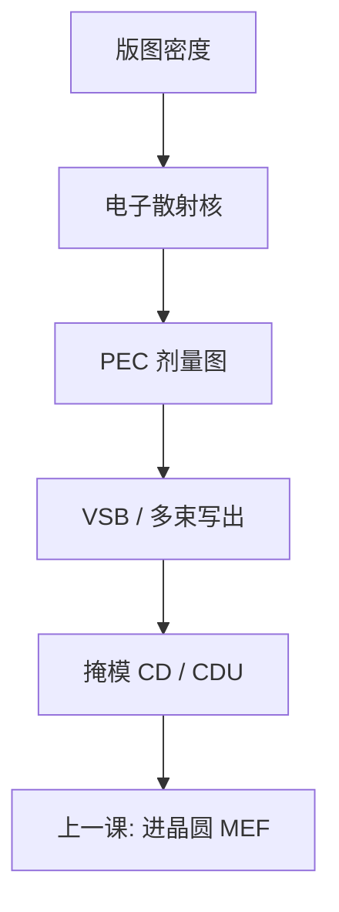

# 电子束写掩模邻近效应

版上的剂量会从密区漏到疏区：电子往回散射，邻近效应校正改的是写剂量，不是晶圆侧那套光学 OPE。

<footer>—— 据电子束写掩模邻近效应校正（PEC）的通称整理</footer>

[上一课](/litho/mask-cd-ppe)把掩模 CD 与放置误差写成进晶圆的预算语言。缺口是这些误差有一截来自写版物理：电子在抗蚀剂与衬底里散射，局部有效剂量随周围图形密度变。本课钉 PEC。6 寸标准尺寸留给[下一课](/litho/six-inch-reticle），不在这里改基板。

## 问题

晶圆侧 OPE 是投影光学的邻域算子。[光学邻近](/litho/ope-proximity) 已经声明：电子束写掩模另有一套电子邻近，不是同一算子。电子束写版时，前向散射在胶里糊纳米到几十纳米，背散射从铬/石英衬底回来，影响微米量级邻域，雾化（fogging）更远。密区剂量堆高，疏区相对不足，若不校正，掩模 CD 随局部密度走，上一课的 mask CDU 与 linearity 会先坏在写这一步。

缺口因此是写剂量的邻域校正，不是再报一次 MEF。把掩模疏密偏差全写成显影或刻铬，会漏掉 PEC 没调好；把 PEC 写成「版厂的 OPC」，又会与晶圆 OPC 抢名。

### PEC 改剂量，OPC 改多边形

PEC（proximity effect correction）按密度图调制束剂量或驻留时间，让到达胶的有效能量在疏密区更均匀。掩模 OPC / 刻蚀偏置校正改的是多边形尺寸。两者都为了晶圆 CD，层不同：一个在写束，一个在版图数据。合同里的 mask CD 已经是 PEC 之后的结果。

多束写与 VSB 的 PEC 实现不同，物理都是散射剂量。本课不写某写模机的核半径表，以免把通称写成型号手册。

## 方法

通称流程：用电子散射核（短程 + 长程 + 雾化）卷积版图密度，得到剂量图，再反解每点应写的剂量。短程核管边锐度与小图形，长程核管大面积密度，雾化管腔体反射电子。校准用疏密测试图形、倒比图形，量掩模 CD–密度曲线，直到 PEC 后曲线够平。

与上一课衔接：PEC 残差进入 mask CDU 与邻近相关 CD；PPE 更多来自写场拼接、充电与台精度，不是 PEC 主项。但密区充电会改束落点，PEC 与充电补偿有时缠在一起，分析要拆。

### 后课默认

说到 mask CD 随密度变，先问 PEC 核是否为该工艺（胶厚、加速电压、衬底）标定。说到晶圆 OPE，不要用 PEC 去修——那是写错对象。

## 机制

入射电子在胶里弹性/非弹性散射（前向），一部分打到铬与石英再回来（背向）。背散射电子在较大半径上叠加本底剂量，本底与周围开口率成正比。显影阈值切在「本底 + 本地」上，于是同样画线宽度在密区更胖（或按色调相反）。PEC 把密区剂量下调、疏区上调，使有效能量对齐。加速电压越高，背散射核往往越宽，长程项更重——这是写模机参数，不是晶圆 NA。

雾化是腔体与载台的二次电子/反光电子，核更平、更全局。校正不足时，大面积明暗区交界出现缓慢 CD 斜坡，像「版上的 flare」。

EUV 厚吸收体、高 Z 层改变背散射，PEC 核要重测，不能把 DUV 二元铬的核贴到 EUV 版上。曲面 ILT 碎片更密，短程 PEC 与数据量一起涨。

## 边界

不发明核的微米半径，不写某厂 PEC 软件名。不把电子束胶的化学放大与晶圆 CAR 写成同一配方。下一课 6 寸基板决定可写面积与夹具，不改散射物理，但场拼接次数随面积变，PPE 预算跟着变。

晶圆厂看到的 MEEF 放大的是 PEC 之后的残差。PEC 做过头会出现过校正振荡，密区过瘦，同样进 CDU。6 寸有效区边缘缺邻居，长程核在版边要单独处理，否则边框附近 CD 会像「写出来的 flare」——下一课外形会截断这块面积，核的物理仍是本课。

## 小结

- 写掩模邻近是电子散射剂量，PEC 调写剂量；与晶圆 OPE/OPC 不是同一算子。
- 短程、长程、雾化三层核；残差进入 mask CDU 与密度相关 CD。
- PPE 主因是拼接与台，不是 PEC；充电会把两者缠在一起。
- EUV 吸收体要重测核。
- PEC 过校正会振荡，密区过瘦同样进 mask CDU。
- 版边缺邻居，长程核要单独处理。
- 晶圆 OPE 不要用 PEC 去修——写错对象。
- 出处：电子束写模 PEC 通称；SEMI / mask shop 对密度相关 CD 的讨论。
