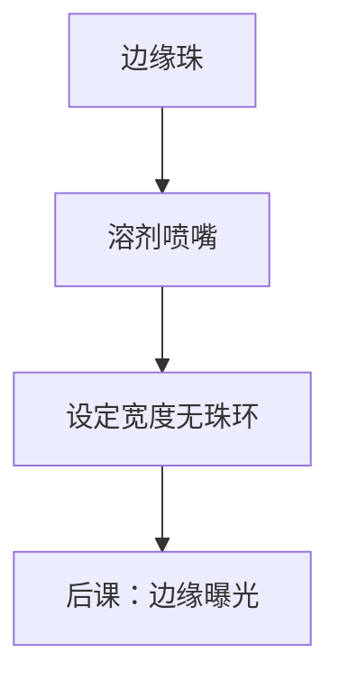

# 边缘胶珠去除 EBR

珠子不参与器件图形，却决定边缘场能不能夹、背面会不会脏。EBR 是机械–溶剂边界，不是又一次曝光。

<footer>—— 对照轨道工艺中的 edge bead removal 公开描述</footer>

[上一课](/litho/spin-coating-uniformity)给出径向剖面，边缘必然堆珠。缺口是：珠不切掉，夹盘、传送和边缘曝光都在碰一团厚胶。本课钉 EBR，不把斜边清洗和背面清洗提前写完。

## 问题

旋涂的自由边使胶在晶圆外沿增厚，成珠或成裙。珠的厚度可以是中心的数倍，软烤后开裂、掉渣，落到曝光场里就是缺陷。夹盘接触珠会污染后续片。把边缘缺陷全写成光刻胶颗粒，会漏掉这圈可预测的几何。

## 方法

溶剂喷嘴沿边缘走一圈，溶掉设定宽度的珠（EBR 宽度是配方参数，与曝光场、边缘exclusion 对齐）。有的流程加背面溶剂（backside rinse）防滴到夹盘——细节在后课。EBR 过宽吃掉可曝光面积；过窄留渣。溶剂与胶体系必须匹配，否则中心场被雾。

EBR 之后边缘是「无胶或薄胶」台阶。对准与边缘场剂量补偿要知道这条台阶在哪，否则套刻标记若靠近边缘会踩在厚度跳变上。

## 机制

局部溶解加旋转把溶掉的胶甩出杯。时间与流量决定侧壁是齐的还是锯齿。锯齿在显影后变成边缘残胶源。

## 边界

本课不处理斜边金属残留或 CVD 包边。下一课三层堆叠假定中心场厚度已定、边缘已切。

## 小结

- EBR 切的是旋涂自由边的珠，保护夹盘与边缘场。
- 宽度是面积与缺陷的权衡，须与 exclusion 对齐。
- 出处：轨道 EBR 工艺通识；接续旋涂课。
