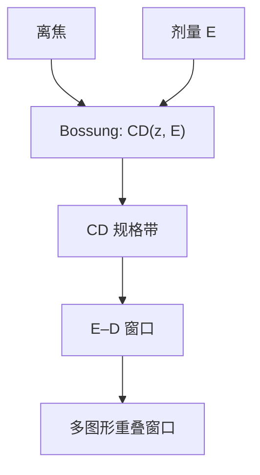

# 曝光–散焦工艺窗口

Bossung 曲线把 CD 画成离焦的函数、按剂量分族；还活着的那块曝光–散焦区域，才是这一层的工艺窗口。

<footer>—— 据 Mack 对 E–D 窗口与 Bossung 曲线的定义；产线形式亦见 Levinson</footer>

[上一课](/litho/stochastic-holes)（随机缺陷与缺失孔）。在此之上，记录介质的分叉写完：CAR 还是金属氧化物，平均行为都已经能接到显影曲线上。缺口是：产线合格与否不是「最佳焦距上 CD 对了」，而是剂量与焦距同时漂的时候 CD（以及侧壁、残胶）是否仍在规格内。本课钉曝光–散焦（E–D）窗口。CD 从哪台仪器读来，留给[下一课](/litho/cd-sem-scatterometry)。

## 问题

[焦深](/litho/depth-of-focus)给出光学轴向尺度 $\propto\lambda/\mathrm{NA}^2$；[衬度曲线](/litho/resist-contrast-curve)给出剂量轴上的 $\gamma$。两者正交，合格区是平面上的一块面积。只报「DOF = 120 nm」而不报剂量范围，等于把窗口压成一条线段。缺口因此是把两个轴画在一起，而不是再选一次胶。

Bossung 图：横轴离焦，纵轴 CD，每条曲线一个剂量。规格带（例如目标 $\pm 10\%$）去切这些曲线，得到每个剂量下的可用焦深；再对剂量扫描，得到窗口。曝光宽容度（EL）常写成窗口在最佳焦距处的剂量相对宽度。

### 重叠窗口才是层的窗口

密线、孤立线、孔、反向线的 Bossung 形状不同，常有「禁戒节距」。层的工艺窗口是各类关键图形合格区的交集。RET 把某一节距的窗做大，可能把另一类切掉。上一课程的 $k_1$ 窗口，在这里变成可测量的面积。

剂量的单位是 $\mathrm{mJ/cm^2}$，离焦是纳米。不要把归一化的 EL 百分比和焦深纳米加在同一个「越大越好」的榜上而不声明图形。

## 方法

曝光矩阵：晶圆上按场变剂量、变焦距（或用楔形调焦），显影后量 CD。得到 Bossung，切规格，画 E–D 图。也可以在模拟器里用校准过的抗蚀剂模型扫同一平面，但验收以硅片矩阵为准。

判据除 CD 外常加：侧壁角、膜残留、桥连/断开。EUV 随机失效（缺孔）会在窗口边沿先于平均 CD 越界——那是随机课的尾部，本课的窗口默认是平均 CD 的合格区，可另叠加缺陷判据。

### 与 NILS 的关系

NILS 高，同样的剂量误差引起的 $\Delta\mathrm{CD}$ 小，EL 宽。离焦掉 NILS，窗在焦轴上收窄。因此空中像课把 NILS 当窗口的光学预言；本课是胶切完之后的实现。预言与实现差一截，差在 $\ell$、$\gamma$ 和计量偏置。

## 机制

最佳焦距附近，剂量主要沿衬度曲线移动等剂量面，CD 单调变。离焦后空中像调制变浅，要维持同一 CD 往往需要改剂量，Bossung 出现弯曲甚至「通过焦点的 CD 翻面」。三束成像的窗更瘦，两束成像（离轴）常在焦轴上更宽——机制在焦深课讲过，这里只是把它读成面积。

浸没与 High-NA 把焦轴预算削薄，窗口先在 $z$ 方向死。换胶（上一课）主要改剂量轴与模糊，对焦轴的帮助有限。所以「换金属氧化物胶」不是对 $\mathrm{NA}^2$ 惩罚的回答。

### 套刻不画进本课的平面

E–D 窗管的是同一层图形的尺寸。套刻管的是相对另一层（或同层另一次曝光）的位置。LELE 的节距误差来自套刻，CD 误差来自各自的 E–D；两张窗相乘，不能把 overlay 纳米数画进 $(E,z)$ 冒充面积。标记如何量位置，是后课。

Bossung 在某些剂量下几乎通过焦点不变，那是 isofocal 附近。孤立与密线的 isofocal 剂量往往不同，overlap 仍可能瘦。不要把一条线的 isofocal 写成整层的免费焦深。

## 边界

窗口不含套刻、不含跨场镜头指纹的全部、不含刻蚀后的最终 CD——除非量的就是刻蚀后。轨道带来的 PEB 不均匀会把名义窗切碎，那是工艺控制，不改 E–D 定义。下一课之前，本课假设 CD 是「真值」；计量偏置会系统平移 Bossung，必须分开校准。

曝光矩阵本身消耗晶圆与机时，产线常用少量场加模拟补密。模拟没有校准过的 $\ell$、$\gamma$ 时，窗口面积不可信。禁戒节距要在照明固定后扫节距，而不是只扫剂量焦距。

EL 与 DOF 常被收成一个「窗口面积」百分数。比较不同层时必须同一规格带、同一图形集，否则面积竞赛无意义。

后课默认：说到工艺窗口就是 E–D 平面上的重叠合格区，不再与光学 DOF 公式混成一个数。

## 小结

- 工艺窗口是剂量–离焦平面上的合格面积，Bossung 是它的切片。
- 层窗口 = 关键图形类别的交集，不是最好看的那条线栅。
- NILS 预言 EL；胶的 $\ell$ 与 $\gamma$ 把预言变成实现。
- 换胶主要动剂量轴，抬 NA 主要罚焦轴。
- CD 如何量，下一课。
- 出处：Mack, *Fundamental Principles of Optical Lithography*；Levinson, *Principles of Lithography*。
