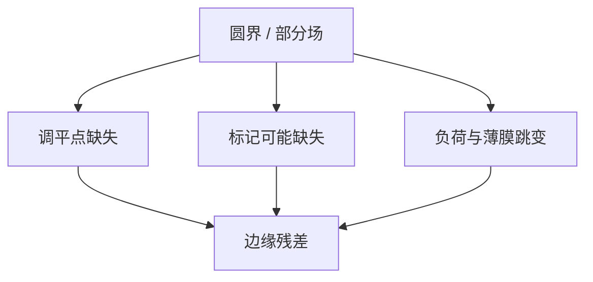

# 边缘场与部分场

圆晶圆上的矩形场在边缘被切成部分场：照明、调平、套刻采样和刻蚀负载同时换边界条件，场心模型不能外推到刀口。

<footer>—— 对照晶圆边缘曝光、部分场与边缘良率的产线通称；[晶圆边缘曝光](/litho/wafer-edge-exposure) 已有轨道侧</footer>

[上一课](/litho/metrology-matching)要求尺度可比。缺口是空间：边缘场、部分场（partial fields）常常不进抽样，却在探针图上先红。[边缘曝光](/litho/wafer-edge-exposure) 与 EBR 已讲胶边；本课钉扫描机场被晶圆圆界切开时的成像与控制。应力翘曲如何整片弯网格，留给[下一课](/litho/wafer-distortion-stress）。

## 问题

部分场：曝光场只有一部分落在晶圆上。调平点缺失、狭缝平均被破坏、套刻标记可能落在场外、照明与散射边界改变。边缘完整场也有：薄膜卷曲、EBR、CMP 边缘侵蚀、卡盘边缘。良率图的「边缘环」常被当成脏，其实是控制盲区。

缺口是**把部分场当一等公民**，不是再讲 EBR 涂胶。抽样计划若排除半径 > 140 mm 的场，APC 的高阶项在边缘无约束，器件却在那里。

### 产量与边缘的对赌

多曝光一圈部分场增加管芯，也增加失控风险。策略：部分场用降阶校正、专用剂量/焦点偏置、或直接放弃最外环管芯。这是经济，不是光学失败。

对准只在内侧标记成功时，边缘场的网格是外推。外推距离应进套刻预算，而不是假装测过。

## 方法

计量：强制边缘/部分场进抽样子集。控制：边缘专用偏置或降阶；调平策略在缺点击时的回退。设计：边缘密封环、dummy。与缺陷：边缘剥落是检测重点，但不要和失焦 CD 混类。产量模型应把边缘管芯良率分开报。

部分场的曝光菜谱（叶片、剂量补偿）应单独验证，不要沿用完整场。晶圆边缘曝光课处理胶边；本课处理场被切开后的成像与网格。两者在最外环叠乘，Pareto 要能拆开。

## 机制

调平用若干点拟合平面/倾斜；缺点击时条件数变差，焦点残差升。照明在场被切时的散射与剂量积分变。刻蚀宏负荷在边缘开口率跳变。套刻高阶在边缘振幅最大，恰是点最少处——过拟合课的最坏布局。

调平点与标记在圆界上同时变少，网格变成外推。外推距离要进套刻预算，或明确放弃最外环管芯。

## 边界

不写某 300 mm 边缘排除半径的未公开规格。不重写 EBR 化学。High-NA 半场是另一类「部分」，不要混名。

后课默认：边缘与部分场要抽样、要降阶或专用偏置。下一课整片应力把网格弯成与边缘叠加的弯月。

## 小结

- 部分场改变调平、剂量积分与标记可测性，场心 APC 不能外推。
- 边缘应进入抽样，或明确放弃管芯。
- 外推网格要进套刻预算。
- 出处：晶圆边缘与 partial field 产线通称；ASML 调平/套刻公开讨论。
