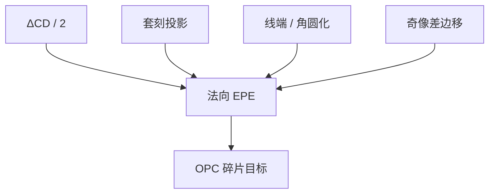

# 边缘放置误差 EPE

CD 只问宽度，套刻只问两层相对；器件看见的是这条边相对目标落在哪。EPE 把宽度误差的一半与位移加在同一条法向上。

<footer>—— 计算光刻以 EPE 为碎片目标见 Cobb / Mack；多层边放置的产线综合见 Levinson</footer>

[上一课](/litho/corner-rounding)把拐角收成圆弧。缺口是：孔、线端、角、直边，计量各报各的纳米，**还没有一个沿法向的统一偏差**。模型 OPC 的循环最小化的正是边缘放置误差（EPE）。本课钉定义。怎么把各项加成预算，留给[下一课](/litho/epe-budget)。不重写套刻公式，不把 EPE 等同于 $k_1$。

## 问题

阈值轮廓上每一点相对设计多边形（或相对目标层）沿当地法向的有符号距离，叫该点的 EPE。线宽误差 $\Delta\mathrm{CD}$ 在两边近似对称时，每边贡献 $\Delta\mathrm{CD}/2$。套刻矢量在法向上的投影整段贡献。LES 是端点法向的 EPE；角圆化是角平分线方向的 EPE。缺一个名字，OPC 修 CD、对准修 overlay、设计放 LES 余量，三条账对不齐，器件短路或接触面积仍可以死。

缺口因此是把已经讲过的成像偏差**投影到边上**，而不是再发明一种衍射。

### 局部量，不是全场一个数

中段 EPE 合格，端头和内角可以超差。报「平均 EPE」会把热点洗掉。必须声明：哪些边、哪些工艺点（剂量、焦点、像差）、ADI 还是 AEI。PV-band 是多工艺点 EPE 的包络，不是另一种定义。

EPE 的符号约定要写清：向外为正还是向内为正。桥连对应间隙上两边 EPE 相向为正；断线相反。符号乱了，预算 RSS 会加错。

## 方法

模拟：在空中像（加紧凑胶模型）上抽等高线，对每个碎片算法向偏差。光学项来自 TCC/SOCS 与像差；位移项来自套刻与奇像差造成的边爬移。计量：SEM 轮廓对目标多边形做同样的法向量。OCD 给的是周期平均 CD，不是局部 EPE，不能单独签核拐角。

LELE 或 SADP 把最终边拆到两次图形化：单次曝光的 EPE 还要再加切线套刻或 spacer 均匀性。本课先钉单次像的边；多层合成进下一课预算。

### 与 NILS 的关系

NILS 大，剂量误差换成的 EPE 小：$\Delta x \approx \Delta I / (dI/dx)$。NILS 是灵敏度，EPE 是已经实现的偏差。像差敏感度上一课序写的 $\partial x_\mathrm{edge}/\partial c_j$ 正是 EPE 对 $c_j$ 的导数。禁戒节距上 NILS 塌，同一剂量误差下 EPE 炸。

## 机制

边的位置是 $I(\mathbf{x})=I_\mathrm{th}$ 的水平集。一切改 $I$ 的形状或改阈值等效（剂量、胶）的东西都挪水平集。傅里叶低通挪的是曲率与斜率；套刻挪的是坐标系；两者在器件上无法区分，除非拆实验：改照明主要动光学 EPE，改对准主要动 overlay 投影。

二维核让端和角的水平集比直边更弯，同一全局 overlay 下，角上的有效接触面积对 EPE 更敏感——这是 SRAM 热点的成像理由。

## 边界

EPE 不含电学过孔电阻的非线性，只是几何。随机 LER 是边的频谱，均值 EPE 为零也可以失效；均值模型 OPC 抹不掉泊松尾。禁止把某 OPC 报表的「名义 EPE」当成产品上多层最终边。也不要把 MEEF 直接叫成 EPE：MEEF 是掩模误差到晶圆 CD 的导数，EPE 是边的位置。

## 小结

- EPE 是边相对目标的法向偏差，统 CD/2、套刻投影、LES 与角。
- 它是局部量；平均会藏热点。
- NILS 把剂量误差换成 EPE；像差敏感度是 EPE 对 $c_j$ 的导数。
- OPC 循环的目标是 EPE，不是单一 CD。
- 下一课：EPE 预算分解。
- 出处：Cobb 模型 OPC；Mack；Levinson。
