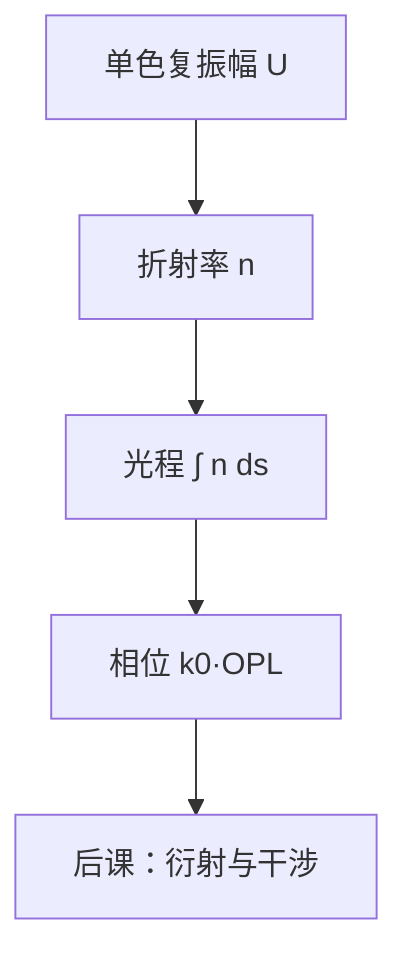

# 单色波、折射率与光程

单色光在均匀介质里以确定的相速度传播；折射率把真空波长改写成介质里的波数，光程则把几何路径收成相位。

<footer>—— 据 Born &amp; Wolf, Principles of Optics 对单色标量场与光程的表述整理</footer>

本课是整个光刻栏的第一课。后面的衍射、数值孔径、部分相干、空中像和瑞利判据，都默认你会「单色复振幅、折射率 $n$、光程决定相位」，不再从麦克斯韦方程或从临界尺寸起笔。不能从 [瑞利判据](/litho/rayleigh-litho) 讲起：那条式子假定波长、孔径与工艺因子已经是可用的符号，而符号从哪来、相位如何沿路径累积，是更早的一层约定。后课默认已经读完本课。

## 问题

投影光刻要在晶圆上写下随位置变化的曝光剂量。剂量来自电磁场；场在光学教材里首先被收成单色标量波。若一开始就把问题写成「怎样印出 40 nm 线」，波长、介质和相位差都还没有定义，后面的干涉与衍射会变成一堆无根的符号。缺口因此不是分辨率公式，而是：先把照明当成角频率 $\omega$ 固定的单色场，把材料当成折射率 $n$，把几何路径换成光程，使后课的每一个相位都可以从本课的积分读出来。

单色是硬约束。扫描仪里的准分子激光或 EUV 等离子体都有有限带宽，但成像推导先在单一 $\omega$ 上做完，再把带宽当色差与相干长度的微扰。本课不处理带宽；后课需要色散时，只引用「本课的 $n$ 其实是 $n(\omega)$」。

### 真空波长还不是介质里的波

真空中波长 $\lambda_0$、波数 $k_0=2\pi/\lambda_0$。进入折射率为 $n$ 的介质，相速度变成 $c/n$，波长缩成 $\lambda=\lambda_0/n$，波数变成 $k=n k_0$。若把「193 nm」直接当成水里或胶里的振荡周期，浸没与抗蚀剂里的相位会全部算错。光刻口语里的曝光波长几乎总是真空（或空气）标称值；介质修正必须显式乘 $n$。

本课的「单色波」是复振幅 $U(\mathbf{r})$ 所代表的时谐场，不是「只有一个纵模的激光器」的工程说明书。有限带宽、部分相干、偏振，分别是后面几课留下的缺口。

## 方法

约定电场（或标量代理）写成

$$
E(\mathbf{r},t)=\mathrm{Re}\bigl\{U(\mathbf{r})\,e^{-i\omega t}\bigr\}.
$$

$U$ 满足亥姆霍兹方程 $(\nabla^2+n^2 k_0^2)U=0$。在几何光学极限下，相位沿光线累积为

$$
\phi = k_0\int n\,ds = k_0\cdot\mathrm{OPL},
$$

光程 $\mathrm{OPL}=\int n\,ds$。两束光在汇合点的相位差就是光程差乘 $k_0$。干涉条纹的亮暗、透镜是否消球差、浸没水层算不算「更厚的空气」，全部先问光程，再问强度。

折射率 $n$ 在本课取实数。吸收用复折射率 $n+i\kappa$ 描述，EUV 多层膜和光刻胶的消光是后课的材料缺口；这里只需承认：不吸收的均匀介质里，$n$ 把路径长度换成相位，不把能量吃掉。

### 平面波是后课衍射的基

均匀介质里的特解是平面波 $U=\exp(i\mathbf{k}\cdot\mathbf{r})$，$|\mathbf{k}|=n k_0$。传播方向的单位矢量决定空间频率将怎样被写进下一课。本课不展开角谱；只钉死：任意单色场可以想成许多不同方向的平面波叠加，而每个平面波携带的相位仍由 $n$ 与路径决定。

光程的单位是长度。不要把 OPL 直接叫「相位」：相位是 $k_0$ 乘光程，无量纲（弧度）。少写 $k_0$，数值孔径和焦深的公式会差一个 $2\pi$。

## 机制

成像的全部相干运算都是在比相位。透镜把物面各点发出的球面波收成会聚波，靠的是玻璃里的额外光程抵消空气里的几何程差。掩模开口与铬的边界，首先是透过率跳变，其次才是衍射；透过区内部，相位仍然按 $n$ 走。晶圆上方若有浸没水，最后一段光程的 $n$ 不再是 1，后课的 $\mathrm{NA}=n\sin\theta$ 才能大于 1——那个 $n$ 就是本课的符号，不必另造。

强度 $I\propto|U|^2$ 丢掉绝对相位，保留相对相位。光刻胶响应的是强度（以及后续化学），不是 $U$ 本身；但没有 $U$ 的相位差，强度调制无从谈起。因此栏的顺序是：先波与光程，再衍射与光瞳，再空中像，最后才是胶。

### 后课默认的符号

从本课起，$\lambda$ 写真空波长，$\lambda/n$ 才是介质波长；$k_0=2\pi/\lambda$；$n$ 是实折射率，除非后课显式改成复数。平面波的方向角 $\theta$ 相对光轴测量，后课的空间频率 $n\sin\theta/\lambda$ 直接用这里的 $n$ 与 $\theta$。不要在衍射课里重新解释「为什么要乘 $n$」。

## 边界

本课固定的是单色标量接口，不是完整电磁学。偏振、多层膜的矢量边界条件、部分相干的互相干函数，都不在本课。也不要把 $n$ 理解成「材料折射率表上的某一个数」就可以结束：温度、波长、浸没水的杂质都会改 $n$，那是工艺控制，不是定义。几何光学的光线只是亥姆霍兹方程的短波极限；当特征尺寸落到波长量级，后课必须回到波动，不能继续只画光线。

单色假设排除了「白光显微镜」式的讨论。光刻光源被设计成很窄的谱，正是为了让本课的 $\omega$ 成为好的零阶模型。带宽的残余效应（色差、相干长度）留给照明与镜头课，不在这里展开。

## 小结

- 光刻栏从单色复振幅、折射率 $n$ 与光程开始，不从瑞利公式或产线 CD 开始。
- 真空波长 $\lambda$ 与介质波长 $\lambda/n$ 必须分开；相位是 $k_0\int n\,ds$。
- 平面波是均匀介质里的基，方向角进入后课的空间频率。
- 强度丢掉绝对相位，成像靠的是光程差。
- 后课默认已经读完本课，不再重讲 $n$ 与光程。
- 出处：Born &amp; Wolf, *Principles of Optics*；波动光学接口亦见 Goodman, *Introduction to Fourier Optics*。
