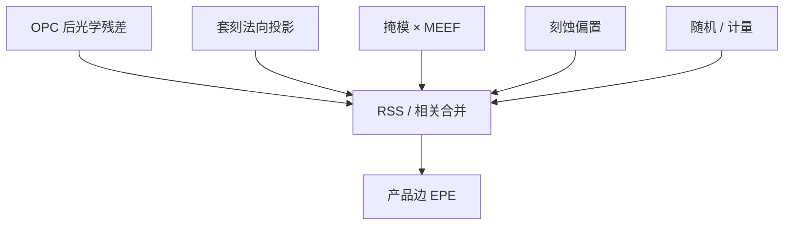

# EPE 预算

产品上那条边的纳米，是成像、套刻、掩模与工艺各交一截再合成的；不分解就只会去拧 OPC 或只会去拧工件台。

<footer>—— 对照 Levinson 对套刻预算的划分方式，以及计算光刻把 EPE 当综合指标的用法（Mack / 产线公开讲义）</footer>

[上一课](/litho/edge-placement-error)把偏差钉在法向上。缺口是：还没有一张能加减的**预算**——哪些项进 OPC 名义修正，哪些项只能平方和，单层 CD 规格怎样与套刻叠成器件边。主干[套刻预算](/litho/overlay-budget)已经会拆 overlay；本课把同类方法用到 EPE。下一单元从薄膜反射另起，不再把驻波冒充成像核。

## 问题

口语「EPE 3 nm」往往是某个统计或某个热点。上一课警告过局部性。缺口接着是：这一包能否拆成光学残差（OPC 之后）、套刻投影、掩模写误差经 MEEF 到边、刻蚀偏置、以及随机 / 计量噪声，从而决定该修模型、改对准，还是改设计余量。不拆，所有超差都会被送到计算光刻。

独立项用 RSS，已知相关项先合并。CD 误差的一半与 overlay 在法向上往往近乎独立，常用

$$
\mathrm{EPE}_\mathrm{rss}\approx\sqrt{(\Delta\mathrm{CD}/2)^2+\mathrm{OVL}_\perp^2+\cdots}.
$$

省略号里是 LES、角、像差残差、多层切线。系数 1/2 假定两边对称；单边定义的栅对接触不要硬套。

### 可校正与不可校正

名义光学 EPE 进 OPC 迭代，可以压到模型误差地板。剂量 / 焦点窗口内的 PV-band、不可建模的高阶像差、套刻残差、LER，校正环吃不掉。把 PV-band 当成「再跑一夜 OPC」，会高估软件；把套刻残差当成「模型没校准」，会低估机台与工艺。

LELE 的最终缝是两次 EPE 加切线套刻；SADP 的最终节距是 spacer 均匀性加芯轴 EPE。预算行必须按图形化路径改，不能抄单次曝光的 RSS 表。

## 方法

按边类别建表：密线中段、孤立线、线端、内角、孔边缘。每类再分：光学（含照明与薄膜栈）、套刻、掩模、刻蚀、计量。场内 / 场间拆行：镜头与扫描同步进场内，晶圆网格与翘曲进场间——与套刻预算对齐，否则同一项会进两张表。

浸没矢量与禁戒节距使「光学行」随 pitch 变：禁戒带上光学行突然变大，RSS 被它主导，这时该改规则或照明，而不是加 overlay 机台。

### 与 NILS、敏感度的接口

剂量误差预算 $\Delta D/D$ 经 NILS 换成光学 EPE 行。像差预算 $c_j$ 经上一课序敏感度换成边位移行。焦面倾斜残差换成场上光学行的峰峰值。预算是这些导数的集成，不是另一套物理。

## 机制

器件失效往往是局部两边相向的 EPE 把间隙吃光，或同向的 EPE 把重叠吃光。RSS 描述统计；热点是确定的系统项（禁戒、角、场曲）叠加随机项。系统项应从 RSS 里拿出来单独列，否则看起来「3σ 还够」，硅上 SRAM 已经桥。这与套刻预算把可校正项扣掉再进残差是同一纪律。

## 边界

本课不给某节点的 EPE 纳米配额。电学目标（接触电阻、失配）可以把几何 EPE 再加权，那是 DTCO，不是成像定义。禁止把未公开的产品 EPE 规格写进课文。薄膜摆动造成的 CD 摆动属于下一单元，预算里光学行必须声明是否含栈反射；含糊会把 BARC 事故记成 OPC 残差。

二维图形课序到此结束：孔/端 → 禁戒 → 角 → EPE → 预算。

## 小结

- EPE 预算按边类别拆光学、套刻、掩模、刻蚀、随机。
- 独立项 RSS；系统热点单独列，不要洗进 3σ。
- 多重图形化改行，不抄单次曝光表。
- NILS 与像差敏感度是光学行的导数来源。
- 下一单元：胶下薄膜反射，不再扩成像核。
- 出处：Levinson（预算纪律）；Mack；Cobb（EPE 作为 OPC 目标）。
