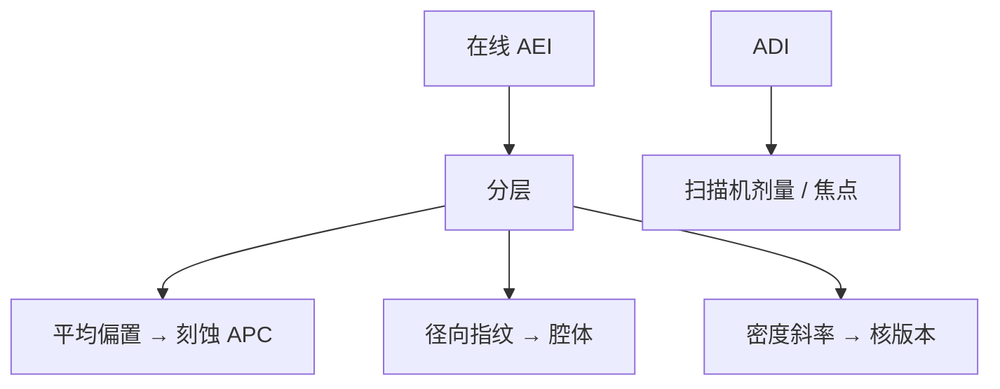

# 刻蚀偏置与 OPC 回环

ADI 贴目标之后，腔体还要把边再挪一截；这截偏置该回写进 OPC 版本，而不是每个班次拿 AEI 去拧扫描机剂量。

<footer>—— 对照 ADI/AEI 偏置、紧凑刻蚀核与 run-to-run 的分工；Levinson 对 after-etch 计量的区分</footer>

[上一课](/litho/etch-loading-effect)把负载写成布局邻域。缺口是闭环：在线 AEI 看见偏置漂了，谁改、改哪一层模型。[刻蚀进 OPC](/litho/etch-in-opc) 与 [刻蚀模型校准](/litho/etch-model-calibration) 已写核如何进迭代、如何标定；本课钉**量产回环**：何时重拟合核、何时只调平均偏置、何时重工晶圆。CMP 形貌如何先毁掉焦深，留给[下一课](/litho/cmp-topography）。

## 问题

偏置 = AEI − ADI（同一部位）。它随腔体老化、聚合物积累、硬掩模厚度和开口率漂。[ADI/AEI](/litho/adi-aei) 已要求两套控制图。回环错误形态：用 AEI 误差去改扫描机剂量——把刻蚀指纹写进光学，下层套刻和胶窗一起坏。正确分层：扫描机盯 ADI；刻蚀 APC 盯平均速率/偏置；密度形状的变化才触发 OPC 核重标定。

缺口是**版本与频率**，不是再拟合一次核。每片重 OPC 不可能；每季度重标定可能太慢。中间是偏置偏移量（global etch bias）进 APC，形状残差进工程触发器。

### 回环不是实时 ILT

在线数据稀疏、有计量延迟、有抽样偏差（下一门过程控制会展开）。只能更新低维参数：全场平均、径向一次项，或许分密度档。二维 jog 的核形状仍靠工程实验片。把稀疏 AEI 直接当全芯片目标去反演 OPC，会拟合噪声。

OPC 版本号含刻蚀食谱 id 与核版本。腔体大保养后应走验证矩阵，而不是假定偏置连续可滑。

## 方法

数据：成对或对齐的 ADI/AEI、开口率图。决策树：平均偏置漂 → 刻蚀时间/过刻 APC；径向指纹 → 腔体匹配；密度斜率变 → 重采集校准片、更新核；局部新热点 → LRC/PWQ，可能改设计。与后课 APC、R2R 的关系：本课定义光刻–刻蚀分工；控制课写滤波与抽样。

仿真链：更新核后必须重跑关键层 LRC，不能只改表格里一个数。

触发器要数字化：密度斜率相对校准片偏多少、新热点是否只在一种开口率出现。含糊的「感觉偏了就重 OPC」会把核版本刷爆。SEMI 意义上的过程控制把低维更新和模型重辨识分开，本课沿用这道缝。

## 机制

平均偏置对应全球中性/离子水平；密度斜率对应微负荷与钝化。前者可周频更新，后者是模型结构。扫描机剂量主要动 ADI 均值，对刻蚀密度斜率几乎无能为力。故「AEI 偏了就加剂量」会在密孤立差上越补越歪。

## 边界

不把 OPC 当每片控制环。不重写等离子体第一性原理。金属–via enclosure 的 AEI 目标属于此环的规格，不要改成 ADI 目标。

后课默认：偏置分层回写；扫描机不背刻蚀的锅。下一课形貌来自 CMP，它会先改焦点和对准，再改下一层的光学。

## 小结

- 刻蚀偏置回环分层：均值进 APC，形状进核版本，禁止用 AEI 拧剂量。
- OPC 版本绑定食谱；大保养后重验证。
- 稀疏计量只能更新低维参数。
- 出处：ADI/AEI 与计算光刻刻蚀核通称；Levinson 计量区分。
