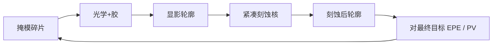

# 刻蚀模型进 OPC

OPC 若停在显影轮廓，刻蚀还会按密度把边再挪一截；转印模型必须进同一条迭代，而不是事后加偏置。

<footer>—— 对照计算光刻中「光学 + 胶 + 刻蚀」紧凑链的通称；负荷与偏置见刻蚀工程公开讨论</footer>

[上一课](/litho/pw-opc)把名义点升级成工艺矩形上的 PV-band。缺口是：那条带默认画在抗蚀剂边上。反应离子刻蚀（以及后续硬掩模）按开口密度、深宽比和聚合物沉积再做一个邻域算子。本课钉刻蚀模型进 OPC。胶本身如何从空中像变成那条显影边，留给[下一课](/litho/resist-compact-model）。

## 问题

同一条显影 CD，密线区与孤立线区刻完可以差出窗口的一截：微负载、大面积负载、侧面聚合物、以及 [ARDE](/litho/etch-loading-ar) 把深度和横向偏置写成密度的函数。若 OPC 只让显影边贴目标，硅或金属上的最终 CD 仍随环境变。早期做法是在 OPC 后再加一层经验蚀刻偏置表——和规则 OPC 同一类破产：二维邻域组合表盖不住。

PW-OPC 的工艺点若不含刻蚀，窗口角上的「还剩的带」会在转印时被吃掉。问题是把刻蚀前向收成可调用的紧凑模型，嵌进碎片循环，而不是再写一篇腔体化学综述。

### 转印是第二个邻域，不是常数偏置

光学邻域是数个波长；刻蚀邻域可以是微米到毫米（负载）叠加纳米级的侧面偏移。两种卷积核不同。把刻蚀当成「全场减 2 nm」只会修对一维标定线，修不对二维热区与 SRAM。

最终签核轮廓要写清：ADI 还是 AEI。PW-band 若只含 ADI，电学看到的是另一张图。

## 方法

紧凑刻蚀模型吃显影多边形（或采样边），输出刻蚀后边。输入特征包括局部开口率、可见视野内的密度、线宽/间距、取向。校准用 ADI/AEI SEM 或电气 CD。模型进 OPC 后，EPE 对**刻蚀后目标**计算；工艺点可以含刻蚀漂移（时间、功率的代理），但全物理腔体模拟进不了全芯片迭代。

分层仍然必要：规则区用短程偏置加密度核；热区加更长程负载或补丁。刻蚀模型换腔、换硬掩模、换气体即作废，与光学模型独立校准、一起使用。

### 与 PW-OPC 的顺序

先有能算的刻蚀前向，再把 AEI 目标放进多工艺点代价。反过来先做光学 PW、再贴刻蚀表，角点会双重计数或漏计。工程上常先光学+胶收敛，再打开刻蚀核微调，避免一开始变量耦合炸裂；签核必须是三者同时开。

## 机制

碎片移动改掩模 → 空中像 → 显影边 → 刻蚀边。梯度（或差分）必须穿过刻蚀核，否则优化仍在修胶边。刻蚀核对小 jog 可能不光滑，MRC 与碎片长度要避免把噪声修进掩模。密度核是低通：它惩罚的是环境，不是单条边的高频衬线；因此刻蚀进 OPC 往往减少「为贴 ADI 而堆的无用衬线」，把修正预算留给真正进 AEI 的自由度。

负荷让大片空区与密区的横向蚀刻不同，SRAM 与逻辑边界成为热点。这与光学热区不完全重合：光学热区在禁戒节距，刻蚀热区在密度跳变。两类都要进同一张掩模。

紧凑刻蚀模型是拟合物，不是等离子体第一性原理。换机台配方等于换 OPC 版本。不要把论文里的 PIC 模拟当全芯片核。

## 边界

本课不把 ALE/RIE 化学写进 OPC。随机孔洞、选择比崩溃不是均值刻蚀核能预测的。后课胶模型若不准，刻蚀核吃进去的 ADI 就是错的，误差会算到「刻蚀」头上。

不要发明供应商蚀刻模型的内部系数名。通称即可：密度核 + 短程偏置，校准到 AEI。

多重图形的每次曝光可以有不同刻蚀。OPC 链按层、按次分别校准，不要共用一张偏置表。

## 小结

- 最终 CD 在 AEI；只修 ADI 会把密度相关转印留给电学。
- 刻蚀是第二个邻域算子，常数偏置表覆盖不了二维负荷。
- 紧凑刻蚀核嵌进碎片循环，EPE 对刻蚀后目标计算。
- 光学热区与密度跳变热区要在同一张掩模上折中。
- 出处：OPC 通称的光学–胶–刻蚀链；刻蚀负荷公开工程讨论。
