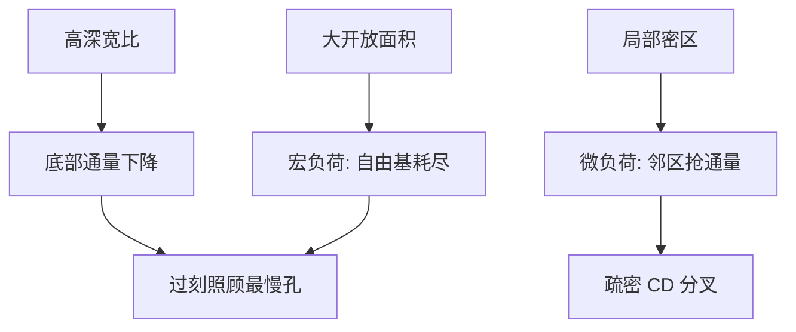

# 深宽比与刻蚀负荷

同一套离子与自由基，开口一深、邻近一密，到达底部的通量就不是晶圆平均值；速率随几何走，叫深宽比相关刻蚀，也叫负荷。

<footer>—— 刻蚀通称：ARDE 与宏 / 微负荷，不把某一腔体的速率表当成自然常数</footer>

[上一课](/litho/rie-pattern-transfer)把 RIE 写成协同与硬掩模转印，默认开口够宽、通量够均匀。缺口是几何：接触孔、浅槽和密线之间，深宽比（AR）和开口面积一变，中性基与离子到达底部的概率变，CD 与深度不再跟紧凑偏置走。本课钉 ARDE 与负荷效应。孔阵列相对线空为什么更难印、更难刻，留给[下一课](/litho/contact-hole-patterning)。

## 问题

上一课的选择比窗口是对「某种膜、某种偏置」说的。同样食谱，孤立宽槽先到底，密线或深孔还在爬——这是深宽比相关刻蚀（ARDE）：高 AR 特征速率下降。晶圆上开放面积大，自由基被吃光，全局速率下降，叫宏负荷；局部密度高，邻近图形抢通量，叫微负荷。OPC 若只用一个与密度无关的偏置，疏密交界会先出窗口。

缺口不是再讲离子从哪来，而是：转印函数对**布局**敏感。DTCO 的密度规则、虚拟图形（dummy）和填充，有一部分是在买更均匀的刻蚀通量，而不是在买光学对比。

### ARDE 不是焦深

光学焦深按 $\lambda/\mathrm{NA}^2$ 变薄，是空中像沿轴。ARDE 是腔体传输：中性基要扩散进孔，离子有角分散，深孔底部通量掉。两者都会让「看起来一样的设计 CD」在硅上分叉，计量链不同。把深孔刻不穿写成曝光不足，会去拧剂量。

过刻用来照顾最慢的孔，同时最宽的槽已经在啃硬掩模或衬底。窗口是最慢特征与最快特征之间的选择比，不是平均速率。

## 方法

工程上把图形分成 AR 族与开口面积族，用截面和终点信号看谁先停、谁还在走。缓解不外乎：降 AR（先开硬掩模再换化学）、加钝化抑制宽槽横向、用脉冲或低占空比改离子/中性比、布局上插 dummy 把局部开放面积拉平。ALE 用循环把「每圈去掉的量」从通量梯度里解开，那是薄膜课的工具；本课的连续 RIE 仍活在通量里。

虚拟图形必须同时过光学与刻蚀两关：dummy 会改空中像邻近，也会改微负荷。只为刻蚀填满、不管 OPC，邻近热点会换一个地方出现。

### 填充图形是刻蚀的 RET

光学有 SRAF；刻蚀有密度填充。两者都改变邻域算子。区别是：SRAF 不应在晶圆上作为独立图形留下；dummy 往往留下，要能被后续 CMP 或电学接受。规则手册里的「最小/最大密度」常是负荷约束，被误写成分辨率约束。

## 机制

中性自由基无方向，运输靠扩散；孔越深越窄，口部消耗后底部欠饱和，速率掉——ARDE 的化学支。离子有鞘层加速，但仍有角分布；深孔壁挡住斜离子，底部离子通量也掉，物理支同样 ARDE。宏负荷是整片开放面积的反应器级质量守恒：面积大，自由基分母变大。微负荷是图案尺度的局部耗尽。三者可以同时在，不能用一个「loading 百分比」打天下。

这解释了接触孔过刻比线空更凶：孔的 AR 更高、底部更黑，终点要以孔为准，线槽就过刻。也解释了为何紧凑刻蚀模型至少要一个密度项；没有这一项，上一课的全芯片核在 SRAM 与逻辑交界处系统性地偏。

同一食谱换掩模开口率，速率可以明显变。比较两台刻蚀机的「快慢」而不声明开口率和 AR，没有意义。

## 边界

不要发明某国产刻蚀机在某一 AR 下的纳米/分。通称机制够用：通量随几何变。不要把 ARDE 写成只有深硅 MEMS 才有——逻辑接触孔和金属沟槽已经在这个词里。本课不重写 Coburn 协同，只把它放进有限深宽比的腔。

CMP 碟形、电镀填充也会随密度变，那是后道另一条负荷，不要和干法微负荷混成一张图。下一课的孔图形化会把光学低对比和本课的高 AR 叠在同一类图形上。

出处：半导体刻蚀通称中的 ARDE、macro/micro loading；与 RIE 教材中的传输限制。不引用未公开的腔体速率曲线。

## 小结

- ARDE：高深宽比降低底部离子/自由基通量，速率下降。
- 宏负荷吃整片开口面积；微负荷吃局部密度。
- 过刻窗口夹在最慢孔与最快槽之间。
- dummy 与密度规则有一部分是刻蚀 RET，不是光学 $k_1$。
- 接触孔图形化下一课，光学与刻蚀在孔上会合。
- 出处：刻蚀通称 ARDE 与负荷；不编造工具速率。
