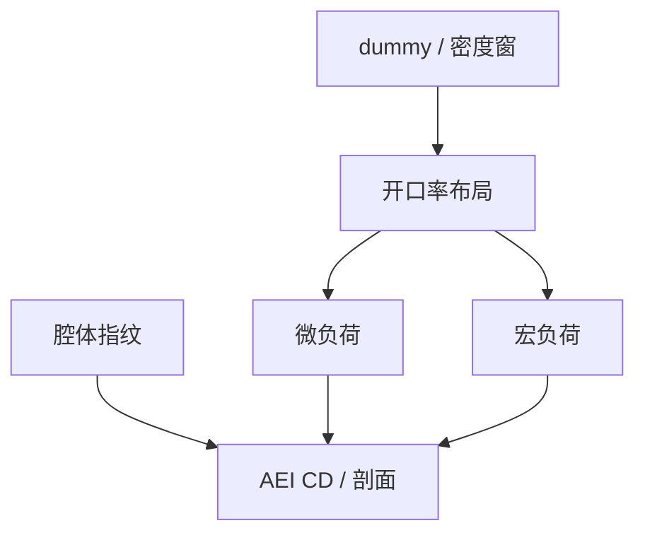

# 刻蚀负载效应

同一食谱，开阔区把自由基吃光，密区抢通量，边缘阵列速率另走一套；负载把布局写成 AEI 的长程邻域。

<footer>—— 对照宏负荷 / 微负荷产线通称；[深宽比与负荷](/litho/etch-loading-ar) 已给几何定义</footer>

[上一课](/litho/anisotropy-passivation)指出钝化随开口率变。缺口是集成尺度：芯片上 SRAM 阵列、逻辑、划片槽、dummy 的开口率差，把 CD 和剖面拉成一张密度图。[ARDE 课](/litho/etch-loading-ar) 已钉宏/微负荷；本课不重写到达概率，而钉**设计填充、dummy 与腔体匹配如何管理负载**。刻蚀偏置如何回写 OPC，留给[下一课](/litho/etch-bias-opc-loop）。

## 问题

宏负荷：晶圆或场级开放面积大，中性浓度下降，全球速率降。微负荷：局部密度，特征互相抢。阵列边缘：介于宏与微之间，SRAM 课已警告 dummy。填充（dummies）和槽密度规则有一截就是买均匀通量，不是为了好看。腔体与静电吸盘温度、气体注入位置再叠一张径向指纹，与布局负载不可互替。

缺口是**合同：谁补负载**。只让 OPC 核吃密度，腔体指纹漂了核就过时；只拧腔体，换产品开口率仍爆。要分层：设计密度窗 + 核 + 腔体 APC。

### dummy 不是免费金属

金属 dummy 影响 CMP（下下课）和电容；介质 dummy 影响局部负荷。规则要声明电气是否连接、是否允许在模拟区。乱填会制造新的微负荷周期，匹配模板里出现「dummy 引起的杀手」。

划片槽和大开口是宏负荷源。PWQ 若只用密线场，会漏掉产品真实开口率下的食谱。

## 方法

量：开口率图、AEI CD 对密度、径向指纹。动作：密度规则与填充；刻蚀核多层半径（短程 + 长程）；腔体气流/温度匹配。与 [CDU 刻蚀偏置](/litho/cdu-etch-bias) 衔接：全场 CDU 往往是负载指纹而不是镜头。产品换版开口率大变，要重验证食谱，而不是只重跑 OPC。

开口率图应用与 OPC 同一层的设计多边形生成，并含 dummy。用「芯片面积」当宏负荷代理会漏掉划片槽和大开口。腔体径向指纹要在固定开口率的测试片上量，才能和布局负荷分账。

## 机制

中性消耗 $\propto$ 开放面积 × 反应概率；扩散补给跟不上则局部浓度降。聚合物前体同样被布局调制，于是钝化与选择比都随密度走——负载不只是「慢一点」，而是剖面形状一起变。长程核能近似平滑密度，吃不掉腔体不对称和晶圆边缘（后课部分场）。

布局开口率与腔体指纹在 AEI 上相加。dummy 只能改前者；径向不对称要回腔体，禁止让 OPC 核去拟合喷淋头。

## 边界

不重推 ARDE 公式。不把某产品的 dummy 规则当 SEMI 标准。等离子体颗粒与负载是不同机制。

后课默认：负载由设计密度 + 核 + 腔体分层管理。下一课把测到的偏置闭环回 OPC，而不是每个班次拧激光。

## 小结

- 负载是布局调制的通量与钝化，CD 与剖面一起走。
- dummy 与密度窗是设计侧补丁，带电学代价。
- 腔体指纹与布局负荷要分开计量。
- 出处：宏/微负荷通称；刻蚀工程与计算光刻密度核。
