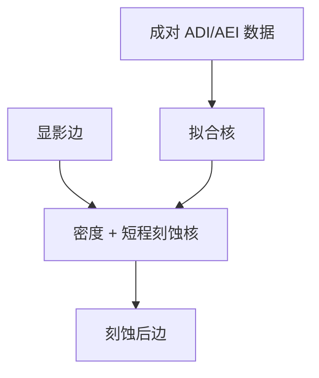

# 刻蚀模型校准

ADI 贴目标不等于硅上贴目标；刻蚀核要在 AEI 上单独拟合，换腔体就换版本。

<footer>—— 对照紧凑刻蚀模型、ADI/AEI 成对计量与负载效应的产线通称</footer>

[上一课](/litho/3d-resist-model)承认胶是三维的。缺口是下一跳：等离子体把胶形变成硬掩模/介质/硅形，偏置随密度与深宽比变。本课钉刻蚀模型校准。[刻蚀进 OPC](/litho/etch-in-opc) 已说明为何要进迭代；这里补怎么标定。全芯片算力，留给[下一课](/litho/full-chip-simulation-cost）。

## 问题

紧凑刻蚀模型吃显影多边形，吐刻蚀后边：短程偏置 + 密度核 + 有时取向。校准数据必须是**同一部位**的 ADI 与 AEI，否则光学残差会被刻蚀项吞掉。ARDE、微负载、大面积负载尺度不同，一个核半径不够——与 PEC 多层核同构。

缺口是**AEI 协议**，不是再讲 RIE 化学。把「经验 etch bias 表」当校准完成，二维邻域仍会在 SRAM–逻辑边界爆。

### 换配方即新模型

功率、气体、过刻、硬掩模材料一变，核作废。OPC 版本号要含刻蚀工艺 id。APC 以后可以微调平均偏置，但不能当全核重标定。

最终签核写清轮廓：ADI、AEI 还是电学。PW-band 只含 ADI 时，窗口角可能在转印里被吃掉。

## 方法

实验：密度矩阵、通过节距、二维、深宽比变化（不同开口）。计量：CD-SEM AEI、有时 TEM 截面。拟合：与胶分两阶段，先锁 ADI 再锁刻蚀。保持集含产品 clips。与 [etch bias OPC 回环](/litho/etch-bias-opc-loop) 后课（集成门）的关系：本课是模型； fab 回环是用在线 AEI 去更新偏置——控制层，不是再建一个物理腔。

## 机制

中性基消耗随开口面积变（负载），离子角分布随深宽比变（ARDE），聚合物在侧壁沉积随局部通量变。紧凑核是这些效应在边法向上的投影，不是 PIC 粒子模拟。梯度若要穿过核，核必须对 jog 足够光滑，否则 OPC 振荡。

## 边界

紧凑刻蚀 ≠ 等离子体第一性原理。不把某腔体的 nm/min 写成宇宙速率。校准不覆盖等离子体不稳定与颗粒。

后课默认：前向链光学–胶–刻蚀都有可调用核；下一课问全芯片扫一遍要多少算力，从而 LRC 只能抽样。

## 小结

- 刻蚀核在成对 ADI/AEI 上单独拟合，与胶项分家。
- 负载多层尺度；换腔体换版本。
- 签核轮廓定义必须写进模型合同。
- 出处：紧凑刻蚀模型与负荷效应产线通称；计算光刻 OPC–刻蚀链。
