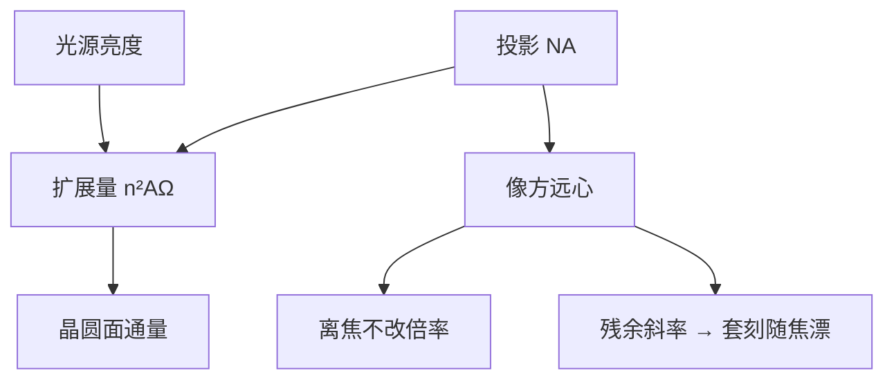

# 光学扩展量与远心

数值孔径给出能进镜头的最大张角；光学扩展量把面积与立体角锁在一起，远心则要求主光线不随离焦改倍率。

<footer>—— 据 Born &amp; Wolf 对光学不变式 / 扩展量的讨论，以及 Levinson 对投影光刻远心的产线表述整理</footer>

[上一课](/litho/lens-na)把投影物镜收成 $\mathrm{NA}=n\sin\theta$，光瞳是频率轴上的硬截止。缺口是：$\mathrm{NA}$ 只回答「斜到什么程度还进得去」，不回答「有多少光能被送进这个锥」，也不回答「离焦时像会不会横向溜走」。本课补两个几何量：光学扩展量（etendue）与远心。照明如何填充这个光瞳，留给[部分相干](/litho/partial-coherence)。仍不写产线 CD 公式。

## 问题

扫描机的晶圆面照度受光源亮度与扩展量限制。扩展量（拉格朗日不变量的积分形式）在无损耗系统里守恒：物方 $n^2 A \Omega$ 与像方相等。把投影 $\mathrm{NA}$ 做大，同一视场能接受的立体角变大，但光源必须提供匹配的扩展量，否则光瞳填不满，throughput 上不去；源的扩展量比镜头能吃的更大，多出来的光也进不去，只能丢掉。

远心是另一件几何事。像方远心意味着主光线平行于光轴：离焦改变的是模糊，不改变倍率。残余远心误差会让套刻和 CD 随焦面一起漂。缺口因此是在 $\mathrm{NA}$ 之后把能量通道与轴向几何钉住，而不是开始谈 $k_1$。

### 扩展量不是 NA 的别名

$\mathrm{NA}$ 是边缘光线角；扩展量还要乘发光面积（及 $n^2$）。同一 $\mathrm{NA}$，狭缝变宽，扩展量变大，光源更难喂饱。准分子激光扩展量很小，照明可以几乎任意整形；放电或激光等离子体的扩展量更大，收集镜与中间焦点必须先做匹配。本课只给守恒接口，不写某代机台的瓦数。

合同上的 $\mathrm{NA}$ 仍指晶圆侧。扩展量匹配发生在照明与投影之间：填不满是 $\sigma$ 上不去，喂过了是光源功率浪费。下一课才把填充比叫做 $\sigma$。

## 方法

圆形、均匀填充的近似下，扩展量随 $(n\sin\theta\cdot r)^2$ 涨，其中 $r$ 是光瞳或视场相关半径，视约定。设计照明时先看投影能接受的最大扩展量，再决定源与积分器怎么填。守恒的是相空间体积，不是「镜头口径毫米数」：同样口径，工作距不同，$\theta$ 不同，扩展量不同——这与上一课「口径不是 $\mathrm{NA}$」是同一几何。

远心：光瞳（出瞳）放到无穷远，主光线与轴平行。物方、像方可以分别远心。晶圆侧远心是套刻通过焦点仍稳的前提；掩模侧若有意留下主光线角（反射式 EUV 的斜入射），那是后课膜系与阴影的缺口，本课只要求：像方主光线一斜，离焦就产生倍率误差。

### 远心误差是轴向预算的横向泄漏

调焦可以把平均面放回最佳焦面，但场内若远心随狭缝位置变，不同位置的主光线斜率不同，同一 $\Delta z$ 造成不同的 $\Delta x$。这表现为通过焦点的套刻扇形或 CD 不对称，不是「$\mathrm{NA}$ 不够」。度量上要声明是狭缝中心还是边缘。

不要把远心和焦深公式混成一个数。焦深问的是对比度还够不够；远心问的是糊斑的中心有没有横向搬家。两者都随 $\mathrm{NA}$ 变敏感，机制不同。

## 机制

相空间里，每条光线占一小格。镜头可以把格子从「大面积、小张角」换成「小面积、大张角」，格子总数（扩展量）不变。浸没提高像方 $n$，同样 $\theta$ 下扩展量与 $\mathrm{NA}$ 一起涨，光源与照明必须重新匹配——这是浸没课要付的能量账，本课先把账本立上。

远心破坏时，离焦相当于沿主光线走一段，像点跟着斜线走。频率语言里这不是低通半径变了，而是波前带上与视场相关的倾斜（一次项），与离焦二次相位叠加。后课写像差时，倾斜和离焦会进同一套光瞳相位；本课只需认出：远心是倾斜项的几何名字。

### 后课默认的接口

说到 throughput，先问扩展量有没有匹配，再问源功率。说到通过焦点的套刻，先问像方远心，再问调平伺服。$\sigma$ 仍未正式作为填充比展开；本课只准备好「光瞳可以被填到多大」这一几何上限。

## 边界

扩展量守恒假定无散射、无吸收。镀膜损耗、遮拦、积分棒墙壁都会吃光，但不改定义。本课不引用未公开的机台流明表或扫描速度。也不要把「远心镜头」理解成已经消像差：远心是主光线方向，球差、彗差仍在。

$\mathrm{NA}$ 截止频率的定义不改。后课部分相干用的照明孔径，必须落在本课扩展量允许的锥里。

## 小结

- $\mathrm{NA}$ 是张角；扩展量是面积×立体角，无损耗时守恒，限制 throughput。
- 源与投影必须匹配扩展量，否则填不满或喂过。
- 像方远心使离焦不改倍率；残余斜率让套刻随焦面漂。
- 远心不是焦深，也不是 $\mathrm{NA}$ 的别名。
- 照明填充比下一课再写成 $\sigma$。
- 出处：Born &amp; Wolf, *Principles of Optics*；Levinson, *Principles of Lithography*。
