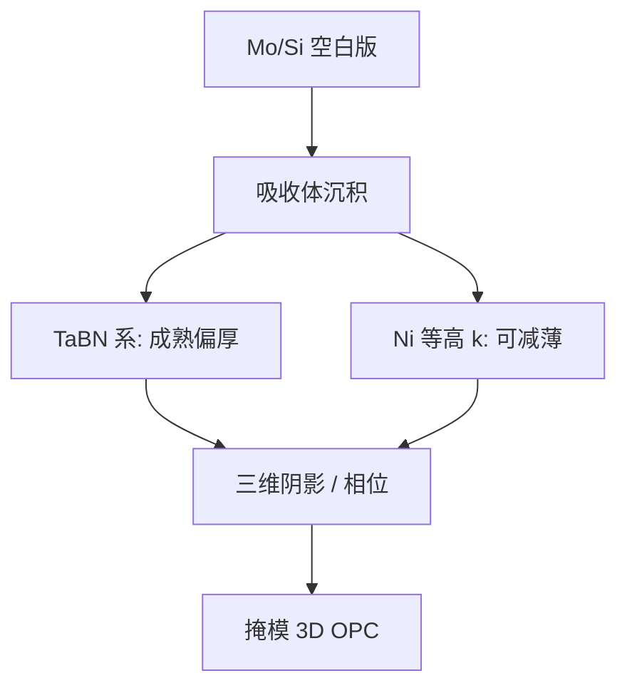

# 吸收体材料

EUV 版的对比来自吸收体挡住该反射的光；材料的 n、k 和厚度决定阴影、相位和能不能减薄。

<footer>—— 对照 EUV 掩模公开材料中的 TaBN 系吸收体，以及 Ni 等后继吸收体讨论</footer>

[上一课](/litho/euv-mask-defects)把空白版相位缺陷和吸收体振幅缺陷分开。缺口是：挡住光的那一层用什么。本课钉吸收体材料（公开的 TaBN 系，以及 Ni 等减薄方案）。光化检验如何看见它们，留给后课，不在这里写检测机台。

## 问题

EUV 掩模是反射多层加吸收体图形。吸收体必须在 13.5 nm 够暗，又要能被电子束写出、干法刻出、缺陷检出。厚度一旦到几十纳米，[斜入射阴影](/litho/euv-oblique-shadow) 和三维掩模效应就把左右不对称、取向偏置写进空中像。[OPC](/litho/opc) 可以修均值，但 MEF 和焦点窗跟吸收体的复折射率绑在一起。

传统量产公开叙述以钽基为主：TaN / TaBN / TaBON 一类，刻蚀与检测链成熟。代价是要足够厚才压住反射，三维效应大。High-NA 角更大，同一厚度更不可接受。缺口是换材料或换厚度，而不是再讲一遍多层缺陷分类。

### k 高可以薄，但相位不是免费的

吸收体不是纯振幅物体。n 偏离真空，厚度带来相移，侧壁和顶角进入严格电磁。减薄若只追光学密度，相位和侧壁会把 PV-band 做成新形状。材料表要同时看 k、n、蚀刻选择比和缺陷衬度。

DUV 铬/MoSi 的「薄吸收」直觉不能直接搬。EUV 是反射、斜入射；吸收体厚度走的是阴影预算，不是接近式光刻的胶厚类比。

## 方法

钽硼氮（TaBN）一类是公开的主流：硼调应力与微结构，氮调吸收和氧化，能在多层帽上刻出可用侧壁。检测在 DUV 与电子束下有衬度。缺点是光学常数决定了厚度下限，三维阴影成为 0.33 已必须进 OPC、0.55 更必须减薄或换高 k 的原因。

公开讨论的后继包括镍（Ni）等更高消光的金属：同样对比可用更薄的膜，阴影和 3D 效应下降。代价是刻蚀、缺陷、与多层的兼容、以及掩模厂工具链是否接得住。这是材料资格认证，不是 OPC 软件里改一个 n、k 表就完成迁移。

### 与变形倍率一起看

[变形光学](/litho/anamorphic-projection) 把掩模侧角度压回多层能活的窗。吸收体仍坐在这条光路上：薄而高 k 是给剩余入射角的余量。材料选择与倍率几何是同一张 High-NA 掩模预算的两边。

## 机制

空中像对比来自「该亮的多层」对「该暗的吸收体」的振幅差，再加三维电磁。侧壁不直、顶角倒角、底部残留，都会改有效相移。OPC 的掩模 3D 模型必须用当前材料校准；换 TaBN 到 Ni，等于作废旧紧凑掩模模型。

缺陷行为也随材料变。吸收体多一块、少一块的打印阈值取决于 k 和厚度；补偿修复（用图形盖相位坑）的工艺窗口同样绑在吸收体刻蚀上。上一课的缺陷分类在本课变成「这种材料上怎么修」。

不要把实验室里某张 Ni 膜的 n、k 写成量产规格。公开事实是钽基在用、高 k / Ni 在讨论与导入路径上；节点资格以掩模厂与扫描机的公开叙述为准。

## 边界

本课不重写埋藏相位坑，也不给具体膜厚纳米数当出厂值。不要发明某代 EXE 已经切换到某牌镍吸收体。后课默认：说到 EUV 版图形层，先问是钽基还是后继高 k，再谈阴影模型。

引用停在掩模公开文献与 ASML / 产业对吸收体的公开讨论。

吸收体不是 pellicle。pellicle 挡颗粒、贡献透过率；吸收体画电路。氢损伤两条链也不要并成一种「膜」。

## 小结

- 量产 EUV 吸收体公开主流是 TaBN 系；厚度换来对比，也换来三维阴影。
- Ni 等高 k 材料的公开动机是减薄、压 3D 效应，尤其服务更大掩模角。
- n、k、侧壁一起进空中像；换材料等于重校准掩模 3D OPC。
- 缺陷修复工艺与吸收体刻蚀链绑定。
- 出处：EUV 掩模公开文献；TaBN / Ni 等吸收体的产业公开讨论。
