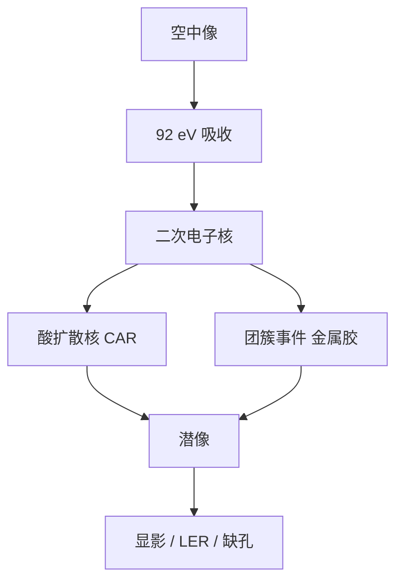

# EUV 吸收与模糊

92 eV 的光子在胶里打出二次电子；电子射程与酸扩散一起给潜像加核，光学 NILS 再陡也要先过这层模糊。

<footer>—— 据 Naulleau 对 EUV 二次电子模糊、De Bisschop 对随机与模糊的公开论述</footer>

[上一课](/litho/actinic-blank-inspect)把掩模空白的相位缺陷在 13.5 nm 上找出来。缺口是：光子到达硅片之后并不是在几何边缘上「点亮即停」——吸收事件产生二次电子，CAR 里酸还要走一段，潜像等于空中像卷积一个纳米量级的核。本课钉 EUV 吸收与模糊。光学课序里的掩模与胶接口到此；[NXE](/litho/asml-nxe) 把整机场几何收成量产平台。

## 问题

EUV 光子能量约 92 eV，是 ArF 的十几倍。一次吸收能打出级联二次电子，电子在凝聚态里走纳米量级才把能量交给 PAG 或金属团簇。Naulleau 等把这层叫做二次电子模糊（secondary electron blur）：它不按 $\lambda/\mathrm{NA}$ 缩放，也不按 $\lambda/\mathrm{NA}^2$ 的焦深缩放。空中像再陡，卷积之后边缘变钝，NILS 下降。

CAR 还要叠酸扩散：PEB 里酸的 $\ell$ 已在[酸扩散](/litho/acid-diffusion-lwr)课写过，EUV 半节距与 $\ell$、电子射程叠在同一尺度。De Bisschop 把模糊、光子散粒和化学离散放在同一张随机账上：模糊既降分辨率，也改局部有效体积，从而改泊松 $N$。只加 NA 不改核，墙会前移。

### 光学模糊与化学核不是一个旋钮

离焦、像差、flare 改空中像。二次电子与酸改记录介质的响应。调焦补不了电子射程；降 PEB 补不了镜头 flare。RLS 三角在这里具体化：要灵敏度就倾向更大化学增益、往往更大 $\ell$；要分辨率就压核、通常加剂量。金属氧化物胶减小酸程，核更接近电子与团簇离散，换的是另一套缺陷学习曲线。

不要把「EUV 模糊」写成某一个发明的纳米常数。公开论述给出的是纳米量级二次电子射程与可调的酸扩散，随胶配方变。本课钉机制，不写未校准的全球 $\ell$。

## 方法

紧凑抗蚀剂模型把吸收写成剂量 → 酸/事件密度，再卷积电子核与酸核，然后进显影。OPC 用的是这颗等效核，不是分子动力学。量测上，通过焦点的 CD、LER 频谱和缺失孔对剂量的曲线，用来把核与光子噪声拆开：核主要砍中高频、降 NILS；泊松在孔面积缩小时主导缺陷尾。

控制：减胶厚（少纵向吸收梯度、少电子从衬底回弹的复杂路径）、调 PAG/淬灭剂、换高吸收胶让同样 $D$ 下事件更多从而可牺牲一点增益。High-NA 焦深更薄，胶厚预算更紧，核与厚度一起被削——那是后课胶厚预算的入口，本课只要求模型声明电子项。

### 与随机效应课的分工

[随机效应](/litho/euv-stochastics)主钉光子计数与缺陷悬崖。本课主钉平均场里的空间核：同样平均 $D$，核宽了则边缘缓、桥接窗变窄。De Bisschop 的公开图把 LCDU 同时写成对比、模糊和 $N$ 的函数。后课机台剂量只提供 $D$；核在胶与 PEB 里。

## 机制

吸收截面决定光子在哪一层被吃掉。电子级联把能量涂开几个纳米，PAG 电离或激发的位置不等于光子吸收点。酸催化再把事件半径放大。总模糊近似若干核的卷积，密图形的 ILS 先被吃掉。衬底与底层的二次电子产额会加一层「从下面打上来」的底座，所以底层不只是黏附，也是模糊与反射的接口。

掩模吸收体边缘的电磁已经三维；胶核再涂一次，MEEF 与桥接对核宽敏感。光化检验保证掩模上没有致命坑，不保证胶能分辨光学上刚刚分开的两条线。分辨率合同是光学截止乘记录核，不是瑞利式单独成立。

Naulleau 的实验与仿真强调：即使理想光学，电子模糊也给 EUV 一条底线。De Bisschop 强调：这条底线与随机缺陷必须放在同一工艺窗口里读，不能只报平均 CD。

## 边界

本课不把某篇 SPIE 的 2 nm 或 5 nm 核写成所有 EUV 层的预算。也不重讲 PAG 化学循环。后课默认：说到 EUV 分辨率，除 $k_1\lambda/\mathrm{NA}$ 外要问吸收模糊核。机台课序从 NXE 场与 NA 合同开始，胶核当作已存在的记录限制。

出处：Naulleau 对 EUV 二次电子与抗蚀剂模糊；De Bisschop 对随机、LCDU 与模糊；Mack 对 CAR 扩散。不发明 arXiv 编号或未公开的核宽度表。

加剂量可以提高 $N$、改善随机尾，但平均场核宽度主要随电子与酸，不随剂量线性消失。用剂量「洗掉模糊」会误导 TPT 会计。

## 小结

- 92 eV 吸收产生纳米量级二次电子模糊，CAR 再叠酸扩散。
- 潜像 = 空中像 ∗ 核；密图形 NILS 先被核吃掉。
- 模糊与光子散粒一起进 LCDU/缺孔，但旋钮不同。
- 紧凑 OPC 必须声明电子项，不能只用 DUV 酸核。
- 掩模光化检验不替代胶核；下一课序进入 NXE 整机。
- 出处：Naulleau；De Bisschop；Bakshi / Mack 对 EUV 胶模糊。
