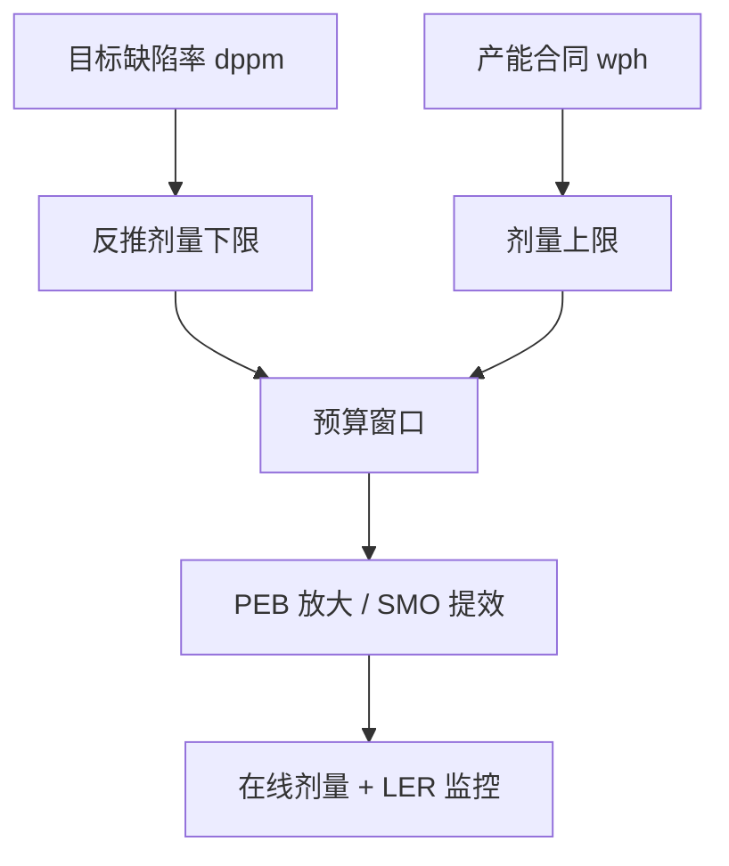
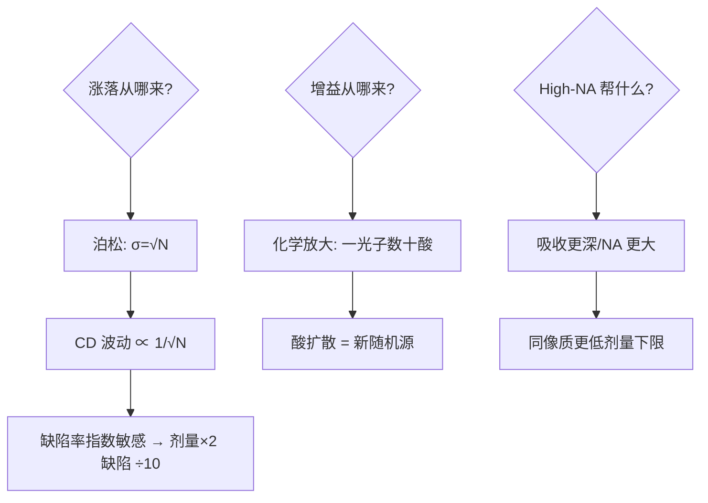

# EUV 剂量预算

EUV 的每一份剂量都是钱和缺陷的汇率：光子少一枚随机缺陷就冒头，光子多一档产能就掉一截——剂量预算是 stochastics 时代的中央账本。

<footer>—— 据 EUV 光子统计（Poisson 噪声）；ASML NXE 剂量-产能表；imec stochastics 研究</footer>

[晶圆边缘排除区](/litho/wafer-edge-exclusion)留出了物理余量，本课把余量折成光子：**剂量预算**。EUV 在 13.5nm 的光子能量高、数量少，散粒噪声让「同一剂量、不同晶圆点」的成像随机起伏成为先进节点的头号缺陷源。缺口是把剂量当预算管理：下限由缺陷率定、上限由产能定。本课不做 resist 化学的全貌。

## 问题

剂量（mJ/cm²）= 光子通量 × 时间。EUV 光子能量 92 eV，30 mJ/cm² 对应约 2×10¹² 光子/cm²——听着多，摊到一条 20nm 线的横截面上只有数百个光子，Poisson 涨落 ±√N 约 5%。光子少 → 胶响应随机 → 线边缘粗糙度（LER）与断线/桥连（stochastic defects）抬头；光子多 → 曝光时间延长，产能（wph）线性下降。缺口：**在缺陷率、CD 控制与产能之间给剂量定价**。

术语翻译：dose-to-size = 恰好印出目标 CD 的剂量；dose margin = 从 dose-to-size 到线塌/桥连的窗口；photon shot noise = 光子到达的泊松涨落，σ=√N；LER/LWR = 线边缘/线宽粗糙度。

数字实例：剂量 30→60 mJ/cm²（翻倍），单个特征的光子数翻倍、相对涨落从 ±5.8% 降到 ±4.1%——断线缺陷率可降一个量级；但单 wafer 曝光时间近似翻倍，产能从 175 wph 掉到 ~90 wph。一层换一层，年产能差出数亿美元——这就是「预算」的含义。

## 方法

预算管理四步：**定下限**——按目标缺陷率（dppm）反推所需剂量：胶灵敏度、量子效率与目标 CD 共同决定「光子泊松涨落不致命」的底线，imec 的高 NA 研究给出 20-25nm 特征需要 60+ mJ/cm² 的量级；**定上限**——产能合同与扫描时间约束；**中间分配**——PEB 放大（化学放大胶的酸扩散相当于「光子增益」）与 source-mask 优化把每一份剂量用在刀刃上；**监控**——在线剂量计量与 LER 抽测联动，剂量漂移即报警。

直觉类比：像下雨天拍照——光少则照片全是噪点（随机缺陷），加长曝光则一天拍不了几张（产能掉）。EUV 摄影师的任务：用最高效的胶卷（化学放大）、最大的光圈（SMO），把「不糊片」所需的最短曝光时间压到最短。

## 机制

泊松机制是底层物理：胶中一个特征接收 $N$ 个光子，吸收并引发酸反应的涨落 $\sqrt{N}/N$ 直接写进线边缘——CD 波动 $\propto1/\sqrt{N}$，剂量翻倍只降 29% 的涨落，缺陷率（对涨落的指数敏感）才降一个量级。放大机制：化学放大胶把每个光子的吸收放大成数十个酸分子的催化脱保——这是「量子增益」，但酸扩散又带进新的随机性（blur 与噪声的交换）。高 NA 的乘数效应：光子吸收在胶内更浅（更少反射损失）+ 数值孔径更大 → 同剂量下像质更好，或同像质下剂量下限更低——High-NA 的剂量经济学是它落地的核心论据之一。上游约束：光源功率（250W 级）决定每秒光子总量，剂量上限其实是光源税。

常见误区：把剂量当「越大越保险」——过高剂量让胶过曝、CD 膨胀，dose-to-size 窗口整体漂移；另一误区是把 LER 全归给剂量——胶分子尺寸、酸扩散长度与剂量各占一份，单靠加剂量压 LER 会先撞产能墙。

## 边界

预算的边界条件在移动：光源功率每代提升（250W→500W+）抬高上限；胶的量子效率与灵敏度是业界「EUV resist challenge」的主战场；multi-patterning 回归（High-NA 场域减半 + SADP）则重新分配「哪些线用多少剂量」。管理上的边界：剂量-缺陷-产能的三角没有全局最优点，只有按层（关键层高剂量、非关键层省）的分层预算——与 mix-and-match 的分区逻辑同构，只是把「机器分配」换成了「光子分配」。与 stochastics 文献的接口：imec/ASML 的联合研究给出「剂量-CD-缺陷率」的经验标定，是每个新节点定义预算的起点。

直觉类比：剂量预算像「公司差旅标准」——下限是「出不了差就误事」（缺陷超标），上限是「公司现金流」（产能）；中层管理者（工艺整合）的任务是给每个部门（每层）定不同的标准，让每一块钱（每一份剂量）花在刀刃上。

## 小结

- 剂量 = 缺陷率与产能的汇率；泊松涨落 √N 是底层物理。
- 下限由缺陷定价、上限由光源与产能定价；PEB/SMO 提效。
- 分层预算：关键层高剂量、非关键层省——没有全局最优点。
- 出处：Poisson 光子统计基础；ASML NXE 剂量-产能数据；imec stochastics 论文（2021-2024）。
