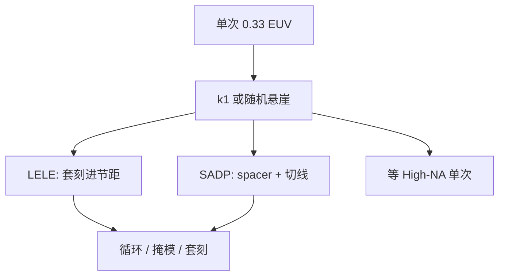

# EUV 双重曝光

单次 EUV 把波长换成 13.5 nm，并不保证每一层都停在 $k_1$ 与随机悬崖都舒服的一侧；不够时，仍要把一层拆成两次图形。

<footer>—— 对照代工厂对 EUV 单次 / 多重的公开节点策略；分解几何见 LELE 与 SADP 课</footer>

[上一课](/litho/photon-shot-budget)把单次曝光的工作点钉在剂量–LWR–缺陷三角上。缺口是：有的层在 0.33 NA 上要么节距低于单次可印窗口，要么剂量加到产率不可接受仍贴着悬崖。公开应对不是发明一种新光学，而是把 DUV 时代已经用过的双重——[LELE](/litho/lele-multipattern) 或 [SADP](/litho/sadp-saqp)——接到 EUV 层上。本课只写「何时拆、拆的代价」，不编某节点每一层的掩模表。[Hyper-NA](/litho/hyper-na) 是否把拆的必要性再推迟一截，是下一课的展望，不是本课的量产合同。

## 问题

0.33 NA、13.5 nm 的单次半节距仍受 $k_1$ 与随机同时限制。最密金属、通孔、切线若目标节距低于单次窗口，或者单次必须把剂量拉到三角的产能顶点之外，层策略就要在「双重 EUV」与「等 High-NA」之间选。双重把每一次曝光的节距放疏、把局部 CD 拉离悬崖，代价是多一次光刻/刻蚀循环，以及套刻或切线对准重新进节距。

公开节点叙事可以写到这一层：TSMC 在 IEDM 等场合说明，N3 相对 N5 增加了 EUV 层，其中部分关键层用了 EUV 多重；成本优化的 N3E 放松若干金属节距，把若干原需多重的层退回单次 EUV，循环与固有成本下降。不要把这句话扩写成「N3 的 M0 一定是 LELE」或「某厂某年全部孔层 SADP」——那些拆分细节没有作为可引用的层表公开。

### 双重不取消随机，只换账本

拆成两次之后，每一次的特征更大、有效 $N$ 更好看，悬崖可以退后。但多一次循环带来套刻、中间形貌上的涂胶、以及两套掩模的缺陷。LELE 把相邻线的相对位移写成节距误差；SADP 把线宽交给 spacer，切线层把套刻请回来。EUV 双重是把随机账的一部分换成套刻与循环账，不是「EUV 已经单次所以不必双重」的反例被取消。

EUV 双重与 DUV 双重是同一族分解，光源和胶不同。不要把 ArF 的 38 nm 半节距墙直接抄成 EUV 的拆分阈值；EUV 的墙是 $k_1$ 加随机悬崖，阈值随胶与剂量变。

## 方法

两条公开路径。LELE：染色分解 → EUV 光刻 1 → 刻蚀 → 再涂胶 → EUV 光刻 2 → 再刻蚀。适合二维自由度高的通孔或不规则金属，套刻是一等规格。SADP（及再往上的 SAQP）：EUV 印疏 mandrel → spacer 劈半 → 切线。适合一维栅，线宽均匀性转给薄膜，切层仍要 EUV 或 DUV。混合（公开讨论中的 LELE-SADP 一类）把 mandrel 自己再分解，用于更苛刻的轨道，但循环更长，只在策略文里当作选项，不要当成某节点默认。

与 High-NA 的分工：0.55 的卖点之一是把原需双重的节距拉回单次。在 EXE 产能与胶厚预算到位之前，0.33 双重是已安装机队上的过渡；两者可以在同一节点并存，按层选，而不是全球切换。

### 成本按循环算，不按「EUV 次数神话」

多一次 EUV 扫描的成本远高于多一次 DUV，所以「能单次就单次」是公开的成本叙事（N3E 即一例）。反过来，若单次必须把剂量加到三角破裂，双重加两次中等剂量，有时比一次极高剂量更可排产——这是预算比较，必须按层做，不能用口号代替。

## 机制

单次成像的通带不够时，分解把目标频谱拆到两张掩模上，每张重新落进可印 $k_1$。随机机制不变：每次曝光仍有自己的 NOK 悬崖，只是工作点更靠通道中央。LELE 的新机制是两次图形的并集对 overlay 敏感；SADP 的新机制是 spacer 几何加切线。EUV 掩模 3D 与阴影在每一张分解掩模上仍在，OPC/SMO 要按分解后的图形重做，不能把单次光瞳直接套到两张版上。套刻规格本身已在单纳米量级，EUV LELE 并不比 DUV LELE「更原谅位移」——只是每次曝光的光学墙不同。

不要用「EUV 已经消灭多重图形」当节点标题。公开事实是：EUV 减少了 DUV 多重的层数；最密层仍可能双重。减少不等于零。

## 边界

本课不给出未公开的层清单、不发明某代的 LELE 层数。代工厂幻灯片上的「EUV 层数」含单次与多重，不能倒推双重比例。切线、封闭环切开、二维金属拐角，使 SADP 不能覆盖任意布线——那是设计规则，不是光学失败。随机悬崖在双重的每一次里都还在，只报「节距已经疏了」不够。

后课默认：单次不够时的工艺选项是 LELE 或自对准双重（公开策略），而不是默认存在一种未公布的「EUV 三重标准流程」。

切线层、封闭环切开、二维拐角仍可能把「已经双重」的层再拆一次光刻，那是设计规则，本课不把它写成第三种默认分解。

读 N3 / N3E 一类对比时，区分「多重改单次」与「节距放松」。后者用密度换循环，不是同一张版的免费优化。

## 小结

- 单次 0.33 EUV 仍可能撞 $k_1$ 或随机三角，公开出路是 LELE 或 SADP，或等 High-NA。
- 双重把随机账的一部分换成套刻与循环；不取消光子统计。
- 节点公开策略会在多重与单次之间来回（如 N3 相对 N3E），不要编层表。
- 分解后的每一张掩模仍要自己的 SMO/OPC 与随机预算。
- 出处：LELE / SADP 机制；代工厂关于 EUV 单次与多重的公开节点说明（如 IEDM 上的 N3/N3E）。
