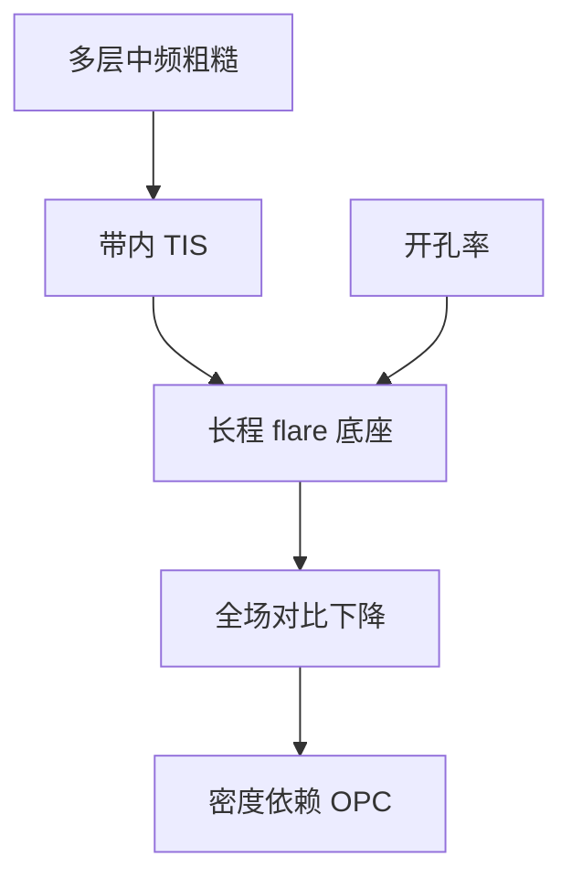

# EUV flare 与多层散射

短波长把多层膜的中频粗糙变成可观的带内散射；flare 是正确波长走了错误角度，给暗区垫上一层随开孔率变的底座。

<footer>—— 据 Mack 对 flare 的定义，以及 ASML 对 EUV flare 的公开讨论</footer>

[上一课](/litho/zeiss-euv-optics)把蔡司收集镜与六镜投影写成原子量级面形合同。缺口是：面形合格不等于不散射——多层界面的中频粗糙把一部分 13.5 nm 打进大角度晕斑，全场对比随图形密度变。本课钉 EUV flare。主光线斜入射造成的三维阴影，留给[下一课](/litho/euv-oblique-shadow)。

## 问题

计量课的 [flare](/litho/flare-and-stray) 已经给出 DUV 语言：长程底座抬 $I_{\min}$，Kirk 测试给积分量。EUV 把同一机制做得更疼：波长短一个数量级，同样埃级粗糙的散射截面更大；多层是体光栅，界面互扩散和粗糙都在带内散射。公开讨论里，EUV 总 flare 可到几个百分点量级，且必须按空间频率分段，不能用一个 RMS 打天下。

后果与 DUV 同构、权重不同：暗场里的孤立亮线、亮场里的孤立暗线，吃到的底座差很多。OPC 若没有开孔率依赖的 flare 核，会把开阔区 CD 修到掩模上，根子却在散射。蔡司出厂波前管的是设计衍射级；flare 是设计级之外的能量再分配。

### 短波长为什么更散

散射角随 $\lambda$ 与空间频率走。13.5 nm 下，中频粗糙（空间波长介于面形与高频抛光之间）把能量送到几十到几百微米乃至全场的晕。投影六面相乘，每一面的 TIS 都往底座里送一份。收集镜更脏、更糙，主要改 IF 光瞳；投影镜 flare 直接进空中像。不要把收集镜寿命造成的「变暗」和 POB flare 写成同一个旋钮。

Mack 的 flare 是成像定义：不该参与设计干涉的光。ASML 公开讨论把它落到 EUV 多层 TIS 与 Kirk 一类量测。本课用这套语言，不编造某代 NXE 的 flare 百分比。

## 方法

建模仍是空中像加长程卷积，或 DC 项加中程核，权重随局部开孔率。EUV 的核更「胖」，因为短波散射角大、镜子张数多。补偿是剂量/偏置随密度变，暗场版图从源头减积分。清洁与氢控碳膜，避免额外粗糙；镀膜规格写中频，而不是只写峰值 $R$。

Kirk 或等价暗垫测试给出积分 flare；要做 OPC，还需要空间核，不能只有一个全场百分数。光瞳填充改变时，镜子上的照射足迹变，有效 TIS 会变——SMO 换光瞳要重评估 flare，不是只重算 TCC。

### 与部分相干、OoB 分开

$\sigma$ 是故意的光瞳填充，已在 TCC 里。Flare 不进标称 TCC。[带外](/litho/euv-source-bandwidth) 是错误波长；flare 是带内走错角度。pellicle 颗粒离焦也像软底座，但是局部缺陷，不是镜面 TIS。三类底座修法不同，混在一个「雾」字里会拧错旋钮。

## 机制

每一界面的微弱散射按统计叠加。空间频率低的像差进 Zernike；中频进 flare 核；高频进大角度损失（掉 $R$）。EUV 多层有几十对界面，体散射不可忽略。扫描狭缝把狭缝外的晕也积分进剂量，时间上仍是缓变底座。

亮场给暗图形漏光，等效剂量增加，CD 按衬度曲线移动；密区里的暗线可能桥接。存储器阵列开孔率匀，逻辑后段疏密差大，EUV flare 指纹更毒——与 DUV 计量课同一句，权重更高。套刻标记对比会被稀释，但位移不是 flare 的一阶效应。

投影镜 flare 随污染缓慢变，收集镜脏主要掉功率。用加剂量去「补 flare」会让随机效应与热一起变差。正确顺序是控粗糙与开孔率，再谈剂量。

## 边界

本课不把某代机台的 flare% 写成常数，也不讨论腔体每一个机械鬼像。浸没气泡不是 EUV flare。后课默认：说到 EUV 对比，除 NILS 外要问多层散射核是否在 OPC 里。

High-NA 镜子更大、角谱更宽，TIS 预算更紧，但定义不变。出处：Mack 对 flare；ASML EUV flare 公开讨论；Bakshi 对多层散射。

元件 TIS 不是整机 Kirk flare。整机还含掩模多层、pellicle 框架散射与腔体。规格要对到哪一张测量图。

## 小结

- EUV flare 是带内多层散射形成的长程底座，随开孔率改对比。
- 短波长与多层界面让中频粗糙比 DUV 更疼；公开量级是几个百分点，不编机台常数。
- OPC 需要空间核；陡胶切不掉 DC。
- 与 $\sigma$、OoB、pellicle 颗粒分账。
- 下一课从反射掩模的斜主光线写三维阴影。
- 出处：Mack；ASML flare 公开材料；Bakshi, *EUV Lithography*。
