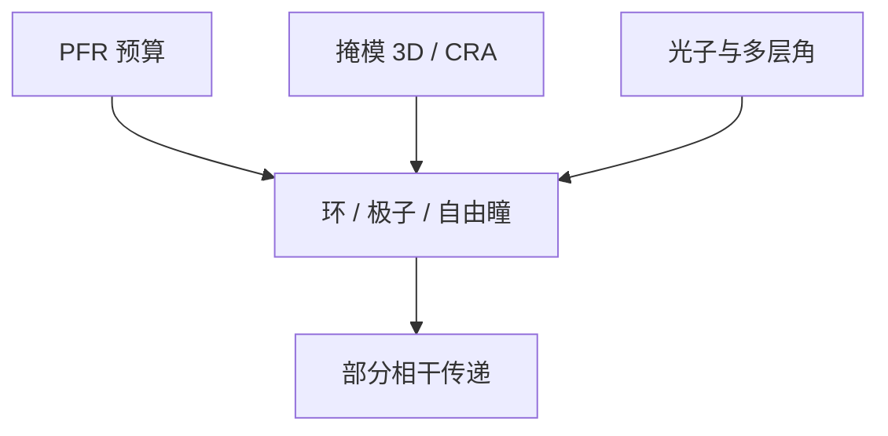

# EUV 照明设置

光瞳可以切成环、极子或自由形状。EUV 的约束是光子、多层角谱和掩模三维，不能把浸没 SMO 的 σ 表直接粘过来。

<footer>—— 对照 ASML FlexPupil / EUV SMO 公开叙述；Finders 等对 EUV 照明与 M3D</footer>

[上一课](/litho/pupil-fill-ratio)给出填充比预算。缺口是预算内部怎么切：环形、偶极、四极，还是可编程自由光瞳。氢等离子体怎样打在这些照射足迹下的镜面上，留给[下一课](/litho/hydrogen-plasma-mirrors)。

## 问题

PFR 只规定面积分数。同样 20% 填充，做成小 σ 常规照明与做成对向偶极，TCC 完全不同。EUV 关键层（切金属、通孔、SADP 心轴）依赖离轴极子抬 NILS；但离轴加大掩模侧角谱，[阴影](/litho/euv-oblique-shadow) 和最佳焦点漂移加重。多层在大入射角掉 $R$、分偏振，极子太靠光瞳边缘会自我打折扣。

缺口是 EUV 特有的设置约束，不是重讲阿贝成像。DUV 浸没有水的偏振管理和巨大光子库；EUV 每换一张激进光瞳，都在问 PFR、pellicle 热指纹和 M3D 是否还收得住。

FlexPupil 一类可编程反射照明是公开方向：用镜阵列或等效元件拼光瞳。具体镜数和算法以 ASML 公开为准，不要把 DUV 衍射光学元件 DOE 直接写成 EUV 硬件。

## 方法

SMO：在源与掩模上联合优化，目标函数含 NILS、PV-band、M3D 和工艺窗口。EUV 必须把 CRA 沿弧变化、flare 核、pellicle 双程放进循环，否则得到的极子在狭缝两端不可用。设置库按层别冻结：逻辑金属与孔不是同一张瞳。换源功率或收集镜老化后，要再资格认证填充形状，不能只改剂量。

常规照明仍用于较松的层，节省 SMO 与掩模复杂度。环形照明给各向同性层。偶极给一维密集线，但会牺牲另一方向，切层往往伴随定向设计规则。

### 设置库要带狭缝坐标

弧上 CRA 变化，同一张「偶极」在狭缝两端不是同一入射。把中心点 SMO 的瞳贴到全弧，边缘 NILS 和阴影会先坏。量产设置要么沿弧分段、要么在优化时就对弧采样。换收集镜或换功率后，有效源变，库要再资格认证，不能只改剂量偏移。

## 机制

光瞳上每一点对应掩模上一个入射方向。极子把能量堆在对对比最有利的衍射级对上，同时把吸收体阴影推到特定方位——HV 偏置成为设置的函数。自由光瞳可以逼近 SMO 的连续解，但制造与计量变成「这张瞳今天还是不是昨天那张」。热：照明镜和掩模上的足迹随设置变，pellicle 皱纹图也变，CD 指纹跟功率爬坡耦合。

设置改的是相干结构，不是波长。随机效应要的剂量绝对值，SMO 给不了更多光子；NILS 提高可以降低对剂量的部分需求，但不能取消泊松。

## 边界

本课不写氢等离子体对帽层的溅射化学，下一课才把「照射足迹」接到氢与镜面。不把某代 NXE 的 σ 表当附录。设置一旦冻结，收集镜老化仍会改填充形状，要进再资格认证，不能当一次性 SMO 交付。出处：ASML EUV 照明 / FlexPupil；Finders、van Setten 对照明与 M3D；Bakshi 部分相干。

## 小结

- EUV 照明设置在 PFR 预算内切割光瞳，并受 M3D、多层角和光子约束。
- SMO 必须带狭缝 CRA 与 flare，不能从浸没表复制。
- 下一课：这些足迹落在氢环境里的多层上会发生什么。
- 出处：ASML；Finders / van Setten；Bakshi。
