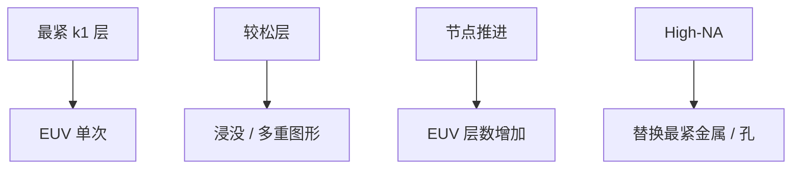

# EUV 层数与节点

节点推进不是「所有层都改 EUV」。切金属、通孔、心轴这些 $k_1$ 最紧的层先上，其余仍可以浸没多重图形。

<footer>—— 对照 ASML / 晶圆厂对 EUV 层插入的公开叙事；不要编造某代具体层数表</footer>

[上一课](/litho/high-na-pattern-transfer)把单层薄胶做成可转印。缺口是整节点：多少层值得付 EUV 的掩模、源和随机税，多少层留在 ArF 浸没。单次曝光还能走到多小的 $k_1$，留给[下一课](/litho/euv-single-expose-limit）。

## 问题

转印课默认「这一层已经决定用 EUV」。工厂的问题是层清单。7 nm 级公开叙事是少量关键层 EUV 替换四重浸没；5/3 nm 级层数增加；High-NA 针对更紧的金属间距，而不是把植入层也改波长。每加一层 EUV：掩模成本、pellicle、源功率、随机缺陷、真空污染都进 COGS。能用浸没 SADP/LELE 且良率可接受的层，不一定要换。

缺口是插入策略，不是再写一次薄胶栈。互补式 EUV 与浸没混用，在主干课已出现；本课钉「层数随节点涨，但不是全 EUV 厂」。

不要把某次财报或技术日上的层数抄成物理定律。本课只保留公开逻辑：关键切层先上、层数随节距涨、High-NA 替换最紧的那几层。

## 方法

分层决策：节距与 $k_1$、套刻、缺陷、掩模张数（EUV 单次 vs 浸没多次）、产能。孔阵列往往因随机缺失对 EUV 剂量和胶更苛刻，可能晚于线层或走不同胶。金属层方向性设计规则与偶极照明绑定，层数增加等于 SMO/掩模库膨胀。

与转印：EUV 层薄胶栈的轨道和刻蚀模块要按层别复制，不是全厂一条胶。混用节点的套刻网格必须同时服务 0.33 EUV、High-NA 半场和浸没。

### 掩模张数是隐藏的层数

浸没多重把一层器件变成两张、四张版；EUV 单次把张数压回去，但 pellicle、光化检验和空白缺陷率把单张成本抬高。层数决策是「器件层」与「掩模张数」两本账。只数 EUV 曝光次数会低估浸没多重的扫描机占用，只数工具台数会低估 EUV 掩模周期。

## 机制

瑞利 $CD=k_1\lambda/\mathrm{NA}$。0.33 EUV 把一批原先需要 SADP 的节距收成单次；再紧则 $k_1$ 掉到随机和 M3D 墙，要么多重 EUV，要么 High-NA 抬 NA。层数是这条物理墙在产品设计上的投影：标准单元金属层越多、间距越紧，EUV 版图越多。经济上，浸没多重的掩模张数和工艺步数会在某点超过单次 EUV——阈值随源功率、pellicle 和良率变，正是功率路线课的下游。

「全 EUV 节点」是营销简化。植入、厚膜、某些钝化仍可能停在 DUV。写层数时分层别，不要写一个整数打天下。

## 边界

本课不把单次曝光的 $k_1$ 下限写成公式终点，下一课才写单次极限。不编造 N3/N2 的官方层数。层清单随产品系列变，同一节点的 SRAM 与逻辑金属层数不必相同。出处：ASML 节点与 EUV 层插入公开材料；Bakshi 系统经济讨论；瑞利与多重图形课。

## 小结

- EUV 按 $k_1$ 最紧的层插入，层数随节点增加，但厂内仍是混用。
- 每层付掩模、源、随机和真空税；能留浸没的不必换。
- 下一课：单次 EUV 本身的节距墙在哪。
- 出处：ASML 公开节点叙事；瑞利 / 多重图形。
