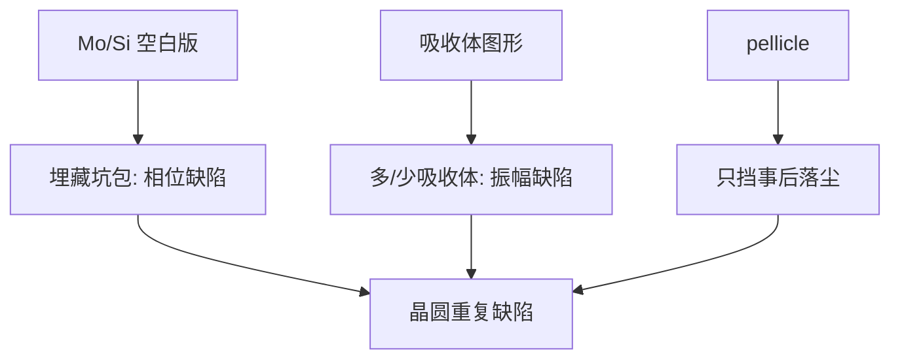

# EUV 掩模多层与缺陷

EUV 版是 Mo/Si 多层膜上的反射镜再加吸收体；埋在膜堆里的坑和包，pellicle 挡不住，印出来是相位缺陷。

<footer>—— 据 Bakshi, EUV Lithography 对空白版与缺陷的讨论；防护膜与量产接口见 ASML 公开材料</footer>

[上一课](/litho/euv-pellicle)把颗粒放到离焦薄膜上，降低掩模面落尘的打印概率。缺口是：空白版在镀多层膜时就已经可能埋进坑、包和颗粒——它们改变布拉格相位，吸收体画得再对也会在晶圆上留下暗点或亮点。本课钉 EUV 反射掩模的缺陷分类。[NXE](/litho/asml-nxe) 如何把这张版用到 0.33 NA 的量产场，是下一课。

## 问题

DUV 透射版的缺陷主要在铬/MoSi 图形层，修镀、挖修有一套。EUV 先要一块 Mo/Si 周期多层的空白版当反射镜，再在上面做吸收体图形。[多层膜镜](/litho/euv-multilayer-mirror)课写过布拉格反射；本课的缺口是这块镜不完美时会发生什么。衬底或膜堆中的高度误差 $\Delta h$ 变成相位 $4\pi n\Delta h/\lambda$ 量级（反射双程），13.5 nm 下几个纳米的坑就够致命。

Pellicle 只挡后来落在膜上的颗粒，不挡已经埋进空白版的缺陷，也不挡吸收体图形缺陷。无膜阶段更是把两类风险叠在一起。量产要的是空白版缺陷密度、吸收体缺陷检测、以及哪些缺陷可以用吸收体补偿图案盖住。

### 相位缺陷与振幅缺陷

埋藏坑/包主要是相位型：反射波前局部扭曲，空中像出现不可用的暗或亮。吸收体多一块或少一块主要是振幅型（也带一点相位），行为更接近 DUV 的铬缺陷，但仍在反射几何与阴影下。两类的检测：深紫外看表面往往看不见埋藏相位，需要光化波段（actinic）或高灵敏表面形貌加多层仿真。

补偿打印：有时在缺陷上方挪动或改吸收体，让局部剂量回到规格。这是掩模厂与 OPC 的联合动作，不是扫描机「对缺陷自动对焦」。能补的是弱缺陷，不是任意大坑。

## 方法

空白版：超光滑衬底、缺陷检查、再镀 Mo/Si，镀后再检。吸收体：沉积、电子束或多束写入、刻蚀、再检。光化缺陷检测与光化成像显微镜（AIMS EUV 一类）在 13.5 nm 上看打印后果，避免「可见光看见、EUV 看不见」或反过来。

晶圆厂侧：重复场缺陷指向掩模；随机缺陷指向胶与颗粒。Pellicle 把后者部分转成可换膜。掩模寿命还受氢环境、碳污染和吸收体溅射限制，清洁与 DGL 课已经给了气体环境，本课只要求缺陷账与那套环境分开记。

### 与 M3D 的边界

[掩模 3D](/litho/mask-3d-effect) 是吸收体厚度的系统电磁效应，OPC 默认要吃。本课的缺陷是局部偏离设计的相位/振幅点。系统阴影不是缺陷；缺陷不是用加厚吸收体就能定义掉的。SMO 优化光瞳也不消灭空白版坑。

## 机制

布拉格条件对膜周期和界面锐度敏感。局部周期被坑扰乱，反射率掉或相位跳，投影物镜把它成像为晶圆上的剂量洞或旁瓣。因为是反射，小高度误差比透射版更毒。扫描场里每次经过同一掩模坐标都印同一缺陷，所以重复性是诊断指纹。

吸收体边缘的随机缺口表现为 CD 或桥连，叠上 EUV 随机胶效应时，要靠重复性区分掩模与光子统计。下一课的 NXE 产能叙事包含掩模可用性：没有够低的空白版缺陷密度，0.33 NA 的光学分辨率兑现不成良率。

## 边界

本课不编造某代空白版缺陷密度的内部规格。也不把 CNT pellicle 写成已经取消掩模检测。High-NA 掩模侧角度更大，阴影与缺陷打印阈值都要重写，那是 EXE 课的附件。后课默认：说到 EUV 掩模，先分空白版相位缺陷、吸收体缺陷、pellicle 上颗粒三类。

## 小结

- EUV 版 = 多层反射空白版 + 吸收体；缺陷分埋藏相位与图形振幅。
- Pellicle 不保护镀膜时埋进去的坑包。
- 光化检测才能看见 13.5 nm 的打印后果。
- 弱缺陷或可用吸收体补偿；重复场缺陷是掩模指纹。
- 下一课把这张版放进 NXE 0.33 NA 的量产场。
- 出处：Bakshi, *EUV Lithography*；ASML pellicle / 掩模公开材料。
