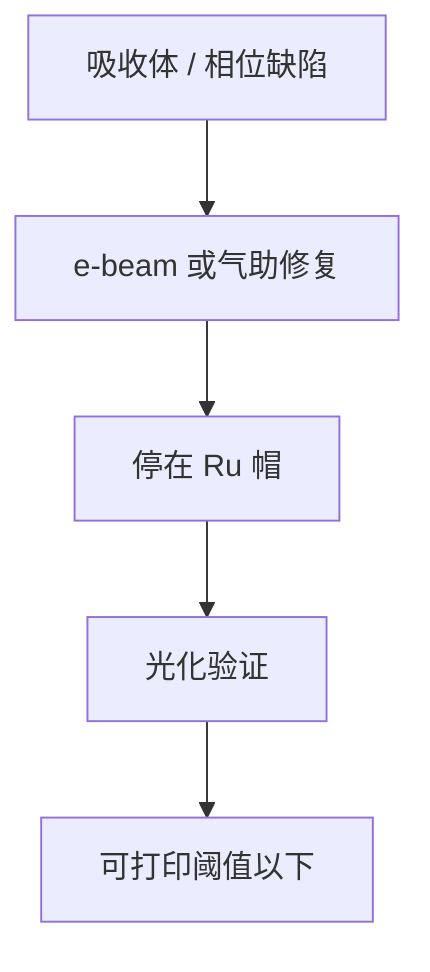

# EUV 掩模修复

修的是反射多层上的吸收体或相位坑，不是铬上的缺口。电子束或气助沉积必须停在钌帽上，多挖一层周期就是新的相位缺陷。

<footer>—— 对照 EUV 掩模修复公开工艺（电子束、气助）；不要当成 DUV 铬修补的换波长版</footer>

[上一课](/litho/mask-roughness)把边沿 PSD 写成 LER 底噪。缺口是缺陷怎么办：多一块吸收体、少一块、或空白相位坑。DUV 的[电子束修复](/litho/mask-repair-ebeam)课属于掩模厂主干，本课只补 EUV 特有的约束——多层、帽、氢和光化验证。薄膜寿命与更换，留给[下一课](/litho/pellicle-lifetime）。

## 问题

粗糙课假设边沿统计均匀。真实版上还有可打印的离散缺陷。EUV 空白的相位坑（多层少周期或颗粒）在硅片上像透镜，吸收体缺陷则像硬挡光。修复工具若按铬版去镀、去挖，会把 Ru 帽和 Mo/Si 挖穿，修完的「平」在 13.5 nm 是深相位物。High-NA 打印阈值更低，修复残渣和局部粗糙更容易过线。

缺口是 EUV 修复的终点检测与材料兼容，不是重写掩模厂修复机台型号。pellicle 装上之后再修更难，寿命课会碰到更换顺序。

本课不把 DUV 掩模厂的 e-beam 修补流程再写一遍。只强调：终点是帽层与光化，不是「SEM 上看起来齐」。

## 方法

清除多余吸收体：电子束诱导蚀刻或机械，停在 Ru。补缺：电子束诱导沉积，材料的 n、k 尽量接近原吸收体，否则局部相移和 BF 偏移。相位坑：有时用吸收体「盖」把坑变成不打印的暗区，或尝试再镀周期——窗口窄。每步前后用光化显微镜（AIMS 类）看 13.5 nm 空中像，DUV 检验会漏相位。

与粗糙：修补边沿的 PSD 往往差于原刻蚀，局部 LER 峰要进缺陷规格。与氢：修复材料必须在扫描机氢环境中不崩、不放气。

### 先揭 pellicle 还是带膜修

多数修复要接近图形面。揭膜产尘、再贴新膜又消耗寿命课的更换配额。带膜修窗口极窄，工具工作距和碎片风险都不友好。量产顺序通常是：检测 → 决定修/报废 → 揭膜 → 光化修复 → 再贴膜再检。无膜运行把这串缩短，却把颗粒风险交给下一课。

## 机制

13.5 nm 对深度极度敏感。挖掉一对 Mo/Si，相位和反射率跳一档，相当于新缺陷。沉积过厚则局部阴影和 BF 变。电子束本身也会在多层里注入电荷和碳，需控剂量。光化验证看的是与扫描机相近的 NA 和照明，否则「AIMS 通过、硅片失败」。

黑边和吸收体缺陷的修复策略不同：黑边本就不该反光，图形区必须保多层。工具配方不能共用到底。

## 边界

本课不写 pellicle 膜本身的寿命曲线，下一课才写。不展开掩模厂清洗槽配方。DUV 铬修补的「SEM 齐了就过」在 EUV 上不够，必须以光化为终点。出处：EUV mask repair 公开工艺；AIMS 光化鉴定；帽层课；DUV 修复课仅作对比引用。

## 小结

- EUV 修复的终点是钌帽与光化空中像，多层周期不可当余量挖。
- 修补材料的光学常数进入局部 M3D 和 LER。
- 下一课：装上薄膜之后，膜比版先老怎么办。
- 出处：EUV repair / AIMS 公开材料；Bajt 帽层约束。
