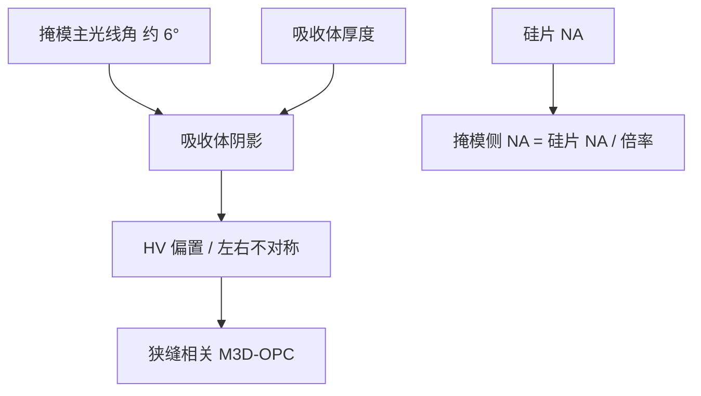

# 斜入射与三维阴影

反射式 EUV 在掩模上不是远心的：主光线带非零入射角，吸收体投下随方位而变的三维阴影。

<footer>—— 据 van Setten、Finders 等对 EUV 掩模阴影与 HV 偏置的公开论述</footer>

[上一课](/litho/euv-flare-ml)把对比损失写成多层散射底座。缺口是：即使 flare 核为零，反射掩模上的主光线也不是正入射——NXE 一类 0.33 NA 系统的掩模侧主光线角公开约 $6^\circ$，吸收体有厚度，开口左右不等价。本课钉斜入射与三维阴影。用变形倍率把掩模角压回去，留给[下一课](/litho/anamorphic-projection)。

## 问题

DUV 透射版可以近远心照明；EUV 必须斜着照，才能让入射与反射都离开法向、让投影物镜接到衍射级。Finders、van Setten 等公开分析把这件事写成掩模三维（M3D）的 EUV 特例：[吸收体厚度](/litho/mask-3d-effect) × $\tan(\mathrm{CRA})$ 给出几何阴影宽度，水平与垂直线的有效开口不同，CD 出现 HV 偏置，最佳焦距随方位和节距漂。

阴影随狭缝位置变，因为主光线角跨场扫描。全场指纹像套刻，根子在物面几何，不在工件台。OPC 必须用厚掩模电磁级，不能把 HV 差写进 overlay 校正。

### 非远心不是装调失败

掩模侧非远心是反射架构的几何税：要给照明和投影各留角度。硅片侧投影仍按远心设计，以免离焦变 CD 放大；物面却必须斜。把「EUV 套刻差」全部归因于斜入射，会修错——阴影是系统偏置，套刻是层间位移。van Setten 的公开图把阴影画在吸收体迎光侧，像平移加变窄，剂量拧不回左右不对称。

约 $6^\circ$ 是 0.33 NA、4× 平台广泛引用的掩模主光线角量级（Finders / van Setten 等）。不要把它抄成 High-NA 的 CRA；下一课变形光学正是为了不让 CRA 随 NA 线性涨。

## 方法

成像链在物体频谱处用 RCWA/FDTD 或 M3D 库替换 Kirchhoff 级振幅，含偏振。校准用不同方位的线和孔测 HV 偏置与通过焦点的 CD。减吸收体厚度、换低 $n$/$k$ 材料是硬件方向，能减弱阴影，但光学密度、缺陷可检测性和蚀刻选择比另记账。

计算光刻把狭缝位置写成 CRA 的函数，全场 OPC 带狭缝相关偏置。照明离轴加大掩模侧角谱，阴影更重，SMO 与 M3D 必须联立，不能先优化光瞳再当薄屏。

### 与 flare、pellicle 分层

flare 是长程底座，阴影是局部有效开口。[pellicle](/litho/euv-pellicle) 是膜的双程与皱纹，不取消 CRA。三者可以同时在，模型要可加，不要用一个「3D 效应」口袋装完。

## 机制

斜入射时迎光侧挡光、背光侧少挡，等效孔径平移并变窄。反射双程让吸收体侧壁被「多看一次」。开口宽度接近波长时，波导色散让 0/1 级相位偏离薄屏，最佳焦距变成图形相关，叠在镜头离焦和胶厚之上。偏振：线栅开口对 s/p 不同，掩模本身是弱偏振器，大 CRA 下更明显。

硅片 NA 0.33、倍率 4×，掩模 NA 约 0.083，CRA 约 6° 是这组数的公开工作点。若仍 4× 而把硅片 NA 抬到 0.55，掩模 NA 与 CRA 会一起涨到多层布拉格和阴影不可接受——这是下一课变形光学的入口，本课只把 0.33 的税钉死。

阴影造成的「平移」不是 overlay 标记该去的位移。标记若与器件图形高度、方位不同，读数甚至不能代表器件阴影。补偿在掩模与 OPC，不在套刻模型里当平移项吃掉。

## 边界

本课不重写全部 DUV M3D，只把 EUV 反射斜入射的增量写清。不编造未公开的吸收体纳米厚度表。后课默认：说到 EUV CD 的 HV 差，先问 CRA 与吸收体，再问镜头像差。

出处：van Setten、Finders 等 SPIE/ASML 公开成像论文；Mack/Levinson 对 thick-mask；Bakshi 对 EUV 掩模。High-NA 的角分配留给变形光学课。

Kirchhoff 薄屏在 EUV 上不是「略差一点」：CRA 非零加厚吸收体，薄屏的符号都会错。量产 OPC 以含 M3D 为默认。

## 小结

- 反射 EUV 掩模侧非远心，0.33 平台主光线角公开约 $6^\circ$。
- 吸收体阴影造成 HV 偏置、左右不对称和图形相关焦漂。
- 这是物面几何，不是工件台套刻；OPC 必须用厚掩模衍射级。
- 掩模侧角随硅片 NA/倍率涨，各向同性 4× 走不到 0.55。
- 下一课用 4×/8× 变形把这组角压回可镀膜、可印的窗口。
- 出处：van Setten、Finders 公开论述；ASML EUV 成像材料。
