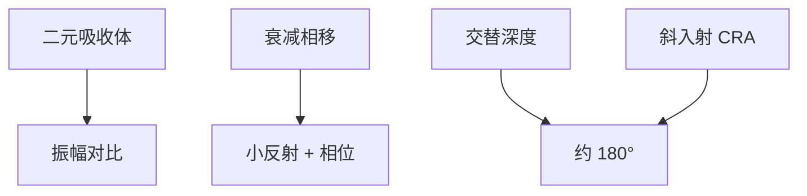

# 相移 EUV 掩模

DUV 相移版靠透射槽或衰减层拧 180°。EUV 是反射多层，相移必须做在膜堆或吸收体里，还要扛住斜入射。

<footer>—— 对照 EUV PSM / 衰减相移的公开探索；Levinson 对相移掩模的一般框架</footer>

[上一课](/litho/low-n-absorber)把 n 拉近 1，为的是少付相位税。缺口是相反的策略：有意保留并设计相位，做成相移掩模（PSM），换 NILS。钌帽层如何保护这块膜堆，留给[下一课](/litho/ruthenium-capping）。

## 问题

低 n 课把意外相移当成误差。PSM 把相移当成自由度：亮区与「暗」区之间约 180°，边沿干涉把 NILS 抬上去，类似 DUV 的衰减相移（att-PSM）或交替相移。EUV 没有透射石英槽——光在多层里反射，相位来自有效光程：减薄吸收体、蚀多层若干周期、或插入专用相移层。斜入射让左右光程不等，设计的 180° 随 CRA 和方位漂，狭缝两端不是同一张 PSM。

缺口是 EUV 反射式相移的可行性与税，不是重讲 Levenson 交替相移的历史。缺陷、检测、修复链都要为「暗区其实在反光且带相位」重建。

EUV PSM 在公开文献里长期处于研究与试点，量产主流仍是二元钽基吸收体。本课写机制与代价，不把会议图形写成厂内默认。

## 方法

衰减型：吸收体减薄或换材料，让暗区仍有小反射并带目标相位，类似 DUV MoSi。交替型：相邻开口对应多层深度不同，反射相位差 180°，对缺陷和焦面极敏感。计算光刻必须用严格电磁，Kirchhoff 加一个常数相位不够。检测：相移缺陷在 DUV 检验上衬度弱，往往要光化检验。

与 High-NA：更大 CRA 让相位随角度走得更凶，PSM 窗口更窄。低 n 吸收体可以是 att-PSM 的材料手段，也可以是二元掩模的减税手段——配方目标必须声明。

### 缺陷打印阈值会改符号

二元掩模上「少一块吸收体」是漏光。衰减相移上同一块可能变成相位缺陷，打印行为随照明和焦点变。修复和检验规格不能从 TaBN 二元表复制。交替型对深度缺陷尤其毒，空白坑会毁掉 180° 条件。这是 PSM 迟迟未成量产默认的掩模厂原因，不只是成像理论。

## 机制

空中像在边沿处 $E_1 + E_2 e^{i\phi}$。$\phi=\pi$ 时暗线更黑，NILS 升，随机效应和剂量可以松一点。$\phi$ 随波长、角和膜厚漂，通过焦点出现「相位焦移」，与下一课之后的掩模 3D 最佳焦点偏移同族、但是故意的。多层蚀深一纳米，相位就变一截，工艺窗口从掩模厂 CDU 扩到深度 CDU。

Levinson 书中的 PSM 成像论点仍成立；实现路径从透射槽换成反射膜堆。不要把 DUV 交替相移的石英刻蚀表贴到 Mo/Si 上。

## 边界

本课不写钌帽的氢兼容，下一课才把帽层钉死——没有帽，相移层先被氧化和氢毁掉。不重写 DUV att-PSM 产线。二元吸收体仍是量产默认；PSM 只在 NILS 墙明显且掩模链接得住时才值得开资格。出处：EUV PSM 公开研究；Levinson *Principles of Lithography*；低 n / M3D 课。

## 小结

- EUV 相移做在反射膜堆里，斜入射让目标相位随场变化。
- 量产默认仍是二元吸收体；PSM 是 NILS 与掩模复杂度的交换。
- 下一课：无论二元还是相移，多层表面都需要钌覆盖。
- 出处：EUV PSM 文献；Levinson；Finders / van Setten 相位与 M3D。
