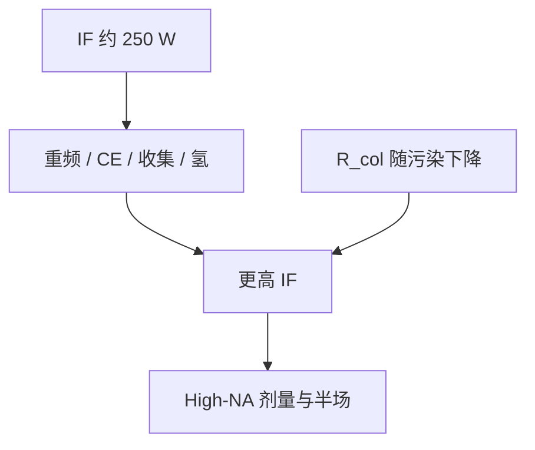

# 光源功率路线 250 W → 1 kW

250 W 是 NXE 高量产的公开里程碑；往 500 W、1 kW 走，不是把同一滴打得更猛，而是重频、CE、收集和可用性一起加码。

<footer>—— 据 ASML 对 IF 功率里程碑与 High-NA 光源需求的公开表述</footer>

[上一课](/litho/tin-plasma-emission)把带内光钉在锡 UTA 上。缺口是瓦数：同样这块谱，中间焦点要从约 250 W 的量产点再往上推，才能喂更厚的剂量、[pellicle](/litho/euv-pellicle) 的 $T^2$、以及 [High-NA](/litho/asml-high-na) 更小的焦深与更薄的胶。本课钉功率路线。镜子如何在更高功率下活下去，留给[下一课](/litho/collector-cleaning)。

## 问题

[功率–剂量–产能](/litho/euv-power-throughput)已经写过：固定胶剂量 $D$，可用 IF 功率决定扫描速度，直到工件台成为下一堵墙。NXE 公开把约 250 W 带内 IF 写成高量产台阶。之后的公开叙事是继续加功率：更高重频、更好 CE、更大可用收集、更稳的剂量环。High-NA EXE 的半场、更高 NA 和随机效应压力，把同一条账的系数再拧紧——公开讨论里出现 500 W 级乃至约 1 kW 的光源目标，不是把 250 W 的瞬时峰值乘四。

缺口是路线，不是再定义 IF。加激光平均功率、加滴频、抠 CE、减气体吸收、减收集镜退化，五条旋钮权重不同。只加 MOPA 级数，价态窗口和碎屑谱会先坏。

这些瓦数是 IF 带内、可维持的公开目标量级，不是硅片上的瓦数，也不是某代机台出货配置的保证值。本课写杠杆，不编未公布的 wph。

## 方法

数量级仍用

$$
P_{\mathrm{IF}} \approx P_{\mathrm{laser}}\cdot\mathrm{CE}\cdot\Omega_{\mathrm{col}}\cdot R_{\mathrm{col}}(t)\cdot T_{\mathrm{gas}}.
$$

往 1 kW 走，每一项都要动。$P_{\mathrm{laser}}$：放大链平均功率和重频上移，热透镜与损伤阈值是墙。CE：停在约 5–6% 的量产窗口并减小抖动，而不是指望 15% 的实验室尖峰。$\Omega_{\mathrm{col}}$：立体角受椭球几何和碎屑防护遮挡限制，不能无限张。$R_{\mathrm{col}}(t)$：功率越高，锡质量流和热负荷越大，若不洗、不换，瞬时千瓦会在几天内掉回几百瓦。$T_{\mathrm{gas}}$：氢要够洗，又不能把带内吃光。

剂量稳定度与平均值并列。狭缝积分的是脉冲串；打空一滴等于那一段亏光子。路线图若只报平均 IF，CDU 会先于产能出局。

## 机制

光子预算在时间上分配。滴频从约 50 kHz 再往上，相邻滴的尾流、残余等离子体和氢扰动变密，预脉冲展开窗口被挤。单脉冲能量若同步加大，盘靶的流体力学稳定性下降，微滴碎屑升，收集镜寿命斜率变陡——功率账的分子和分母被同一件事拧。因此公开路线强调「可维持」，Banine、Fomenkov 等把可用性与瓦数写在同一张图上。

High-NA 并不改变 UTA 物理，它改变下游透过与剂量需求：变形光学、更多镜面或更大角度、薄胶要更高 $D$ 才能压随机。1 kW 是这条下游账倒逼出来的光源目标，不是光谱学上的新波长。工厂电力按激光墙插准备，CE 几个百分点仍是整厂功耗杠杆。

不要把产品发布会上的「>250 W」抄成物理定律。里程碑会动；机制是 $P_{\mathrm{IF}}$ 乘积与碎屑寿命耦合。后课清洗，正是 $R_{\mathrm{col}}(t)$ 这一项。

## 边界

本课不写收集镜怎么洗、投影镜几面、环形场怎么切。不把 3600/3800/EXE 的配置产能当习题答案。出处：ASML IF 功率与 High-NA 光源需求的公开材料；Bakshi 系统能量流；Fomenkov / Banine 光源可用性论述。

## 小结

- 250 W 是 NXE 公开的高量产 IF 台阶；往 1 kW 是重频、CE、收集与可用性的联合路线。
- 加激光不能破坏价态窗口和碎屑谱，否则 $R_{\mathrm{col}}$ 把增益吃回。
- 下一课专门处理收集镜在更高功率下的清洁与恢复。
- 出处：ASML 功率里程碑；Bakshi；Fomenkov、Banine 等。
