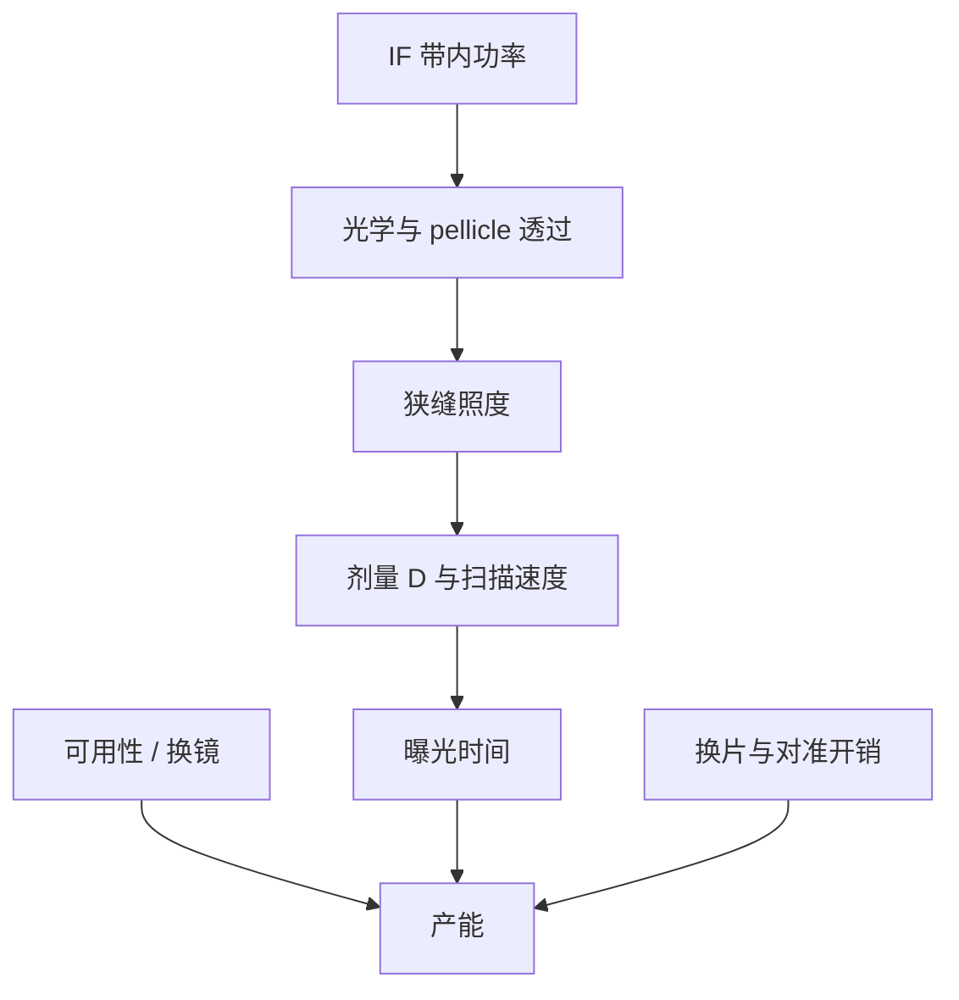

# 功率、剂量与产能

硅片剂量是能量面密度，扫描速度把功率积成剂量；产能是这条积分再扣开销与可用性，不是光源铭牌上的瞬时瓦数。

<footer>—— 据 ASML 对 IF 功率、剂量控制与生产力关系的公开表述整理</footer>

[上一课](/litho/intermediate-focus)（中间焦点 IF）。把收集镜写成会随时间变暗的 $R_{\mathrm{col}}$。缺口是：晶圆厂买的不是镜子，是在给定胶剂量下的可服务产能。本课钉功率—剂量—产能（P–dose–TPT）会计。光谱哪一段算带内，留给[下一课](/litho/euv-source-bandwidth)。不编造某代机台的量产片/小时数。

## 问题

光刻胶合同是剂量 $D$（mJ/cm²），不是光源瓦数。扫描狭缝以速度 $v$ 扫过场，狭缝照度 $I$ 满足 $D\sim I\cdot t_{\mathrm{dwell}}$，$t_{\mathrm{dwell}}$ 与 $v$ 成反比。可用的 $I$ 来自 IF 带内功率经照明、掩模、[pellicle](/litho/euv-pellicle) 双程和投影物镜相乘衰减。物镜约一成透过率，已在[多层膜](/litho/euv-multilayer-mirror)课算过，所以 IF 必须到数百瓦量级，扫描才进得了高产窗口。

ASML 公开把 IF 250 W 写成 [NXE](/litho/asml-nxe) 高量产的功率里程碑，并反复强调功率要在剂量控制环下可维持，而不是脉冲峰值。收集镜变脏、pellicle 吸收、氢柱吸收，都把「铭牌功率」打成「此刻可用功率」。产能还要扣换片、对准、校准和停机——双工件台吃的是测量与曝光重叠，吃不掉光源不可用。

### 加剂量与加功率不是同一方向

[随机效应](/litho/euv-stochastics)常要求更高 $D$。$D$ 升则同样功率下必须降 $v$，名义产能掉。反过来，源功率升才能在固定 $D$ 下加快扫描，直到工件台加速、热和计量成为下一堵墙。公开关系是这条杠杆，而不是某一张广告上的 wph。pellicle 的 $T^2$ 等效于系统性减 $I$，必须用源功率或更慢扫描补回。

250 W 是 IF 带内、可维持的公开里程碑，不是硅片上的瓦数。中间还要乘照明、掩模、膜和 POB。不要把 250 W 直接除以场面积当成剂量。

## 方法

数量级账沿用光源课：

$$
P_{\mathrm{IF}} \approx P_{\mathrm{laser}}\cdot\mathrm{CE}\cdot\Omega_{\mathrm{col}}\cdot R_{\mathrm{col}}(t)\cdot T_{\mathrm{gas}}.
$$

硅片侧可用功率再乘下游透过率。剂量闭环：硅片或光学传感器测得能量，执行器调激光能量、滴触发和扫描速度。平均功率决定能否达到目标 $D$；脉冲间抖动决定场内 CD。收集镜寿命进入 $R_{\mathrm{col}}(t)$，于是同一配方下的最大 $v$ 会随镜子老化下调，或用加激光换更陡的碎屑斜率。

产能会计把曝光时间与非曝光时间分开。曝光时间随场尺寸、扫描速度和场数变；非曝光时间随双台、对准网格密度和物料搬运变。可用性把收集镜更换、破膜、氢联锁写成折扣。公开叙事把这些乘在一起谈生产力，而不是只报 CE。

### 剂量均匀性比平均值先成为墙

狭缝方向的功率分布、扫描方向的速度误差、pellicle 热指纹，都会变成剂量图。OPC 能吃静态指纹，吃不了随功率爬坡而变的热图。因此「功率够不够」包含稳定度：随机效应要的是每个孔的 $N$，不是班次平均瓦数。

## 机制

光子预算在时间上分配。源是脉冲的（数十 kHz），扫描是连续的：每个狭缝位置积分许多脉冲。发生器打空或 CE 抖动，等于那一段积分亏光子。工件台按倍率同步；速度提高时，加速度与热负荷上升，套刻预算另记账，本课只指出：功率墙之后是台子墙，不是无限 $v\propto P$。

工厂电力按激光墙插功率准备，IF 数百瓦对应十千瓦量级驱动，已在 LPP 课写过。CE 几个百分点是整厂功耗杠杆。收集镜热与 pellicle 热随可用功率涨，寿命与破膜率反过来限制你敢不敢用满铭牌。P–dose–TPT 是一张闭合的账，拧任意一角都会在另两角出现。

不要把某代 NXE 产品页上的 wph 抄成物理上限。那是在声明的胶剂量、场利用率和可用性下的配置产能；换胶剂量或 mix，数字立刻变。本课只保留 ASML 公开的关系链。

## 边界

本课不写具体量产片/小时，不把 3600/3800 的出货配置产能当成课后习题答案。High-NA 的半场与更高剂量压力会改同一条会计的系数，机制不变。后课默认：说到「源够不够亮」，先问带内 IF、下游透过、$D$ 与可用性，而不是问激光铭牌。

也不要把瞬时 CE 高峰外推成年平均 TPT。镜子在脏、膜在热、氢在吸收。出处是 ASML 对功率、剂量控制与生产力的公开说明，以及 Bakshi 对系统能量流的综述。

剂量单位是 mJ/cm²，功率单位是 W。口误把「250 W 剂量」写进工艺窗口，整张 E–D 图会错位。后课光谱讨论的是瓦数里有多少落在 2% 带内。

## 小结

- 固定剂量下，可用功率决定扫描能有多快，直到台子与热成为下一堵墙。
- IF 250 W 级是 NXE 高量产的公开功率里程碑，不是硅片瓦数。
- $R_{\mathrm{col}}(t)$、pellicle 的 $T^2$ 和氢吸收把铭牌功率打成可用功率。
- 产能还要扣开销与可用性；换镜与破膜进同一张账。
- 不加未公开的 wph；下一课把「功率」拆成带内与带外。
- 出处：ASML 对 IF 功率、剂量与生产力关系的公开材料。
