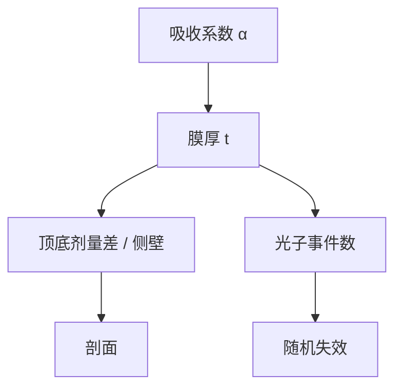

# EUV 胶的吸收与厚度

Beer 定律在 13.5 nm 很陡：膜必须够薄才侧壁直，又必须够吸收才有光子事件。厚度从此不是刻蚀余量的自由变量。

<footer>—— 对照 Levinson、Mack 对吸收与胶厚；Naulleau 对 EUV 吸收与模糊</footer>

[上一课](/litho/pellicle-free-risk)从掩模防护回到硅片。缺口是记录介质：[EUV 胶](/litho/euv-resist) 已把 CAR 与金属氧化物的 RLS 工作点分开；本课专攻吸收系数与厚度如何互锁。底层如何向胶里灌二次电子，留给[下一课](/litho/underlayer-secondary-electron）。

## 问题

无膜课把额外光子送给硅片。胶能不能用上，取决于膜内吸收。13.5 nm 下有机 CAR 的吸收长度往往只有几十纳米量级，膜厚与吸收长度同量级：太厚，顶底剂量差大，侧壁斜、清底难；太薄，体积 $V$ 里平均光子数 $\bar N=\sigma D V$ 不够，泊松先于平均 CD 爆。金属氧化物靠高 $\sigma$（金属）允许更薄仍收够事件，这是化学课的吸收轴，本课把它写成厚度预算。

缺口不是再选一次 PAG 或锡氧笼，而是：给定 $\alpha$（或光学密度），$t$ 还能涂多少。[High-NA 胶厚](/litho/high-na-resist-budget) 已从焦深和倒塌切入；本课从光子吸收切入，两张表必须交。

$$
I(z)=I_0 e^{-\alpha z},\qquad \bar N \propto (1-e^{-\alpha t})\,D.
$$

$\alpha$ 随元素和密度变。加剂量加的是 $D$，加金属加的是 $\alpha$。只加 $D$ 会顶光源和出气；只减 $t$ 会顶 $\bar N$ 和刻蚀。

## 方法

测：EUV 或等效的膜吸收、对比曲线随厚变化、侧壁角。选：CAR 往往停在约二三十纳米量级（层别而异）；High-NA 和倒塌把目标推向更薄，必须靠 $\alpha$ 或底层电子补 $\bar N$。转印：薄胶把硬掩模功能下放到栈，下一课之后的图形转移课展开。

与随机：同样 $D$，吸收分数 $(1-e^{-\alpha t})$ 决定事件数。透明胶「侧壁好看」但孔缺失；不透明胶「光子够」但顶底差。工作点在中间。

### 沿 z 的剂量差就是剖面

$e^{-\alpha t}$ 是膜底相对膜顶的剩余光。$\alpha t$ 太大，显影阈值只能切在某一深度，侧壁必斜或顶圆。$\alpha t$ 太小，整膜事件稀疏。金属氧化物提高 $\alpha$，允许更小 $t$ 仍维持 $\alpha t$ 在可剖面的窗——化学课的吸收轴在这里变成剖面轴。底层电子再从底部灌入，下一课会把这条 Beer 曲线弯曲。

## 机制

[吸收与模糊](/litho/euv-absorption-blur) 已指出：吸收位置是二次电子的出生点。$\alpha$ 高则事件密、但沿 z 衰减快；电子再把潜像沿几纳米核抹开。厚度选择等于在「纵向均匀」和「统计足够」之间切。Mack 的显影模型仍适用：曝光能量密度随 z 变，溶解速率随 z 变，剖面是积分结果。

不要把 ArF 的「厚胶 = 耐刻」搬过来。EUV 吸收长度不允许那张保险；耐刻改由底层或金属胶承担。

## 边界

本课不把底层二次电子产额写完，下一课才把 underlayer 当电子源。不重写 CAR vs 金属氧化物化学。出处：Levinson；Mack；Naulleau 吸收/模糊；High-NA 胶厚课。

## 小结

- 厚度由 $\alpha$、侧壁、光子统计和倒塌共同决定，不是刻蚀单向加厚。
- 吸收分数 $(1-e^{-\alpha t})$ 才是随机项的分子。
- 下一课：底层向这张薄膜灌入的二次电子。
- 出处：Levinson、Mack、Naulleau。
