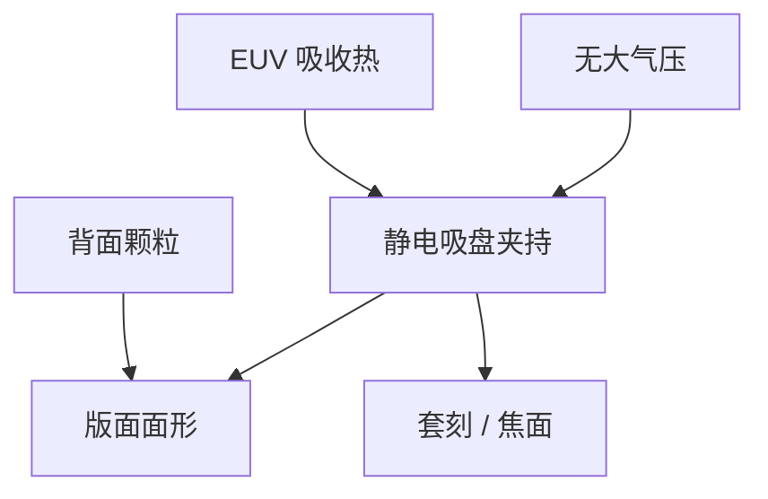

# EUV 掩模台与吸盘

反射版在真空里不能靠大气压差吸住。静电吸盘提供夹持，也把背面形貌和热流写成套刻与焦面。

<footer>—— 对照 ASML 对 EUV 掩模台 / 静电吸盘的公开讨论；Bakshi 系统机械</footer>

[上一课](/litho/euv-vacuum-contamination)把扫描腔收成干净真空。缺口是掩模怎么在这张真空里定位：没有空气，真空吸盘失效；反射几何还要把热从多层吸走。背面颗粒如何顶起版面，留给[下一课](/litho/reticle-backside-particles)。

## 问题

DUV 掩模台可以靠真空沟槽夹持，大气压提供数十牛顿的均匀力。EUV 腔体是真空，这条力没了。量产用静电吸盘（ESC）：电极–介质–掩模背面构成电容，库仑力夹持。力必须够扫描加速度，又不能在背面留下不可恢复的电荷或损伤。掩模是 [LTEM](/litho/mask-blank-ltem) 基板加多层，热膨胀和夹持变形直接进套刻。

缺口是真空夹持与热–力耦合，不是再讲工件台磁浮。照明和 pellicle 把功率堆在版上，对流几乎为零，吸盘还是主要热沉。夹持不均匀，版面拱起，最佳焦点和放大率一起漂。

EUV 掩模图形在正面多层上；吸盘抓的是背面。正反面的颗粒、划伤和镀膜不对称，都会通过夹持力变成面形。

## 方法

ESC 分区控制电压，贴合后做面形与温度图。冷却通道在吸盘体内，把吸收的 EUV 和红外带走。与[磁浮工件台](/litho/euv-maglev-stage)同步扫描，掩模侧加速度较小但定位公差按倍率放大到硅片。换版：机械手、库、以及 pellicle 框架必须与吸盘密封面兼容，产尘是污染课的掩模侧源。

计量：版面反射标记看变形，温度传感器看热漂，夹持力/电流看吸盘健康。配方含加电曲线，避免拉弧。氢环境对绝缘介质和电缆是额外约束，材料必须真空与氢双认证。

### 热阻路径就是套刻路径

多层吸收 → 基板扩散 → 吸盘冷却液。路径上任何一层接触不良（背面颗粒、氧化、镀膜不均）都会造成局部热点，放大率成斑。剂量爬坡时这张热图跟着变，静态 overlay 表补偿不了。夹持电压提高可以改善接触，也提高击穿和颗粒压入风险，与下一课同一把刀。

## 机制

静电压力 $P\sim\varepsilon E^2$。电压受击穿限制，间隙被背面颗粒局部撑开时，力塌掉并留下鼓包——下一课的主题。热：多层吸收的能量经基板到吸盘，径向温度梯度造成放大率误差，随扫描占空比变，OPC 静态补偿吃不掉。电荷弛豫使夹持力随时间变，校准周期课的「零点会漂」在掩模台以电压和温度的形式重现。

不要把浸没机掩模台真空沟槽的维修经验直接搬过来。介质击穿、氢兼容和热阻是新的失效模式。

## 边界

本课不展开背面颗粒的打印与良率，下一课专写。不重写 DUV 掩模库物流。掩模厂如何做背面，属于后一课程，本课只要求扫描机吸盘把背面当光学面的一部分。夹持电压是配方项，换版类型要重资格。出处：ASML EUV reticle stage；Bakshi；真空污染课。

## 小结

- 真空里用静电吸盘夹反射掩模，夹持与热沉是同一硬件。
- 版面面形进入套刻和焦面；背面状态通过吸盘耦合到正面成像。
- 下一课：颗粒夹在吸盘与背面之间会怎样。
- 出处：ASML；Bakshi。
