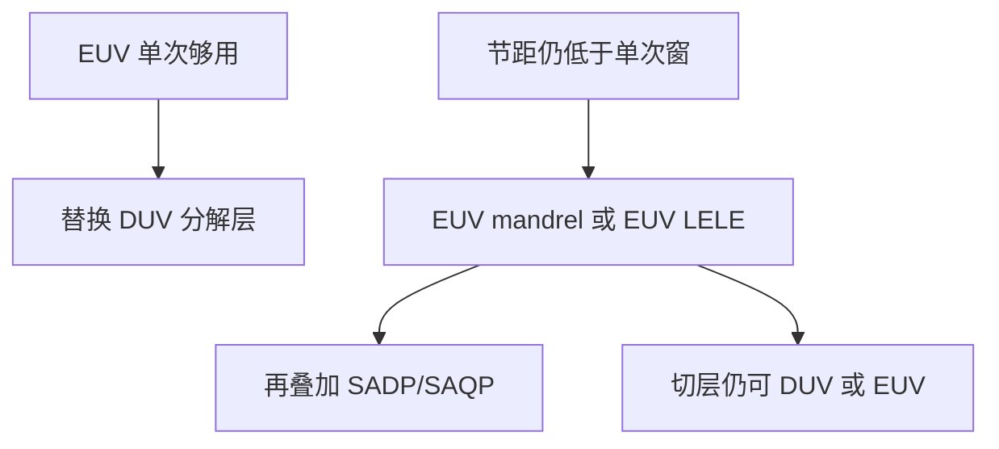

# EUV 与自对准的混合

EUV 单次把一部分临界层从 DUV 多重里救出来；节距再往下，0.33 NA 的单次窗口又不够，于是 EUV 当芯轴或与 SAQP 叠在同一层策略里。

<footer>—— 据晶圆厂与设备商对先进节点「EUV + 自对准多重」的公开层策略表述，不涉及产能与良率数字</footer>

[上一课](/litho/duv-multipattern-cost)把浸没多重走到商品 7/5 nm 的代价写成过机次数、掩模、同层套刻与设计规则。缺口是：EUV 插入之后，并不是所有密层都改成一张版印完。单次 EUV 仍有 $k_1$ 窗；更密的鳍、金属、孔会走上 EUV 双重、或 EUV 芯轴加 spacer。本课钉混合策略，不编 wph、片成本和成品率。

## 问题

上一课的经济逻辑是：一张 EUV 替换两张或三张 DUV 分解，并去掉同层 LELE 套刻。这只覆盖「EUV 单次已经印得下」的层。0.33 NA、13.5 nm 的单次半节距仍受 $k_1$ 地板约束；目标节距更小，就要把 EUV 当作 mandrel 光源去做 [SADP/SAQP](/litho/sadp-saqp)，或对 EUV 再做 LELE 着色。公开节点叙事里，鳍长期走自对准、金属与孔逐步 EUV，再在更密世代把 EUV 与 spacer 叠起来，是层类型策略，不是「EUV 取代多重」的口号。

缺口因此是混合，而不是重算浸没 38–40 nm 单次极限。没有这层，会把「用了 NXE」写成整颗芯片不再有 cut 与 spacer。

### 节点名仍不是波长

同一商品名下，有的层 EUV 单次，有的层 EUV+SADP，有的层仍浸没多重。讨论必须按层：mandrel 用哪台、切用哪台、孔是否三重。把某厂公开的「某代开始上 EUV」读成该代没有自对准，是把新闻稿当截面工艺。

High-NA（0.55）把单次窗口再拉开一截，公开定位是减少多重；在它覆盖不到或尚未导入的层上，混合策略仍然在。本课不把 EXE 写成已经取消 spacer。

## 方法

常见公开组合（按层，不点名良率）：浸没或 EUV 做 mandrel + spacer 做鳍或密金属；切层用 DUV LELE 或 EUV 单次，取决于切密度；通孔从 DUV 多重迁到 EUV 单次，再密则 EUV 双重。选择判据是拓扑（一维走 spacer，二维走 LELE/EUV）加上单次是否落在该波长的 $k_1$ 窗内。

混跑要求 DUV–EUV overlay 匹配，上一课已引用设备公开量级作为设备前提，不是良率。配方上，EUV mandrel 的 OPC 含掩模阴影；spacer 厚度预算与纯 DUV SADP 同类，walking 计量不因换波长消失。

### 不要用 EUV 单次 $k_1$ 去承诺 spacer 后的鳍宽

最终鳍宽仍主要跟 $t$ 与刻蚀走。EUV 只是把芯轴印得更密或更少多重，好让 spacer 轮数减少。把「EUV 分辨率」直接写成鳍 CD，是把光学半节距和薄膜 CD 混为一谈。

## 机制

波长换栈改变的是芯轴或孔的空中像；自对准机制不换：侧墙仍贴侧壁，walking 仍是 core/gap，cut 仍吃 overlay。EUV 随机效应（光子与胶）会进入 mandrel LER，再保形到 spacer，这是附加误差源，不是 DUV 多重代价的简单平移。本课不量化随机良率。

上一课把代价写成乘法。混合之后乘法还在，只是因子从「全 DUV 几次」变成「EUV 一次加 spacer 模块加切」。公开策略说的是哪一类层迁栈，不是一张可以外推到所有厂的产能表。

产能机制仍按模块乘：EUV 一次贵、浸没多次便宜，公开故事只说到层替换与机台分工，没有可抄的宇宙成本表。上一课禁止编的数字，本课继续禁止。

引用层策略时声明世代与层类型（鳍 / 金属 / 孔 / 切）。没有公开来源就不要写「某 nm 全部 SAQP+EUV」的清单。

## 边界

禁止：编造每小时晶圆、每层美元、7/5/3 nm 成品率、或未公开的掩模张数。允许：指出混合是产线公开方向——EUV 单次不够时与自对准或 EUV 多重叠用；浸没仍承担大量次临界与部分切层。中国产线与出口管制不在本课展开。

后课进入 EUV 光源与设备课序时，默认读者已知道：NXE 不是自动取消 spacer 与 cut。

随机、缺陷、pellicle 会限制 EUV 单次实际窗口，使混合更早出现。那是 EUV 专项课的误差源，本课只承认它们会把「单次够不够」往保守推。

## 小结

- EUV 单次替换部分 DUV 分解；更密层仍要 EUV 多重或 EUV+SADP/SAQP。
- 混合按层选型：一维自对准，二维 EUV/LELE，切层独立。
- Spacer 的 walking 与 cut 套刻不因换波长消失。
- 不编产能、成本与良率数字。
- 出处：先进节点公开层策略（EUV 与自对准共存）；上一课浸没多重代价结构。
