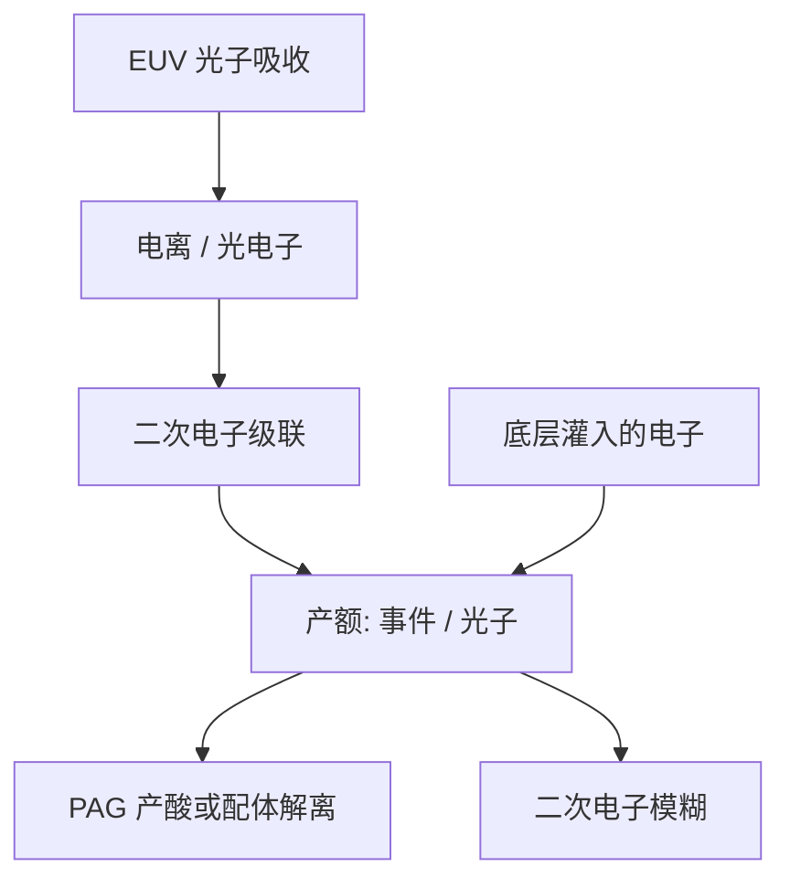

# 二次电子产额

92 eV 的光子几乎不当场完成化学：电离之后是一串二次电子，产额与热化距离把空中像卷积成潜像核。

<footer>—— 据 Naulleau 对 EUV 二次电子模糊、Kozawa 对电离产酸的公开论述整理</footer>

[上一课](/litho/euv-underlayer)把底层写成黏附、隔离与界面二次电子的功能栈，并警告底层可以往胶里灌电子。缺口是把「二次电子」从一句接口变成产额：一次吸收生出多少电子、它们走多远、怎样变成酸或配体事件。本课钉二次电子产额与模糊。放气留给[下一课](/litho/resist-outgassing）。

## 问题

DUV 的 PAG 可以靠光子直接光解。EUV 光子约 92 eV，远高于电离阈，能量先变成光电子与级联二次电子，再把能量交给 PAG 或锡氧配体。Kozawa 把 CAR 在 EUV 上的产酸写成电离路径：热化电子附着、酸从 PAG 释放，量子效率不再是「一个光子一颗酸」的 DUV 图像。Naulleau 把电子在凝聚态里走的那几纳米叫做二次电子模糊：它不随 $\lambda/\mathrm{NA}$ 缩放。

底层课已经指出：高 Z 底层会抬界面产额，灵敏度「免费」上升，模糊与随机一起改。缺口是产额本身——secondary electron yield——而不是再列一次底层功能。

### 产额不是灵敏度的别名

灵敏度是多少 $\mathrm{mJ/cm^2}$ 打到目标 CD。产额是每个被吸收光子（或每电子伏沉积能量）最终贡献多少化学事件。吸收截面、电子逃逸、淬灭、团簇离散都会插在中间。只报更敏，不知道是锡吸收高了、底层灌电子了，还是化学增益大了。

不要把二次电子模糊写成某一个全球纳米常数。公开论述给出的是纳米量级热化距离，随材料与密度变。本课钉机制，不编未校准的射程表。

## 方法

紧凑模型：剂量 → 吸收 → 电子核卷积 → 酸或配体事件密度 → 显影。电子核与酸核要能分开标定：降 PEB 主要砍酸程；换底层、换高 Z 负载主要砍电子项。量测上，LER 频谱的中高频、孔的随机失效对剂量的曲线，用来拆核与泊松——[吸收与模糊](/litho/euv-absorption-blur) 在光学课序里已经用过这套拆法，本课把它接到胶栈的产额语言上。

底层实验：同一胶、只换 underlayer 的二次电子产额，看 $E_0$ 与侧壁。界面产额升高，底部事件变密，footing 或倒锥会走——与光学离焦同貌，先查栈。

### 后课默认

说到 EUV 潜像，默认事件由二次电子介导，而不是 DUV 式直接光解。说到模糊，默认电子核与酸核（若仍是 CAR）叠加。金属氧化物胶没有长程酸，核更接近电子与团簇。

## 机制

一次 92 eV 吸收可打出多个电子–空穴，电子在散射中降能，直到热化。热化距离给出空间核半径量级。产额取决于：材料电离截面、电子在膜里的逃逸与复合、受体（PAG、配体）的捕获截面。Kozawa 强调：电子附着路径让产酸效率对 PAG 分布和聚合物电子性质敏感，不是只对光学 $I(x)$ 敏感。Naulleau 强调：核把 NILS 砍掉一截，随机体积也变，泊松 $N$ 跟着变——模糊不是只糊边，也改缺陷统计。

界面：底层产生的电子向上注入，胶底部有效产额升高，轴向不对称。这是底层课的机制在产额符号下的重写，不是新光学。

高产额看起来像免费光子，其实是把事件挪到电子射程里。射程与半节距抢同一纳米预算时，加吸收、加产额都会先糊后敏。

## 边界

不编每光子产酸个数的「标准值」，不把某胶的实验室 G 值当节点规格。不重写完整 RLS 推导。下一课放气是真空卫生，与电子产额正交：产额再高，碳氢出气仍会污染多层膜。

光学 flare 与电子核不要混：flare 改空中像的远程台基；电子核是吸收点附近的纳米卷积。调焦补不了后者。锡氧胶没有长程酸，产额仍在：电子打断配体的效率随团簇与底层变，换胶族等于换 $Y$，紧凑模型要重拟合核，不能只改剂量。

## 小结

- EUV 化学事件由二次电子介导；产额是事件/吸收，不是灵敏度的别名。
- Kozawa：电离产酸；Naulleau：电子模糊核不随 NA 缩放。
- 底层灌电子改界面产额与侧壁，先查栈再怪照明。
- 核砍 NILS，也改随机体积；加产额不是免费分辨率。
- 换胶族等于换产额 $Y$；紧凑模型要重拟合核。
- 调焦补不了电子核；flare 是远程台基，不要与核混。
- 出处：Kozawa 对 EUV 电离产酸的论述；Naulleau 对二次电子模糊的公开讨论。
