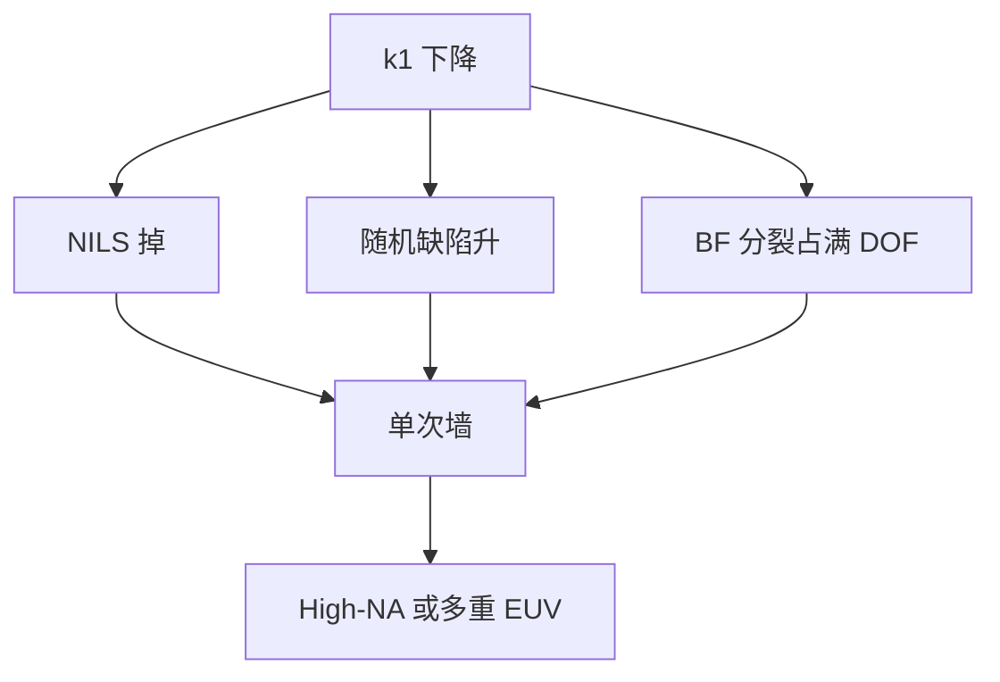

# EUV 单次曝光极限

$k_1$ 掉到约 0.3 以下，NILS、随机孔和掩模 3D 一起到墙。单次不是「EUV 就能无限缩」，再往下是多重 EUV 或抬 NA。

<footer>—— 对照 Mack $k_1$ 与 NILS；ASML 对 0.33 单次 vs High-NA / 多重的公开讨论</footer>

[上一课](/litho/euv-layers-per-node)决定哪些层上 EUV。缺口是单次能走多远：0.33 NA、13.5 nm 的瑞利墙，再叠加随机、M3D 和掩模粗糙。高 NA 的产能与经济是否值得为这堵墙买单，留给[下一课](/litho/high-na-throughput-economics）。

## 问题

层数课把最紧层派给 EUV 单次。物理上 $CD=k_1\lambda/\mathrm{NA}$，0.33 NA 下 $k_1\approx 0.4$ 对应大约 16 nm 半节距量级；$k_1$ 再往 0.3 走，TCC 对关键衍射级的传递变弱，NILS 掉，剂量要涨才能压随机，光源和 pellicle 先告急。孔比线更早死，因为二维缺陷对泊松更敏感。M3D 的 BF 分裂在低 $k_1$ 下占满焦深。掩模粗糙经高 MEEF 放大。

缺口是把「单次极限」写成这些机制的交集，而不是报一个广告节距。极限随胶、照明和缺陷规格变，故本课写墙的结构，不写某代保证半节距。

浸没在 $k_1\sim 0.3$ 靠水 NA=1.35 和多重图形续命。EUV 单次的墙更早碰到光子统计，因为每毫焦的光子数少。

## 方法

判据并行：NILS 下限、随机失效率（孔缺失、桥）、公共焦深、掩模 LER 传递、pellicle 指纹。任一先越界即单次出局。出路三条：加剂量（产能↓）、EUV 双重/切割（层数与套刻↑）、High-NA（场切半、经济下一课）。SMO 和低 n 吸收体是把墙往后推几纳米，不是取消墙。

与转印：即使空中像勉强过，薄胶转印的缺陷放大可能先把单次判死。极限是成像×集成。

### 孔阵列是更早的墙

线可以用偶极把 NILS 抬回；孔是二维，照明更接近环或四极，光子事件摊在面积上，缺失率对剂量更陡。单次极限往往先在孔层报到，线层还能再走一档 $k_1$。层数课把孔与线分开插入，原因在此，不是两种胶的口味问题。

## 机制

部分相干下，关键级对的相干传递随 $k_1$ 掉。NILS 低则阈值附近的边沿对剂量和焦点更敏感，随机涨落更容易过打印阈值。92 eV 光子稀疏，CAR 放大或金属吸收只能把工作点在 RLS 上滑动。0.55 NA 把同一 $k_1$ 对应的 CD 缩小，墙被挪到更小节距，但焦深、半场拼接和光子预算另开新墙——不是免费。

Mack 的 $k_1$ 成像图在 EUV 仍适用；额外的轴是随机 Z 因子和 M3D。三轴同时碰到才是工程极限。

## 边界

本课不把 High-NA 的 wph 和晶圆成本算完，下一课才写产能与经济。不重写双重图形的套刻细节。出处：Mack；ASML 0.33 vs High-NA；Naulleau 随机；Finders M3D。

## 小结

- 单次极限是 NILS、随机、M3D 和掩模粗糙的交集，不是单一瑞利数字。
- 出路是加剂量、多重 EUV 或抬 NA；SMO 只推移。
- 下一课：抬 NA 的产能和经济，并交接到掩模制造课程。
- 出处：Mack；ASML；Naulleau；Finders。
